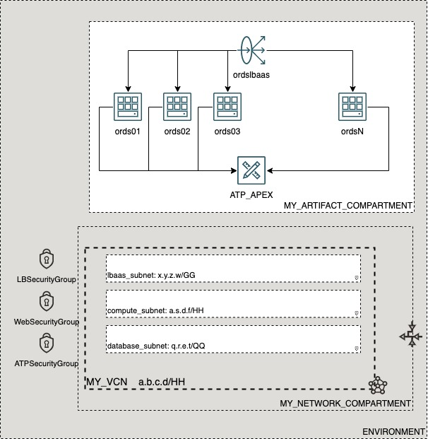

# OCI Cloud Bricks: Sample APEX

[](https://img.shields.io/badge/license-UPL-green) [](https://sonarcloud.io/dashboard?id=oracle-devrel_terraform-oci-cloudbricks-examples)

## Introduction
The following system builds a sample APEX with a Customer Managed ORDS front end and a LBaaS with Certificates



## Getting Started
For details in how the Oracle CloudBricks Framework works, refer to the [following file](../../../README.md)

### Prerequisites
- A Pre-Created Object Storage Bucket to store tfstate files
- a Pre-Installed Executor with CLI installed. For instructions in how to install CLI, go to the [following link](https://docs.oracle.com/en-us/iaas/Content/API/SDKDocs/cliinstall.htm)
- A Pre-Configured .oci/config file with API Keys. For details in how to do this step, go to the [following link](https://docs.oracle.com/en-us/iaas/Content/API/Concepts/apisigningkey.htm). File should look similar to this: 
  
```shell

[DEFAULT]
user=ocid1.user.oc1..aaaaaaaafoobarfoobarfoobar
fingerprint=9a:9e:13:cf:94:6e:2c:b9:54:D1:60:0d:e4:14:8b:5e
tenancy=ocid1.tenancy.oc1..aaaaaaaaoqdyfoobarfoobarfoobar
region=re-region-1
key_file=/full/path/to/api/key/my_api_key.pem

```

- A Pre-Configured .aws/credentials file with values from pre-created Customer Secret Keys. File should look similar to this: 
  
```shell
[default]
aws_access_key_id=202ad26f6546c71cc8990c821eece00a6b543ssa21231
aws_secret_access_key=xgYpRAiel5Yxrc9G67MGddaskjdhalsdiujlewiH3NxX4ZMe4=
```

For instructions in how to create Customer Secret Keys, go to the [following link](https://docs.oracle.com/en-us/iaas/Content/Identity/Tasks/managingcredentials.htm#To4)

---

## Components
The following system contains the following components: 

### [backend.tf](./backend.tf)

This file defines the S3 compatibility API integration to store .tfstate file into an OCI Bucket. It's content is the following: 

```go
terraform {
  backend "s3" {
    bucket   = "Precreated_bucket_to_store_tfstate_files_name"
    key      = "Samples/dbcs-database.tfstate"
    region   = "re-region-1"
    endpoint = "https://Tenancy_ObjectStorage_namespace.compat.objectstorage.re-region-1.oraclecloud.com"

    skip_region_validation      = true
    skip_credentials_validation = true
    skip_metadata_api_check     = true
    force_path_style            = true
  }
}
```

*Considerations*

- The `bucket` variable, requires the display name of the bucket where tfstate files will be stored
- The `key` variable, supports a structure of your choice, by providing `/` as separators. Name of the file should always be `system_name.tfstate`
- The `region` variable contains the name id of the region where the system is being deployed at
- The `endpoint` variable contains the concatenation of the tenancy namespace and the region as depicted on above example. For instructions in how to determine the Tenancy Object Storage namespace, refer to the [following documentation](https://docs.oracle.com/en-us/iaas/Content/Object/Tasks/understandingnamespaces.htm)
- The rest of *variables* require to be set as is. **Do not change nor update these values**

---

### [datasource.tf](./datasource.tf)
This file defines the datasources required for internal tracking lookup on Open Source Project. Do not alter this file

---

### [main.tf](./main.tf) 
This file defines the main orchestration of module. The following structure is expected

```go
module "ModuleName" {

  source = "git::ssh://git@github.com/oracle-devrel/module.git?ref=v1.0.0"
  providers = {
    oci.home = oci.home
  }
  ######################################## PROVIDER SPECIFIC VARIABLES ######################################
  tenancy_ocid     = var.tenancy_ocid
  region           = var.region
  user_ocid        = var.user_ocid
  fingerprint      = var.fingerprint
  private_key_path = var.private_key_path
  ######################################## PROVIDER SPECIFIC VARIABLES ######################################
  ######################################## COMPARTMENT SPECIFIC VARIABLES ######################################
  module  = foo
  variables = bar
  here      = bar
  ######################################## COMPARTMENT SPECIFIC VARIABLES ######################################
}
```

*Considerations*
- Whereas needed, apply variable and module overloading
- For module specifics, refer to module documentation: 
  - [terraform-oci-cloudbricks-apex](https://github.com/oracle-devrel/terraform-oci-cloudbricks-apex/blob/main/README.md)
- For variable usage, refer to section *Variable Documentation*
- This project contains a sample script that will generate sample certificates. This is located under `apex/certs/gen_certs.sh`. 
  - Directory `apex/certs` must include certificates in the following form: 
    - `LoadBalancerCertificate.cert`: The Certificate file attached to the Load Balancer 
    - `CACertificate.key`: The Certificate Authority key file
    - `LoadBalancerKey.key`: The Load Balancer Key file


If using self signed certificates, the following is the output of script execution: 

```shell
 ./gen_certs.sh 
Generating RSA private key, 2048 bit long modulus
.....................................................+++
.......................+++
e is 65537 (0x10001)
Signature ok
subject=/C=US/ST=Denial/L=Springfield/O=Dis/CN=selfsignedcert
Getting Private key
Generating RSA private key, 2048 bit long modulus
............................+++
........................+++
e is 65537 (0x10001)
Signature ok
subject=/C=US/ST=Denial/L=Springfield/O=Dis/CN=root
Getting CA Private Key
Certificate:
    Data:
        Version: 1 (0x0)
        Serial Number:
            b2:8a:25:a7:ba:92:05:0f
    Signature Algorithm: sha256WithRSAEncryption
        Issuer: C=US, ST=Denial, L=Springfield, O=Dis, CN=selfsignedcert
        Validity
            Not Before: Feb  2 12:59:08 2022 GMT
            Not After : Dec 26 12:59:08 2158 GMT
        Subject: C=US, ST=Denial, L=Springfield, O=Dis, CN=root
        Subject Public Key Info:
            Public Key Algorithm: rsaEncryption
                Public-Key: (2048 bit)
                Modulus:
                    00:cf:b1:72:31:47:f4:82:e7:28:ea:78:97:64:0d:
                    43:cd:7a:54:45:59:ef:00:c2:34:97:55:c1:a7:88:
...
...
...
                    49:7a:aa:a1:60:6d:3a:fb:f1:55:17:0f:93:9d:81:
                    46:ed:c3:e7:da:38:b2:88:f3:e6:b7:6d:95:f4:12:
                    af:09:21:bc:08:65:c9:ec:d4:84:3e:84:5d:9c:86:
                    a8:a5
                Exponent: 65537 (0x10001)
    Signature Algorithm: sha256WithRSAEncryption
         16:df:0b:61:75:c5:31:d7:4f:11:82:1a:12:67:ed:cf:3f:c0:
         72:15:73:f8:49:41:7a:cc:75:be:0c:4e:64:96:da:c3:d5:fe:
...
...
...
         62:20:0c:07:ff:ed:c6:13:db:e8:69:85:2e:dd:1f:b9:91:d4:
         0c:a3:10:86:0e:f7:fd:da:cd:9f:f8:c6:7d:07:03:c1:ed:74:
         08:4c:e2:4c
-----BEGIN CERTIFICATE-----
MIIDKjCCAhICCQCyiiWnupIFDzANBgkqhkiG9w0BAQsFADBbMQswCQYDVQQGEwJV
UzEPMA0GA1UECAwGRGVuaWFsMRQwEgYDVQQHDAtTcHJpbmdmaWVsZDEMMAoGA1UE
CgwDRGlzMRcwFQYDVQQDDA5zZWxmc2lnbmVkY2VydDAgFw0yMjAyMDIxMjU5MDha
...
...
...
chVz+ElBesx1vgxOZJbaw9X+KRzSOXkfHIT4Xk182EmJH6aJd1JNYbPY9QfRUNKG
FJYexcvhVU5cGql6heaDKAdo78si/6lxiMa6lIX7arRbgxw3OhC7YmTLntmJX5VL
DranKxBai4WzvB0RS4mL8XsJv3i3QoIQbSM92r58Ff4ALZDzsdR7LEETbUuX8ca7
U54FgjdoerYwgHi1Tnj1mwo9FqKuHnQMjW6pHmuHG7EA8UvPc9yrga2Ux5FRre0B
FNlUaHnmYiAMB//txhPb6GmFLt0fuZHUDKMQhg73/drNn/jGfQcDwe10CEziTA==
-----END CERTIFICATE-----
```

---

### [output.tf](./output.tf)
The following file defines the output of system, for future forward integration use with Configuration Management Tools

---


### [README.md](./README.md)
This file

---

### [system.tfvars](./system.tfvars)
The following file defines the specific variables customized using variable overloading. Please refer to backend brick module documentation for details in how to fill.
For module specifics, refer to module documentation: 
  - [terraform-oci-cloudbricks-apex](https://github.com/oracle-devrel/terraform-oci-cloudbricks-dbcs-apex/blob/main/README.md)

---

### [variables.tf](./variables.tf)
The following file defines all the variables used in this system. For details on it's content, refer to section *Variable Documentation*

---

## Variable Documentation
## Requirements

| Name | Version |
|------|---------|
| <a name="requirement_terraform"></a> [terraform](#requirement\_terraform) | >= 0.13.5 |
| <a name="requirement_oci"></a> [oci](#requirement\_oci) | >= 4.36.0 |

## Providers

| Name | Version |
|------|---------|
| <a name="provider_oci"></a> [oci](#provider\_oci) | 4.61.0 |

## Modules

| Name | Source | Version |
|------|--------|---------|
| <a name="module_apex01"></a> [apex01](#module\_apex01) | git::ssh://git@github.com/oracle-devrel/terraform-oci-cloudbricks-apex | v1.0.4 |

## Resources

| Name | Type |
|------|------|
| [oci_identity_region_subscriptions.home_region_subscriptions](https://registry.terraform.io/providers/hashicorp/oci/latest/docs/data-sources/identity_region_subscriptions) | data source |

## Inputs

| Name | Description | Type | Default | Required |
|------|-------------|------|---------|:--------:|
| <a name="input_apex01_ATP_data_guard_enabled"></a> [apex01\_ATP\_data\_guard\_enabled](#input\_apex01\_ATP\_data\_guard\_enabled) | n/a | `bool` | `false` | no |
| <a name="input_apex01_ATP_database_cpu_core_count"></a> [apex01\_ATP\_database\_cpu\_core\_count](#input\_apex01\_ATP\_database\_cpu\_core\_count) | n/a | `number` | `1` | no |
| <a name="input_apex01_ATP_database_data_storage_size_in_tbs"></a> [apex01\_ATP\_database\_data\_storage\_size\_in\_tbs](#input\_apex01\_ATP\_database\_data\_storage\_size\_in\_tbs) | n/a | `number` | `1` | no |
| <a name="input_apex01_ATP_database_db_name"></a> [apex01\_ATP\_database\_db\_name](#input\_apex01\_ATP\_database\_db\_name) | n/a | `string` | `"aTFdb"` | no |
| <a name="input_apex01_ATP_database_db_version"></a> [apex01\_ATP\_database\_db\_version](#input\_apex01\_ATP\_database\_db\_version) | n/a | `string` | `"19c"` | no |
| <a name="input_apex01_ATP_database_defined_tags_value"></a> [apex01\_ATP\_database\_defined\_tags\_value](#input\_apex01\_ATP\_database\_defined\_tags\_value) | n/a | `string` | `"value"` | no |
| <a name="input_apex01_ATP_database_display_name"></a> [apex01\_ATP\_database\_display\_name](#input\_apex01\_ATP\_database\_display\_name) | n/a | `string` | `"ATP"` | no |
| <a name="input_apex01_ATP_database_freeform_tags"></a> [apex01\_ATP\_database\_freeform\_tags](#input\_apex01\_ATP\_database\_freeform\_tags) | n/a | `map` | <pre>{<br>  "Owner": "ATP"<br>}</pre> | no |
| <a name="input_apex01_ATP_database_license_model"></a> [apex01\_ATP\_database\_license\_model](#input\_apex01\_ATP\_database\_license\_model) | n/a | `string` | `"LICENSE_INCLUDED"` | no |
| <a name="input_apex01_ATP_instance_compartment_name"></a> [apex01\_ATP\_instance\_compartment\_name](#input\_apex01\_ATP\_instance\_compartment\_name) | Defines the compartment name where the ATP infrastructure will be created | `any` | n/a | yes |
| <a name="input_apex01_ATP_network_subnet_name"></a> [apex01\_ATP\_network\_subnet\_name](#input\_apex01\_ATP\_network\_subnet\_name) | ATP Subnet Name | `any` | n/a | yes |
| <a name="input_apex01_ATP_password"></a> [apex01\_ATP\_password](#input\_apex01\_ATP\_password) | n/a | `any` | n/a | yes |
| <a name="input_apex01_ATP_private_endpoint"></a> [apex01\_ATP\_private\_endpoint](#input\_apex01\_ATP\_private\_endpoint) | n/a | `bool` | `true` | no |
| <a name="input_apex01_ATP_private_endpoint_label"></a> [apex01\_ATP\_private\_endpoint\_label](#input\_apex01\_ATP\_private\_endpoint\_label) | n/a | `string` | `"ATPPrivateEndpoint"` | no |
| <a name="input_apex01_ATP_tde_wallet_zip_file"></a> [apex01\_ATP\_tde\_wallet\_zip\_file](#input\_apex01\_ATP\_tde\_wallet\_zip\_file) | n/a | `string` | `"tde_wallet_aTFdb.zip"` | no |
| <a name="input_apex01_apex_version"></a> [apex01\_apex\_version](#input\_apex01\_apex\_version) | Defines the current static content version of apex | `string` | `"21.1.2"` | no |
| <a name="input_apex01_assign_public_ip_flag"></a> [apex01\_assign\_public\_ip\_flag](#input\_apex01\_assign\_public\_ip\_flag) | Defines either machine will have or not a Public IP assigned. All Pvt networks this variable must be false | `bool` | `false` | no |
| <a name="input_apex01_availability_domain_name"></a> [apex01\_availability\_domain\_name](#input\_apex01\_availability\_domain\_name) | n/a | `string` | `""` | no |
| <a name="input_apex01_bkp_policy_boot_volume"></a> [apex01\_bkp\_policy\_boot\_volume](#input\_apex01\_bkp\_policy\_boot\_volume) | Describes the backup policy attached to the boot volume | `string` | `"gold"` | no |
| <a name="input_apex01_certificate_bundle_display_name"></a> [apex01\_certificate\_bundle\_display\_name](#input\_apex01\_certificate\_bundle\_display\_name) | Display name of certificate associated to LBaaS | `string` | `"certificate"` | no |
| <a name="input_apex01_certificate_private_key"></a> [apex01\_certificate\_private\_key](#input\_apex01\_certificate\_private\_key) | Load Balancer Private Key | `any` | `null` | no |
| <a name="input_apex01_compute_availability_domain_list"></a> [apex01\_compute\_availability\_domain\_list](#input\_apex01\_compute\_availability\_domain\_list) | Defines the availability domain list where OCI artifact will be created. This is a numeric value greater than 0 | `list(any)` | n/a | yes |
| <a name="input_apex01_compute_display_name_base"></a> [apex01\_compute\_display\_name\_base](#input\_apex01\_compute\_display\_name\_base) | Defines the compute and hostname Label for created compute | `any` | n/a | yes |
| <a name="input_apex01_compute_network_subnet_cidr_block"></a> [apex01\_compute\_network\_subnet\_cidr\_block](#input\_apex01\_compute\_network\_subnet\_cidr\_block) | CIDR Block of the subnet where the computes are located at | `any` | n/a | yes |
| <a name="input_apex01_compute_network_subnet_name"></a> [apex01\_compute\_network\_subnet\_name](#input\_apex01\_compute\_network\_subnet\_name) | Compute Subnet Name | `any` | n/a | yes |
| <a name="input_apex01_fault_domain_name"></a> [apex01\_fault\_domain\_name](#input\_apex01\_fault\_domain\_name) | Describes the fault domain to be used by machine | `list(any)` | <pre>[<br>  "FAULT-DOMAIN-1",<br>  "FAULT-DOMAIN-2",<br>  "FAULT-DOMAIN-3"<br>]</pre> | no |
| <a name="input_apex01_flex_lb_max_shape"></a> [apex01\_flex\_lb\_max\_shape](#input\_apex01\_flex\_lb\_max\_shape) | n/a | `string` | `"100"` | no |
| <a name="input_apex01_flex_lb_min_shape"></a> [apex01\_flex\_lb\_min\_shape](#input\_apex01\_flex\_lb\_min\_shape) | n/a | `string` | `"10"` | no |
| <a name="input_apex01_instance_os"></a> [apex01\_instance\_os](#input\_apex01\_instance\_os) | Operating system for compute instances | `string` | `"Oracle Linux"` | no |
| <a name="input_apex01_instance_shape"></a> [apex01\_instance\_shape](#input\_apex01\_instance\_shape) | Defines the shape to be used on compute creation | `any` | n/a | yes |
| <a name="input_apex01_instance_shape_config_memory_in_gbs"></a> [apex01\_instance\_shape\_config\_memory\_in\_gbs](#input\_apex01\_instance\_shape\_config\_memory\_in\_gbs) | (Updatable) The total amount of memory available to the instance, in gigabytes. | `string` | `""` | no |
| <a name="input_apex01_instance_shape_config_ocpus"></a> [apex01\_instance\_shape\_config\_ocpus](#input\_apex01\_instance\_shape\_config\_ocpus) | (Updatable) The total number of OCPUs available to the instance. | `string` | `""` | no |
| <a name="input_apex01_is_flex_shape"></a> [apex01\_is\_flex\_shape](#input\_apex01\_is\_flex\_shape) | Boolean that describes if the shape is flex or not | `bool` | `false` | no |
| <a name="input_apex01_label_zs"></a> [apex01\_label\_zs](#input\_apex01\_label\_zs) | Auxiliary variable to concatenate with compute number | `list(any)` | <pre>[<br>  "0",<br>  ""<br>]</pre> | no |
| <a name="input_apex01_lb_shape"></a> [apex01\_lb\_shape](#input\_apex01\_lb\_shape) | n/a | `string` | `"flexible"` | no |
| <a name="input_apex01_lbaas_ca_cert"></a> [apex01\_lbaas\_ca\_cert](#input\_apex01\_lbaas\_ca\_cert) | Load Balancer ca certificate | `any` | `null` | no |
| <a name="input_apex01_lbaas_ca_cert_is_path"></a> [apex01\_lbaas\_ca\_cert\_is\_path](#input\_apex01\_lbaas\_ca\_cert\_is\_path) | Declared if the certificate LBaaS is in a path or if it is string | `bool` | `true` | no |
| <a name="input_apex01_lbaas_display_name"></a> [apex01\_lbaas\_display\_name](#input\_apex01\_lbaas\_display\_name) | Display Name for Load Balancer | `any` | n/a | yes |
| <a name="input_apex01_lbaas_network_subnet_name"></a> [apex01\_lbaas\_network\_subnet\_name](#input\_apex01\_lbaas\_network\_subnet\_name) | LBaaS Subnet Name | `any` | n/a | yes |
| <a name="input_apex01_lbaas_pvt_key_is_path"></a> [apex01\_lbaas\_pvt\_key\_is\_path](#input\_apex01\_lbaas\_pvt\_key\_is\_path) | Declares if the Private Key of LBaaS is in a path or string | `bool` | `true` | no |
| <a name="input_apex01_lbaas_ssl_cert"></a> [apex01\_lbaas\_ssl\_cert](#input\_apex01\_lbaas\_ssl\_cert) | Load Balancer Public Certificate | `any` | `null` | no |
| <a name="input_apex01_lbaas_ssl_cert_is_path"></a> [apex01\_lbaas\_ssl\_cert\_is\_path](#input\_apex01\_lbaas\_ssl\_cert\_is\_path) | Declares if the public certificate is in a path or string | `bool` | `true` | no |
| <a name="input_apex01_lbaas_subnet_cidr_block"></a> [apex01\_lbaas\_subnet\_cidr\_block](#input\_apex01\_lbaas\_subnet\_cidr\_block) | CIDR Block of the subnet where the LBaaS is located at | `any` | n/a | yes |
| <a name="input_apex01_linux_compute_instance_compartment_name"></a> [apex01\_linux\_compute\_instance\_compartment\_name](#input\_apex01\_linux\_compute\_instance\_compartment\_name) | Defines the compartment name where the infrastructure will be created | `any` | n/a | yes |
| <a name="input_apex01_linux_compute_network_compartment_name"></a> [apex01\_linux\_compute\_network\_compartment\_name](#input\_apex01\_linux\_compute\_network\_compartment\_name) | Defines the compartment where the Network is currently located | `any` | n/a | yes |
| <a name="input_apex01_linux_os_version"></a> [apex01\_linux\_os\_version](#input\_apex01\_linux\_os\_version) | Operating system version for all Linux instances | `string` | `"7.9"` | no |
| <a name="input_apex01_num_instances"></a> [apex01\_num\_instances](#input\_apex01\_num\_instances) | Amount of instances to create | `number` | `0` | no |
| <a name="input_apex01_ssh_private_is_path"></a> [apex01\_ssh\_private\_is\_path](#input\_apex01\_ssh\_private\_is\_path) | Describes if SSH Private Key is located on file or inside code | `bool` | `false` | no |
| <a name="input_apex01_ssh_private_key"></a> [apex01\_ssh\_private\_key](#input\_apex01\_ssh\_private\_key) | Private key to log into machine | `any` | n/a | yes |
| <a name="input_apex01_ssh_public_is_path"></a> [apex01\_ssh\_public\_is\_path](#input\_apex01\_ssh\_public\_is\_path) | Describes if SSH Public Key is located on file or inside code | `bool` | `false` | no |
| <a name="input_apex01_ssh_public_key"></a> [apex01\_ssh\_public\_key](#input\_apex01\_ssh\_public\_key) | Defines SSH Public Key to be used in order to remotely connect to compute instance | `string` | n/a | yes |
| <a name="input_apex01_vcn_display_name"></a> [apex01\_vcn\_display\_name](#input\_apex01\_vcn\_display\_name) | VCN Display name to execute lookup | `any` | n/a | yes |
| <a name="input_apex01_verify_peer_certificate"></a> [apex01\_verify\_peer\_certificate](#input\_apex01\_verify\_peer\_certificate) | Defines if peer verification is enabled | `bool` | `true` | no |
| <a name="input_availability_domain"></a> [availability\_domain](#input\_availability\_domain) | n/a | `string` | `""` | no |
| <a name="input_fingerprint"></a> [fingerprint](#input\_fingerprint) | API Key Fingerprint for user\_ocid derived from public API Key imported in OCI User config | `any` | n/a | yes |
| <a name="input_private_key_path"></a> [private\_key\_path](#input\_private\_key\_path) | Private Key Absolute path location where terraform is executed | `any` | n/a | yes |
| <a name="input_region"></a> [region](#input\_region) | Target region where artifacts are going to be created | `any` | n/a | yes |
| <a name="input_tenancy_ocid"></a> [tenancy\_ocid](#input\_tenancy\_ocid) | OCID of tenancy | `any` | n/a | yes |
| <a name="input_user_ocid"></a> [user\_ocid](#input\_user\_ocid) | User OCID in tenancy | `any` | n/a | yes |

## Outputs

| Name | Description |
|------|-------------|
| <a name="output_ApexURL"></a> [ApexURL](#output\_ApexURL) | Public URL containing Apex |
| <a name="output_SQLDeveloperPublicApexURL"></a> [SQLDeveloperPublicApexURL](#output\_SQLDeveloperPublicApexURL) | Public SQL Developer URL via ORDS |
---

## Contributing
This project is open source.  Please submit your contributions by forking this repository and submitting a pull request!  Oracle appreciates any contributions that are made by the open source community.

## License
Copyright (c) 2021 Oracle and/or its affiliates.

Licensed under the Universal Permissive License (UPL), Version 1.0.

See [LICENSE](LICENSE) for more details.