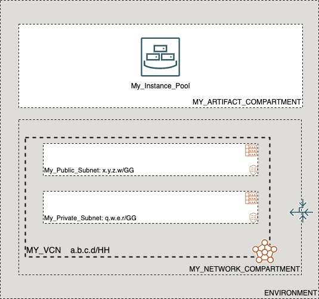

# OCI Cloud Bricks: Sample Autoscaling Instance Pool

[](https://img.shields.io/badge/license-UPL-green) [](https://sonarcloud.io/dashboard?id=oracle-devrel_terraform-oci-cloudbricks-examples)

## Introduction
The following system builds a standalone linux compute instance pool with an autoscaling configuration of any kind (Flex/Standard/CPU/Memory/Schedule).



## Getting Started
For details on how the Oracle CloudBricks Framework works, refer to the [following file](../../README.md)

### Prerequisites
- A Pre-Created Object Storage Bucket to store tfstate files
- a Pre-Installed Executor with CLI installed. For instructions in how to install CLI, go to the [following link](https://docs.oracle.com/en-us/iaas/Content/API/SDKDocs/cliinstall.htm)
- A Pre-Configured .oci/config file with API Keys. For details in how to do this step, go to the [following link](https://docs.oracle.com/en-us/iaas/Content/API/Concepts/apisigningkey.htm). File should look similar to this: 
  
```shell

[DEFAULT]
user=ocid1.user.oc1..aaaaaaaafoobarfoobarfoobar
fingerprint=9a:9e:13:cf:94:6e:2c:b9:54:D1:60:0d:e4:14:8b:5e
tenancy=ocid1.tenancy.oc1..aaaaaaaaoqdyfoobarfoobarfoobar
region=re-region-1
key_file=/full/path/to/api/key/my_api_key.pem

```

- A Pre-Configured .aws/credentials file with values from pre-created Customer Secret Keys. File should look similar to this: 
  
```shell
[default]
aws_access_key_id=202ad26f6546c71cc8990c821eece00a6b543ssa21231
aws_secret_access_key=xgYpRAiel5Yxrc9G67MGddaskjdhalsdiujlewiH3NxX4ZMe4=
```

For instructions in how to create Customer Secret Keys, go to the [following link](https://docs.oracle.com/en-us/iaas/Content/Identity/Tasks/managingcredentials.htm#To4)

---

## Components
The following system contains the following components: 

### [backend.tf](./backend.tf)

This file defines the S3 compatibility API integration to store .tfstate file into an OCI Bucket. It's content is the following: 

```go
terraform {
  backend "s3" {
    bucket   = "Precreated_bucket_to_store_tfstate_files_name"
    key      = "Samples/sample_hub_spoke_compartment_with_parent.tfstate"
    region   = "re-region-1"
    endpoint = "https://Tenancy_ObjectStorage_namespace.compat.objectstorage.re-region-1.oraclecloud.com"

    skip_region_validation      = true
    skip_credentials_validation = true
    skip_metadata_api_check     = true
    force_path_style            = true
  }
}
```

*Considerations*

- The `bucket` variable, requires the display name of the bucket where tfstate files will be stored
- The `key` variable, supports a structure of your choice, by providing `/` as separators. Name of the file should always be `system_name.tfstate`
- The `region` variable contains the name id of the region where the system is being deployed at
- The `endpoint` variable contains the concatenation of the tenancy namespace and the region as depicted on above example. For instructions in how to determine the Tenancy Object Storage namespace, refer to the [following documentation](https://docs.oracle.com/en-us/iaas/Content/Object/Tasks/understandingnamespaces.htm)
- The rest of *variables* require to be set as is. **Do not change nor update these values**

---

### [datasource.tf](./datasource.tf)
This file defines the datasources required for internal tracking lookup on Open Source Project. Do not alter this file

---

### [main.tf](./main.tf) 
This file defines the main orchestration of module. The following structure is expected

```go
module "ModuleName" {

  source = "git::ssh://git@github.com/oracle-devrel/module.git?ref=v1.0.0"
  providers = {
    oci.home = oci.home
  }
  ######################################## PROVIDER SPECIFIC VARIABLES ######################################
  tenancy_ocid     = var.tenancy_ocid
  region           = var.region
  user_ocid        = var.user_ocid
  fingerprint      = var.fingerprint
  private_key_path = var.private_key_path
  ######################################## PROVIDER SPECIFIC VARIABLES ######################################
  ######################################## COMPARTMENT SPECIFIC VARIABLES ######################################
  module  = foo
  variables = bar
  here      = bar
  ######################################## COMPARTMENT SPECIFIC VARIABLES ######################################
}
```

*Considerations*
- Whereas needed, apply variable and module overloading
- For module specifics, refer to module documentation: 
  - [terraform-oci-cloudbricks-linux-compute-instance-pool](https://github.com/oracle-devrel/terraform-oci-cloudbricks-linux-compute-instance-pool/blob/main/README.md)
 
- For variable usage, refer to section *Variable Documentation*

---

### [output.tf](./output.tf)
The following file defines the output of system, for future forward integration use with Configuration Management Tools

---


### [README.md](./README.md)
This file

---

### [system.tfvars](./system.tfvars)
The following file defines the specific variables customized using variable overloading. Please refer to backend brick module documentation for details in how to fill.
For module specifics, refer to module documentation: 
  - [terraform-oci-cloudbricks-linux-compute-instance-pool](https://github.com/oracle-devrel/terraform-oci-cloudbricks-linux-compute-instance-pool/blob/main/README.md)

---

### [variables.tf](./variables.tf)
The following file defines all the variables used in this system. For details on it's content, refer to section *Variable Documentation*

---

## Variable Documentation
## Requirements

| Name | Version |
|------|---------|
| <a name="requirement_terraform"></a> [terraform](#requirement\_terraform) | >= 0.13.5 |
| <a name="requirement_oci"></a> [oci](#requirement\_oci) | >= 4.36.0 |

## Providers

| Name | Version |
|------|---------|
| <a name="provider_oci"></a> [oci](#provider\_oci) | 4.67.0 |

## Modules

| Name | Source | Version |
|------|--------|---------|
| <a name="module_instancepool01"></a> [instancepool01](#module\_instancepool01) | git::ssh://git@github.com/oracle-devrel/terraform-oci-cloudbricks-linux-compute-instance-pool.git | v1.0.0 |

## Resources

| Name | Type |
|------|------|
| [oci_identity_region_subscriptions.home_region_subscriptions](https://registry.terraform.io/providers/hashicorp/oci/latest/docs/data-sources/identity_region_subscriptions) | data source |

## Inputs

| Name | Description | Type | Default | Required |
|------|-------------|------|---------|:--------:|
| <a name="input_fingerprint"></a> [fingerprint](#input\_fingerprint) | API Key Fingerprint for user\_ocid derived from public API Key imported in OCI User config | `any` | n/a | yes |
| <a name="input_instancepool01_assign_public_ip_flag"></a> [instancepool01\_assign\_public\_ip\_flag](#input\_instancepool01\_assign\_public\_ip\_flag) | Defines either machine will have or not a Public IP assigned. All Pvt networks this variable must be false | `bool` | `false` | no |
| <a name="input_instancepool01_autoscaling_config_display_name"></a> [instancepool01\_autoscaling\_config\_display\_name](#input\_instancepool01\_autoscaling\_config\_display\_name) | Configuration name for Autoscaling | `any` | n/a | yes |
| <a name="input_instancepool01_autoscaling_cooldown"></a> [instancepool01\_autoscaling\_cooldown](#input\_instancepool01\_autoscaling\_cooldown) | Sets the cooldown between autoscaling operations | `number` | `300` | no |
| <a name="input_instancepool01_autoscaling_is_cpu"></a> [instancepool01\_autoscaling\_is\_cpu](#input\_instancepool01\_autoscaling\_is\_cpu) | Boolean that desribe if autoscaling is cpu based or not | `bool` | `false` | no |
| <a name="input_instancepool01_autoscaling_is_memory"></a> [instancepool01\_autoscaling\_is\_memory](#input\_instancepool01\_autoscaling\_is\_memory) | Boolean that desribe if autoscaling is memory based or not | `bool` | `false` | no |
| <a name="input_instancepool01_autoscaling_is_schedule"></a> [instancepool01\_autoscaling\_is\_schedule](#input\_instancepool01\_autoscaling\_is\_schedule) | Boolean that desribe if autoscaling is schedule based or not | `bool` | `false` | no |
| <a name="input_instancepool01_base_compute_image_ocid"></a> [instancepool01\_base\_compute\_image\_ocid](#input\_instancepool01\_base\_compute\_image\_ocid) | Defines the OCID for the OS image to be used on artifact creation. Extract OCID from: https://docs.cloud.oracle.com/iaas/images/ or designated custom image OCID created by packer | `any` | n/a | yes |
| <a name="input_instancepool01_bkp_policy_boot_volume"></a> [instancepool01\_bkp\_policy\_boot\_volume](#input\_instancepool01\_bkp\_policy\_boot\_volume) | Describes the backup policy attached to the boot volume | `string` | `"gold"` | no |
| <a name="input_instancepool01_compute_availability_domain_map"></a> [instancepool01\_compute\_availability\_domain\_map](#input\_instancepool01\_compute\_availability\_domain\_map) | The name of the availability domain in which this node is placed | `map(any)` | n/a | yes |
| <a name="input_instancepool01_compute_display_name_base"></a> [instancepool01\_compute\_display\_name\_base](#input\_instancepool01\_compute\_display\_name\_base) | Defines the compute and hostname Label for created compute | `any` | n/a | yes |
| <a name="input_instancepool01_fault_domain_list"></a> [instancepool01\_fault\_domain\_list](#input\_instancepool01\_fault\_domain\_list) | Fault Domain List | `list(any)` | <pre>[<br>  "FAULT-DOMAIN-1",<br>  "FAULT-DOMAIN-2",<br>  "FAULT-DOMAIN-3"<br>]</pre> | no |
| <a name="input_instancepool01_instance_config_shape"></a> [instancepool01\_instance\_config\_shape](#input\_instancepool01\_instance\_config\_shape) | Defines the shape to be used on compute creation | `any` | n/a | yes |
| <a name="input_instancepool01_instance_configuration_display_name"></a> [instancepool01\_instance\_configuration\_display\_name](#input\_instancepool01\_instance\_configuration\_display\_name) | Display name for instance configuration | `any` | n/a | yes |
| <a name="input_instancepool01_instance_display_name_base"></a> [instancepool01\_instance\_display\_name\_base](#input\_instancepool01\_instance\_display\_name\_base) | Instance base display name | `any` | n/a | yes |
| <a name="input_instancepool01_instance_shape_config_memory_in_gbs"></a> [instancepool01\_instance\_shape\_config\_memory\_in\_gbs](#input\_instancepool01\_instance\_shape\_config\_memory\_in\_gbs) | Memory assigned to computes in pool | `string` | `""` | no |
| <a name="input_instancepool01_instance_shape_config_ocpus"></a> [instancepool01\_instance\_shape\_config\_ocpus](#input\_instancepool01\_instance\_shape\_config\_ocpus) | OCPU assigned computes in pool | `string` | `""` | no |
| <a name="input_instancepool01_is_autoscaling_enabled"></a> [instancepool01\_is\_autoscaling\_enabled](#input\_instancepool01\_is\_autoscaling\_enabled) | Describes if autoscaling is enabled or not for this pool | `bool` | `false` | no |
| <a name="input_instancepool01_is_compute_in_hub_dmz01"></a> [instancepool01\_is\_compute\_in\_hub\_dmz01](#input\_instancepool01\_is\_compute\_in\_hub\_dmz01) | Defines if the compute is going to be created in Hub DMZ01 Subnet | `bool` | `false` | no |
| <a name="input_instancepool01_is_compute_in_hub_svc01"></a> [instancepool01\_is\_compute\_in\_hub\_svc01](#input\_instancepool01\_is\_compute\_in\_hub\_svc01) | Defines if the compute is going to be created in the Hub SharedSvc01 Subnet | `bool` | `false` | no |
| <a name="input_instancepool01_is_flex_shape"></a> [instancepool01\_is\_flex\_shape](#input\_instancepool01\_is\_flex\_shape) | Boolean that describes if the shape is flex or not | `bool` | `false` | no |
| <a name="input_instancepool01_is_load_balancer_required"></a> [instancepool01\_is\_load\_balancer\_required](#input\_instancepool01\_is\_load\_balancer\_required) | Boolean that determines if load balancer attachment is required or not | `bool` | `false` | no |
| <a name="input_instancepool01_label_zs"></a> [instancepool01\_label\_zs](#input\_instancepool01\_label\_zs) | n/a | `list(any)` | <pre>[<br>  "0",<br>  ""<br>]</pre> | no |
| <a name="input_instancepool01_launch_mode"></a> [instancepool01\_launch\_mode](#input\_instancepool01\_launch\_mode) | Launch mode in which the image will be executed | `string` | `"NATIVE"` | no |
| <a name="input_instancepool01_lbaas_bes_checkport"></a> [instancepool01\_lbaas\_bes\_checkport](#input\_instancepool01\_lbaas\_bes\_checkport) | Port where BES Healthcheck and where Load balancer listener is configured | `string` | `""` | no |
| <a name="input_instancepool01_lbaas_bes_name"></a> [instancepool01\_lbaas\_bes\_name](#input\_instancepool01\_lbaas\_bes\_name) | LBaaS Back end set name | `string` | `""` | no |
| <a name="input_instancepool01_linux_compute_instance_compartment_id"></a> [instancepool01\_linux\_compute\_instance\_compartment\_id](#input\_instancepool01\_linux\_compute\_instance\_compartment\_id) | Defines the compartment OCID where the infrastructure will be created | `string` | `""` | no |
| <a name="input_instancepool01_linux_compute_instance_compartment_name"></a> [instancepool01\_linux\_compute\_instance\_compartment\_name](#input\_instancepool01\_linux\_compute\_instance\_compartment\_name) | Defines the compartment name where the infrastructure will be created | `string` | `""` | no |
| <a name="input_instancepool01_linux_compute_network_compartment_name"></a> [instancepool01\_linux\_compute\_network\_compartment\_name](#input\_instancepool01\_linux\_compute\_network\_compartment\_name) | Defines the compartment where the Network is currently located | `any` | n/a | yes |
| <a name="input_instancepool01_load_balancer_ocid"></a> [instancepool01\_load\_balancer\_ocid](#input\_instancepool01\_load\_balancer\_ocid) | LBaaS OCID | `string` | `""` | no |
| <a name="input_instancepool01_maintainance_action"></a> [instancepool01\_maintainance\_action](#input\_instancepool01\_maintainance\_action) | Instance maintainence action | `string` | `"LIVE_MIGRATE"` | no |
| <a name="input_instancepool01_max_autoscale_instance_number"></a> [instancepool01\_max\_autoscale\_instance\_number](#input\_instancepool01\_max\_autoscale\_instance\_number) | Maximum number of instance that can be scaled to when using threshold scaling configurations | `string` | `""` | no |
| <a name="input_instancepool01_min_autoscale_instance_number"></a> [instancepool01\_min\_autoscale\_instance\_number](#input\_instancepool01\_min\_autoscale\_instance\_number) | Minimum number of instance that can be scaled to when using threshold scaling configurations | `string` | `""` | no |
| <a name="input_instancepool01_network_subnet_name"></a> [instancepool01\_network\_subnet\_name](#input\_instancepool01\_network\_subnet\_name) | Defines the specific Subnet to be used for this resource | `any` | n/a | yes |
| <a name="input_instancepool01_network_type"></a> [instancepool01\_network\_type](#input\_instancepool01\_network\_type) | Network type | `string` | `"PARAVIRTUALIZED"` | no |
| <a name="input_instancepool01_pool_size"></a> [instancepool01\_pool\_size](#input\_instancepool01\_pool\_size) | Amount of instances to create | `any` | n/a | yes |
| <a name="input_instancepool01_primary_vnic_display_name"></a> [instancepool01\_primary\_vnic\_display\_name](#input\_instancepool01\_primary\_vnic\_display\_name) | Defines the Primary VNIC Display Name | `string` | `"primaryvnic"` | no |
| <a name="input_instancepool01_private_ip"></a> [instancepool01\_private\_ip](#input\_instancepool01\_private\_ip) | Describes the private IP required for machine | `any` | `null` | no |
| <a name="input_instancepool01_scalein_step"></a> [instancepool01\_scalein\_step](#input\_instancepool01\_scalein\_step) | Number of instances to scale by in threshold confiogurations | `string` | `""` | no |
| <a name="input_instancepool01_scaleout_step"></a> [instancepool01\_scaleout\_step](#input\_instancepool01\_scaleout\_step) | Number of instances to scale by in threshold confiogurations | `string` | `""` | no |
| <a name="input_instancepool01_schedule_is_scalein_enabled"></a> [instancepool01\_schedule\_is\_scalein\_enabled](#input\_instancepool01\_schedule\_is\_scalein\_enabled) | Describes if scalein is enabled or not for this pool | `bool` | `false` | no |
| <a name="input_instancepool01_schedule_is_scaleout_enabled"></a> [instancepool01\_schedule\_is\_scaleout\_enabled](#input\_instancepool01\_schedule\_is\_scaleout\_enabled) | Describes if scaleout is enabled or not for this pool | `bool` | `false` | no |
| <a name="input_instancepool01_schedule_scalein_time_window"></a> [instancepool01\_schedule\_scalein\_time\_window](#input\_instancepool01\_schedule\_scalein\_time\_window) | Describes time window scaling in UTC and cron format | `string` | `""` | no |
| <a name="input_instancepool01_schedule_scaleout_instance_number"></a> [instancepool01\_schedule\_scaleout\_instance\_number](#input\_instancepool01\_schedule\_scaleout\_instance\_number) | Describes the number for instances during scale out for this pool | `string` | `""` | no |
| <a name="input_instancepool01_schedule_scaleout_time_window"></a> [instancepool01\_schedule\_scaleout\_time\_window](#input\_instancepool01\_schedule\_scaleout\_time\_window) | Describes time window scaling out UTC and cron format | `string` | `""` | no |
| <a name="input_instancepool01_threshold_scale_in"></a> [instancepool01\_threshold\_scale\_in](#input\_instancepool01\_threshold\_scale\_in) | Threshold of CPU or memory utilization to cause a scale in | `string` | `""` | no |
| <a name="input_instancepool01_threshold_scale_out"></a> [instancepool01\_threshold\_scale\_out](#input\_instancepool01\_threshold\_scale\_out) | Threshold of CPU or memory utilization to cause a scale out | `string` | `""` | no |
| <a name="input_instancepool01_vcn_display_name"></a> [instancepool01\_vcn\_display\_name](#input\_instancepool01\_vcn\_display\_name) | Name of the VCN where artifact is associated with | `any` | n/a | yes |
| <a name="input_private_key_path"></a> [private\_key\_path](#input\_private\_key\_path) | Private Key Absolute path location where terraform is executed | `any` | n/a | yes |
| <a name="input_region"></a> [region](#input\_region) | Target region where artifacts are going to be created | `any` | n/a | yes |
| <a name="input_tenancy_ocid"></a> [tenancy\_ocid](#input\_tenancy\_ocid) | OCID of tenancy | `any` | n/a | yes |
| <a name="input_user_ocid"></a> [user\_ocid](#input\_user\_ocid) | User OCID in tenancy | `any` | n/a | yes |

## Outputs

| Name | Description |
|------|-------------|
| <a name="output_instancepool01"></a> [instancepool01](#output\_instancepool01) | instancepool01 data |

## Contributing
This project is open source.  Please submit your contributions by forking this repository and submitting a pull request!  Oracle appreciates any contributions that are made by the open source community.

## License
Copyright (c) 2021 Oracle and/or its affiliates.

Licensed under the Universal Permissive License (UPL), Version 1.0.

See [LICENSE](LICENSE) for more details.