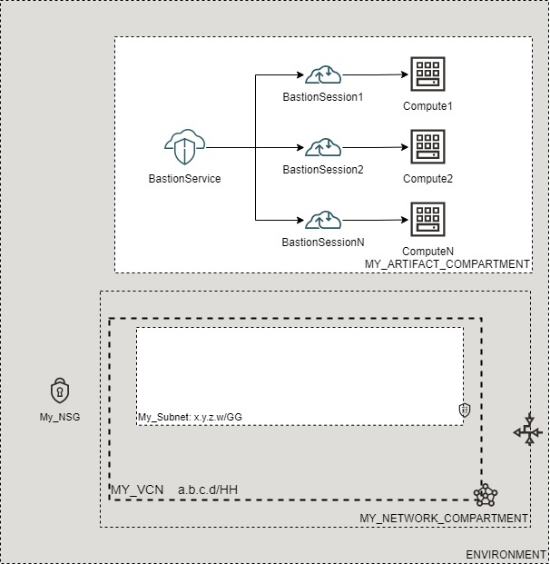

# OCI Cloud Bricks: Sample Bastion Service Deployment

[](https://img.shields.io/badge/license-UPL-green) [](https://sonarcloud.io/dashboard?id=oracle-devrel_terraform-oci-cloudbricks-examples)

## Introduction
The following system builds a Sample Bastion Service Deployment with Computes, a Bastion Service and Bastion Sessions to link them together.

**IMPORTANT**: Due to reliance on the Bastion Plugin, which is disabled by default on computes and takes time to start up, the provisioning of the service will almost definitely fail with the error: 

`To create a Managed SSH session, the Bastion plugin must be in the RUNNING state on the target instance, but the plugin is not running on ocid1.instance.oc1.re-region-1.aaaaaetcetcetcetcetcetc. Enable the Bastion plugin on the target instance before creating the session. `

This just requires you to wait 2-5 minutes after a fail, then apply can be re-run with no problems.



## Getting Started
For details in how the Oracle CloudBricks Framework works, refer to the [following file](../../../README.md)

### Prerequisites
- A Pre-Created Object Storage Bucket to store tfstate files
- a Pre-Installed Executor with CLI installed. For instructions in how to install CLI, go to the [following link](https://docs.oracle.com/en-us/iaas/Content/API/SDKDocs/cliinstall.htm)
- A Pre-Configured .oci/config file with API Keys. For details in how to do this step, go to the [following link](https://docs.oracle.com/en-us/iaas/Content/API/Concepts/apisigningkey.htm). File should look similar to this: 
  
```shell

[DEFAULT]
user=ocid1.user.oc1..aaaaaaaafoobarfoobarfoobar
fingerprint=9a:9e:13:cf:94:6e:2c:b9:54:D1:60:0d:e4:14:8b:5e
tenancy=ocid1.tenancy.oc1..aaaaaaaaoqdyfoobarfoobarfoobar
region=re-region-1
key_file=/full/path/to/api/key/my_api_key.pem

```

- A Pre-Configured .aws/credentials file with values from pre-created Customer Secret Keys. File should look similar to this: 
  
```shell
[default]
aws_access_key_id=202ad26f6546c71cc8990c821eece00a6b543ssa21231
aws_secret_access_key=xgYpRAiel5Yxrc9G67MGddaskjdhalsdiujlewiH3NxX4ZMe4=
```

For instructions in how to create Customer Secret Keys, go to the [following link](https://docs.oracle.com/en-us/iaas/Content/Identity/Tasks/managingcredentials.htm#To4)

---

## Components
The following system contains the following components: 

### [backend.tf](./backend.tf)

This file defines the S3 compatibility API integration to store .tfstate file into an OCI Bucket. It's content is the following: 

```go
terraform {
  backend "s3" {
    bucket   = "Precreated_bucket_to_store_tfstate_files_name"
    key      = "Samples/bastion-service.tfstate"
    region   = "re-region-1"
    endpoint = "https://Tenancy_ObjectStorage_namespace.compat.objectstorage.re-region-1.oraclecloud.com"

    skip_region_validation      = true
    skip_credentials_validation = true
    skip_metadata_api_check     = true
    force_path_style            = true
  }
}
```

*Considerations*

- The `bucket` variable, requires the display name of the bucket where tfstate files will be stored
- The `key` variable, supports a structure of your choice, by providing `/` as separators. Name of the file should always be `system_name.tfstate`
- The `region` variable contains the name id of the region where the system is being deployed at
- The `endpoint` variable contains the concatenation of the tenancy namespace and the region as depicted on above example. For instructions in how to determine the Tenancy Object Storage namespace, refer to the [following documentation](https://docs.oracle.com/en-us/iaas/Content/Object/Tasks/understandingnamespaces.htm)
- The rest of *variables* require to be set as is. **Do not change nor update these values**

---

### [datasource.tf](./datasource.tf)
This file defines the datasources required for internal tracking lookup on Open Source Project. Do not alter this file

---

### [main.tf](./main.tf) 
This file defines the main orchestration of module. The following structure is expected

```go
module "ModuleName" {

  source = "git::ssh://git@github.com/oracle-devrel/module.git?ref=v1.0.0"
  providers = {
    oci.home = oci.home
  }
  ######################################## PROVIDER SPECIFIC VARIABLES ######################################
  tenancy_ocid     = var.tenancy_ocid
  region           = var.region
  user_ocid        = var.user_ocid
  fingerprint      = var.fingerprint
  private_key_path = var.private_key_path
  ######################################## PROVIDER SPECIFIC VARIABLES ######################################
  ######################################## COMPARTMENT SPECIFIC VARIABLES ######################################
  module  = foo
  variables = bar
  here      = bar
  ######################################## COMPARTMENT SPECIFIC VARIABLES ######################################
}
```

*Considerations*
- Whereas needed, apply variable and module overloading
- For module specifics, refer to module documentation: 
  - [terraform-oci-cloudbricks-linux-compute](https://github.com/oracle-devrel/terraform-oci-cloudbricks-linux-compute/blob/main/README.md)
  - [terraform-oci-cloudbricks-bastionservice](https://github.com/oracle-devrel/terraform-oci-cloudbricks-bastionservice/blob/main/README.md)
  - [terraform-oci-cloudbricks-bastionservice-sessions](https://github.com/oracle-devrel/terraform-oci-cloudbricks-bastionservice-sessions/blob/main/README.md)
- For variable usage, refer to section *Variable Documentation*

---

### [output.tf](./output.tf)
The following file defines the output of system, for future forward integration use with Configuration Management Tools

---


### [README.md](./README.md)
This file

---

### [system.tfvars](./system.tfvars)
The following file defines the specific variables customized using variable overloading. Please refer to backend brick module documentation for details in how to fill.
For module specifics, refer to module documentation: 
  - [terraform-oci-cloudbricks-linux-compute](https://github.com/oracle-devrel/terraform-oci-cloudbricks-linux-compute/blob/main/README.md)
  - [terraform-oci-cloudbricks-bastionservice](https://github.com/oracle-devrel/terraform-oci-cloudbricks-bastionservice/blob/main/README.md)
  - [terraform-oci-cloudbricks-bastionservice-sessions](https://github.com/oracle-devrel/terraform-oci-cloudbricks-bastionservice-sessions/blob/main/README.md)
    - *Note1*: As this frontend deployment provisions the computes for you, compute OCIDs do not need to be specified in the `bastion_session01_bastion_session_compute_list` variable, as shown in [system.tfvars](./system.tfvars). 
    - *Note2*: Be sure to create the same amount of computes as entries given in the `bastion_session01_bastion_session_compute_list` variable. 

---

### [variables.tf](./variables.tf)
The following file defines all the variables used in this system. For details on it's content, refer to section *Variable Documentation*

---

## Variable Documentation
## Requirements

| Name | Version |
|------|---------|
| <a name="requirement_terraform"></a> [terraform](#requirement\_terraform) | >= 0.13.5 |
| <a name="requirement_oci"></a> [oci](#requirement\_oci) | >= 4.36.0 |

## Providers

| Name | Version |
|------|---------|
| <a name="provider_oci"></a> [oci](#provider\_oci) | 4.53.0 |

## Modules

| Name | Source | Version |
|------|--------|---------|
| <a name="module_bastion_service01"></a> [bastion\_service01](#module\_bastion\_service01) | git::ssh://git@github.com/oracle-devrel/terraform-oci-cloudbricks-bastionservice | v1.0.0 |
| <a name="module_bastion_session01"></a> [bastion\_session01](#module\_bastion\_session01) | git::ssh://git@github.com/oracle-devrel/terraform-oci-cloudbricks-bastionservice-sessions | v1.0.0 |
| <a name="module_compute01"></a> [compute01](#module\_compute01) | git::ssh://git@github.com/oracle-devrel/terraform-oci-cloudbricks-linux-compute | v1.0.2 |

## Resources

| Name | Type |
|------|------|
| [oci_identity_region_subscriptions.home_region_subscriptions](https://registry.terraform.io/providers/hashicorp/oci/latest/docs/data-sources/identity_region_subscriptions) | data source |

## Inputs

| Name | Description | Type | Default | Required |
|------|-------------|------|---------|:--------:|
| <a name="input_bastion_service01_allowed_client_cidr"></a> [bastion\_service01\_allowed\_client\_cidr](#input\_bastion\_service01\_allowed\_client\_cidr) | A list of address ranges in CIDR notation that you want to allow to connect to sessions hosted by this bastion | `list` | <pre>[<br>  "0.0.0.0/0"<br>]</pre> | no |
| <a name="input_bastion_service01_bastion_max_session_ttl_in_seconds"></a> [bastion\_service01\_bastion\_max\_session\_ttl\_in\_seconds](#input\_bastion\_service01\_bastion\_max\_session\_ttl\_in\_seconds) | The maximum TTL for a session initiated from the bastion | `number` | `3600` | no |
| <a name="input_bastion_service01_bastion_service_instance_compartment_name"></a> [bastion\_service01\_bastion\_service\_instance\_compartment\_name](#input\_bastion\_service01\_bastion\_service\_instance\_compartment\_name) | Defines the compartment name where the infrastructure will be created | `string` | `""` | no |
| <a name="input_bastion_service01_bastion_service_name"></a> [bastion\_service01\_bastion\_service\_name](#input\_bastion\_service01\_bastion\_service\_name) | Name of the Bastion Service | `string` | `"bastionservice"` | no |
| <a name="input_bastion_service01_bastion_service_network_compartment_name"></a> [bastion\_service01\_bastion\_service\_network\_compartment\_name](#input\_bastion\_service01\_bastion\_service\_network\_compartment\_name) | Defines the compartment where the Network is currently located | `string` | `""` | no |
| <a name="input_bastion_service01_bastion_service_type"></a> [bastion\_service01\_bastion\_service\_type](#input\_bastion\_service01\_bastion\_service\_type) | The type of bastion | `string` | `"STANDARD"` | no |
| <a name="input_bastion_service01_private_network_subnet_name"></a> [bastion\_service01\_private\_network\_subnet\_name](#input\_bastion\_service01\_private\_network\_subnet\_name) | Defines the subnet display name where this resource will be created at | `string` | `""` | no |
| <a name="input_bastion_service01_vcn_display_name"></a> [bastion\_service01\_vcn\_display\_name](#input\_bastion\_service01\_vcn\_display\_name) | VCN Display name to execute lookup | `string` | `""` | no |
| <a name="input_bastion_session01_bastion_service_instance_compartment_name"></a> [bastion\_session01\_bastion\_service\_instance\_compartment\_name](#input\_bastion\_session01\_bastion\_service\_instance\_compartment\_name) | Defines where the Bastion Service has already been provisioned | `any` | n/a | yes |
| <a name="input_bastion_session01_bastion_service_name"></a> [bastion\_session01\_bastion\_service\_name](#input\_bastion\_session01\_bastion\_service\_name) | Defines the Bastion Service name to attach the session to | `any` | n/a | yes |
| <a name="input_bastion_session01_bastion_session_compute_list"></a> [bastion\_session01\_bastion\_session\_compute\_list](#input\_bastion\_session01\_bastion\_session\_compute\_list) | A list of objects that contains the display name, id, type, ttl and either the username or port, depending on which session type is used. | `any` | n/a | yes |
| <a name="input_bastion_session01_ssh_public_key"></a> [bastion\_session01\_ssh\_public\_key](#input\_bastion\_session01\_ssh\_public\_key) | Defines SSH Public Key to be used for the Bastion Session | `any` | n/a | yes |
| <a name="input_compute01_assign_public_ip_flag"></a> [compute01\_assign\_public\_ip\_flag](#input\_compute01\_assign\_public\_ip\_flag) | Defines either machine will have or not a Public IP assigned. All Pvt networks this variable must be false | `bool` | `false` | no |
| <a name="input_compute01_bkp_policy_boot_volume"></a> [compute01\_bkp\_policy\_boot\_volume](#input\_compute01\_bkp\_policy\_boot\_volume) | Describes the backup policy attached to the boot volume | `string` | `"gold"` | no |
| <a name="input_compute01_compute_availability_domain_list"></a> [compute01\_compute\_availability\_domain\_list](#input\_compute01\_compute\_availability\_domain\_list) | Defines the availability domain list where OCI artifact will be created. This is a numeric value greater than 0 | `list(any)` | n/a | yes |
| <a name="input_compute01_compute_display_name_base"></a> [compute01\_compute\_display\_name\_base](#input\_compute01\_compute\_display\_name\_base) | Defines the compute and hostname Label for created compute | `any` | n/a | yes |
| <a name="input_compute01_compute_nsg_name"></a> [compute01\_compute\_nsg\_name](#input\_compute01\_compute\_nsg\_name) | Name of the NSG associated to the compute | `any` | n/a | yes |
| <a name="input_compute01_fault_domain_name"></a> [compute01\_fault\_domain\_name](#input\_compute01\_fault\_domain\_name) | Describes the fault domain to be used by machine | `list(any)` | <pre>[<br>  "FAULT-DOMAIN-1",<br>  "FAULT-DOMAIN-2",<br>  "FAULT-DOMAIN-3"<br>]</pre> | no |
| <a name="input_compute01_instance_image_ocid"></a> [compute01\_instance\_image\_ocid](#input\_compute01\_instance\_image\_ocid) | Defines the OCID for the OS image to be used on artifact creation. Extract OCID from: https://docs.cloud.oracle.com/iaas/images/ or designated custom image OCID created by packer | `any` | n/a | yes |
| <a name="input_compute01_instance_shape"></a> [compute01\_instance\_shape](#input\_compute01\_instance\_shape) | Defines the shape to be used on compute creation | `any` | n/a | yes |
| <a name="input_compute01_instance_shape_config_memory_in_gbs"></a> [compute01\_instance\_shape\_config\_memory\_in\_gbs](#input\_compute01\_instance\_shape\_config\_memory\_in\_gbs) | (Updatable) The total amount of memory available to the instance, in gigabytes. | `string` | `""` | no |
| <a name="input_compute01_instance_shape_config_ocpus"></a> [compute01\_instance\_shape\_config\_ocpus](#input\_compute01\_instance\_shape\_config\_ocpus) | (Updatable) The total number of OCPUs available to the instance. | `string` | `""` | no |
| <a name="input_compute01_is_flex_shape"></a> [compute01\_is\_flex\_shape](#input\_compute01\_is\_flex\_shape) | Boolean that describes if the shape is flex or not | `bool` | `false` | no |
| <a name="input_compute01_is_nsg_required"></a> [compute01\_is\_nsg\_required](#input\_compute01\_is\_nsg\_required) | Boolean that describes if an NSG is associated to the machine | `bool` | `false` | no |
| <a name="input_compute01_label_zs"></a> [compute01\_label\_zs](#input\_compute01\_label\_zs) | Auxiliary variable to concatenate with compute number | `list(any)` | <pre>[<br>  "0",<br>  ""<br>]</pre> | no |
| <a name="input_compute01_linux_compute_instance_compartment_name"></a> [compute01\_linux\_compute\_instance\_compartment\_name](#input\_compute01\_linux\_compute\_instance\_compartment\_name) | Defines the compartment name where the infrastructure will be created | `any` | n/a | yes |
| <a name="input_compute01_linux_compute_network_compartment_name"></a> [compute01\_linux\_compute\_network\_compartment\_name](#input\_compute01\_linux\_compute\_network\_compartment\_name) | Defines the compartment where the Network is currently located | `any` | n/a | yes |
| <a name="input_compute01_network_subnet_name"></a> [compute01\_network\_subnet\_name](#input\_compute01\_network\_subnet\_name) | Defines the subnet display name where this resource will be created at | `any` | n/a | yes |
| <a name="input_compute01_num_instances"></a> [compute01\_num\_instances](#input\_compute01\_num\_instances) | Amount of instances to create | `number` | `0` | no |
| <a name="input_compute01_primary_vnic_display_name"></a> [compute01\_primary\_vnic\_display\_name](#input\_compute01\_primary\_vnic\_display\_name) | Defines the Primary VNIC Display Name | `string` | `"primaryvnic"` | no |
| <a name="input_compute01_private_ip"></a> [compute01\_private\_ip](#input\_compute01\_private\_ip) | Describes the private IP required for machine | `any` | `null` | no |
| <a name="input_compute01_ssh_private_is_path"></a> [compute01\_ssh\_private\_is\_path](#input\_compute01\_ssh\_private\_is\_path) | Describes if SSH Private Key is located on file or inside code | `bool` | `false` | no |
| <a name="input_compute01_ssh_private_key"></a> [compute01\_ssh\_private\_key](#input\_compute01\_ssh\_private\_key) | Private key to log into machine | `any` | n/a | yes |
| <a name="input_compute01_ssh_public_is_path"></a> [compute01\_ssh\_public\_is\_path](#input\_compute01\_ssh\_public\_is\_path) | Describes if SSH Public Key is located on file or inside code | `bool` | `false` | no |
| <a name="input_compute01_ssh_public_key"></a> [compute01\_ssh\_public\_key](#input\_compute01\_ssh\_public\_key) | Defines SSH Public Key to be used in order to remotely connect to compute instance | `string` | n/a | yes |
| <a name="input_compute01_vcn_display_name"></a> [compute01\_vcn\_display\_name](#input\_compute01\_vcn\_display\_name) | VCN Display name to execute lookup | `any` | n/a | yes |
| <a name="input_fingerprint"></a> [fingerprint](#input\_fingerprint) | API Key Fingerprint for user\_ocid derived from public API Key imported in OCI User config | `any` | n/a | yes |
| <a name="input_private_key_path"></a> [private\_key\_path](#input\_private\_key\_path) | Private Key Absolute path location where terraform is executed | `any` | n/a | yes |
| <a name="input_region"></a> [region](#input\_region) | Target region where artifacts are going to be created | `any` | n/a | yes |
| <a name="input_tenancy_ocid"></a> [tenancy\_ocid](#input\_tenancy\_ocid) | OCID of tenancy | `any` | n/a | yes |
| <a name="input_user_ocid"></a> [user\_ocid](#input\_user\_ocid) | User OCID in tenancy | `any` | n/a | yes |

## Outputs

| Name | Description |
|------|-------------|
| <a name="output_BastionService"></a> [BastionService](#output\_BastionService) | The Bastion Service Details |
| <a name="output_BastionSessions"></a> [BastionSessions](#output\_BastionSessions) | A list of the provisioned Bastion Sessions |
| <a name="output_Computes"></a> [Computes](#output\_Computes) | A list of the provisioned computes |

## Contributing
This project is open source.  Please submit your contributions by forking this repository and submitting a pull request!  Oracle appreciates any contributions that are made by the open source community.

## License
Copyright (c) 2021 Oracle and/or its affiliates.

Licensed under the Universal Permissive License (UPL), Version 1.0.

See [LICENSE](LICENSE) for more details.