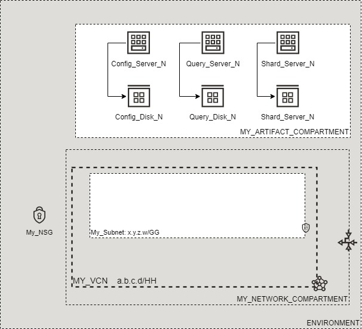

# OCI Cloud Bricks: Sample MongoDB Deployment

[](https://img.shields.io/badge/license-UPL-green) [](https://sonarcloud.io/dashboard?id=oracle-devrel_terraform-oci-cloudbricks-examples)

## Introduction
The following system builds a Sample MongoDB Database



## Getting Started
For details in how the Oracle CloudBricks Framework works, refer to the [following file](../../../README.md)

### Prerequisites
- A Pre-Created Object Storage Bucket to store tfstate files
- a Pre-Installed Executor with CLI installed. For instructions in how to install CLI, go to the [following link](https://docs.oracle.com/en-us/iaas/Content/API/SDKDocs/cliinstall.htm)
- A Pre-Configured .oci/config file with API Keys. For details in how to do this step, go to the [following link](https://docs.oracle.com/en-us/iaas/Content/API/Concepts/apisigningkey.htm). File should look similar to this: 
  
```shell

[DEFAULT]
user=ocid1.user.oc1..aaaaaaaafoobarfoobarfoobar
fingerprint=9a:9e:13:cf:94:6e:2c:b9:54:D1:60:0d:e4:14:8b:5e
tenancy=ocid1.tenancy.oc1..aaaaaaaaoqdyfoobarfoobarfoobar
region=re-region-1
key_file=/full/path/to/api/key/my_api_key.pem

```

- A Pre-Configured .aws/credentials file with values from pre-created Customer Secret Keys. File should look similar to this: 
  
```shell
[default]
aws_access_key_id=202ad26f6546c71cc8990c821eece00a6b543ssa21231
aws_secret_access_key=xgYpRAiel5Yxrc9G67MGddaskjdhalsdiujlewiH3NxX4ZMe4=
```

For instructions in how to create Customer Secret Keys, go to the [following link](https://docs.oracle.com/en-us/iaas/Content/Identity/Tasks/managingcredentials.htm#To4)

---

## Components
The following system contains the following components: 

### [backend.tf](./backend.tf)

This file defines the S3 compatibility API integration to store .tfstate file into an OCI Bucket. It's content is the following: 

```go
terraform {
  backend "s3" {
    bucket   = "Precreated_bucket_to_store_tfstate_files_name"
    key      = "Samples/mongodb.tfstate"
    region   = "re-region-1"
    endpoint = "https://Tenancy_ObjectStorage_namespace.compat.objectstorage.re-region-1.oraclecloud.com"

    skip_region_validation      = true
    skip_credentials_validation = true
    skip_metadata_api_check     = true
    force_path_style            = true
  }
}
```

*Considerations*

- The `bucket` variable, requires the display name of the bucket where tfstate files will be stored
- The `key` variable, supports a structure of your choice, by providing `/` as separators. Name of the file should always be `system_name.tfstate`
- The `region` variable contains the name id of the region where the system is being deployed at
- The `endpoint` variable contains the concatenation of the tenancy namespace and the region as depicted on above example. For instructions in how to determine the Tenancy Object Storage namespace, refer to the [following documentation](https://docs.oracle.com/en-us/iaas/Content/Object/Tasks/understandingnamespaces.htm)
- The rest of *variables* require to be set as is. **Do not change nor update these values**

---

### [datasource.tf](./datasource.tf)
This file defines the datasources required for internal tracking lookup on Open Source Project. Do not alter this file

---

### [main.tf](./main.tf) 
This file defines the main orchestration of module. The following structure is expected

```go
module "ModuleName" {

  source = "git::ssh://git@github.com/oracle-devrel/module.git?ref=v1.0.0"
  providers = {
    oci.home = oci.home
  }
  ######################################## PROVIDER SPECIFIC VARIABLES ######################################
  tenancy_ocid     = var.tenancy_ocid
  region           = var.region
  user_ocid        = var.user_ocid
  fingerprint      = var.fingerprint
  private_key_path = var.private_key_path
  ######################################## PROVIDER SPECIFIC VARIABLES ######################################
  ######################################## COMPARTMENT SPECIFIC VARIABLES ######################################
  module  = foo
  variables = bar
  here      = bar
  ######################################## COMPARTMENT SPECIFIC VARIABLES ######################################
}
```

*Considerations*
- Whereas needed, apply variable and module overloading
- For module specifics, refer to module documentation: 
  - [terraform-oci-cloudbricks-mongodb](https://github.com/oracle-devrel/terraform-oci-cloudbricks-mongodb/blob/main/README.md)
- For variable usage, refer to section *Variable Documentation*

---

### [output.tf](./output.tf)
The following file defines the output of system, for future forward integration use with Configuration Management Tools

---


### [README.md](./README.md)
This file

---

### [system.tfvars](./system.tfvars)
The following file defines the specific variables customized using variable overloading. Please refer to backend brick module documentation for details in how to fill.
For module specifics, refer to module documentation: 
  - [terraform-oci-cloudbricks-mongodb](https://github.com/oracle-devrel/terraform-oci-cloudbricks-mongodb/blob/main/README.md)

---

### [variables.tf](./variables.tf)
The following file defines all the variables used in this system. For details on it's content, refer to section *Variable Documentation*

---

## Variable Documentation
## Requirements

| Name | Version |
|------|---------|
| <a name="requirement_terraform"></a> [terraform](#requirement\_terraform) | >= 0.13.5 |
| <a name="requirement_oci"></a> [oci](#requirement\_oci) | >= 4.36.0 |

## Providers

| Name | Version |
|------|---------|
| <a name="provider_oci"></a> [oci](#provider\_oci) | 4.51.0 |

## Modules

| Name | Source | Version |
|------|--------|---------|
| <a name="module_mongodb01"></a> [mongodb01](#module\_mongodb01) | git::ssh://git@github.com/oracle-devrel/terraform-oci-cloudbricks-mongodb | v1.0.2 |

## Resources

| Name | Type |
|------|------|
| [oci_identity_region_subscriptions.home_region_subscriptions](https://registry.terraform.io/providers/hashicorp/oci/latest/docs/data-sources/identity_region_subscriptions) | data source |

## Inputs

| Name | Description | Type | Default | Required |
|------|-------------|------|---------|:--------:|
| <a name="input_fingerprint"></a> [fingerprint](#input\_fingerprint) | API Key Fingerprint for user\_ocid derived from public API Key imported in OCI User config | `any` | n/a | yes |
| <a name="input_mongodb01_compute_nsg_name"></a> [mongodb01\_compute\_nsg\_name](#input\_mongodb01\_compute\_nsg\_name) | Name of the NSG associated to the computes | `string` | `""` | no |
| <a name="input_mongodb01_config_backup_policy_level"></a> [mongodb01\_config\_backup\_policy\_level](#input\_mongodb01\_config\_backup\_policy\_level) | The backup policy of config server ISCSI disks | `any` | n/a | yes |
| <a name="input_mongodb01_config_disk_size_in_gb"></a> [mongodb01\_config\_disk\_size\_in\_gb](#input\_mongodb01\_config\_disk\_size\_in\_gb) | The size of the attached disk to the config server instances, stores logging data | `any` | n/a | yes |
| <a name="input_mongodb01_config_disk_vpus_per_gb"></a> [mongodb01\_config\_disk\_vpus\_per\_gb](#input\_mongodb01\_config\_disk\_vpus\_per\_gb) | The VPUS of the attached disk to the config server instances | `any` | n/a | yes |
| <a name="input_mongodb01_config_server_ad_list"></a> [mongodb01\_config\_server\_ad\_list](#input\_mongodb01\_config\_server\_ad\_list) | The availability domains to provision the config server instances in | `any` | n/a | yes |
| <a name="input_mongodb01_config_server_count"></a> [mongodb01\_config\_server\_count](#input\_mongodb01\_config\_server\_count) | The number of config server instances to provision | `any` | n/a | yes |
| <a name="input_mongodb01_config_server_fd_list"></a> [mongodb01\_config\_server\_fd\_list](#input\_mongodb01\_config\_server\_fd\_list) | The fault domains to provision the config server instances in | `any` | n/a | yes |
| <a name="input_mongodb01_config_server_is_flex_shape"></a> [mongodb01\_config\_server\_is\_flex\_shape](#input\_mongodb01\_config\_server\_is\_flex\_shape) | Boolean to determine if the config server instances are flex or not | `bool` | `false` | no |
| <a name="input_mongodb01_config_server_memory_in_gb"></a> [mongodb01\_config\_server\_memory\_in\_gb](#input\_mongodb01\_config\_server\_memory\_in\_gb) | The amount of memory in GB for the config server instances to use when flex shape is enabled | `string` | `""` | no |
| <a name="input_mongodb01_config_server_name"></a> [mongodb01\_config\_server\_name](#input\_mongodb01\_config\_server\_name) | The name given to the config server instances | `any` | n/a | yes |
| <a name="input_mongodb01_config_server_ocpus"></a> [mongodb01\_config\_server\_ocpus](#input\_mongodb01\_config\_server\_ocpus) | The number of OCPUS for the config server instances to use when flex shape is enabled | `string` | `""` | no |
| <a name="input_mongodb01_config_server_shape"></a> [mongodb01\_config\_server\_shape](#input\_mongodb01\_config\_server\_shape) | The shape for the config server instances to use | `any` | n/a | yes |
| <a name="input_mongodb01_database_backup_policy_level"></a> [mongodb01\_database\_backup\_policy\_level](#input\_mongodb01\_database\_backup\_policy\_level) | Backup policy level for Database ISCSI disks | `any` | n/a | yes |
| <a name="input_mongodb01_database_size_in_gb"></a> [mongodb01\_database\_size\_in\_gb](#input\_mongodb01\_database\_size\_in\_gb) | The size of the attached disk to the shard server instances, stores database data | `any` | n/a | yes |
| <a name="input_mongodb01_database_vpus_per_gb"></a> [mongodb01\_database\_vpus\_per\_gb](#input\_mongodb01\_database\_vpus\_per\_gb) | The VPUS of the attached disk to the shard server instances | `any` | n/a | yes |
| <a name="input_mongodb01_instance_backup_policy_level"></a> [mongodb01\_instance\_backup\_policy\_level](#input\_mongodb01\_instance\_backup\_policy\_level) | The backup policy of all instances boot volumes | `any` | n/a | yes |
| <a name="input_mongodb01_linux_compute_instance_compartment_name"></a> [mongodb01\_linux\_compute\_instance\_compartment\_name](#input\_mongodb01\_linux\_compute\_instance\_compartment\_name) | Defines the compartment name where the infrastructure will be created | `any` | n/a | yes |
| <a name="input_mongodb01_linux_compute_network_compartment_name"></a> [mongodb01\_linux\_compute\_network\_compartment\_name](#input\_mongodb01\_linux\_compute\_network\_compartment\_name) | Defines the compartment where the Network is currently located | `any` | n/a | yes |
| <a name="input_mongodb01_mongodb_version"></a> [mongodb01\_mongodb\_version](#input\_mongodb01\_mongodb\_version) | The version of MongoDB used in the setup | `any` | n/a | yes |
| <a name="input_mongodb01_private_network_subnet_name"></a> [mongodb01\_private\_network\_subnet\_name](#input\_mongodb01\_private\_network\_subnet\_name) | Defines the subnet display name where this resource will be created at | `any` | n/a | yes |
| <a name="input_mongodb01_query_backup_policy_level"></a> [mongodb01\_query\_backup\_policy\_level](#input\_mongodb01\_query\_backup\_policy\_level) | The backup policy of query server ISCSI disks | `any` | n/a | yes |
| <a name="input_mongodb01_query_disk_size_in_gb"></a> [mongodb01\_query\_disk\_size\_in\_gb](#input\_mongodb01\_query\_disk\_size\_in\_gb) | The size of the attached disk to the query server instances, stores logging data | `any` | n/a | yes |
| <a name="input_mongodb01_query_disk_vpus_per_gb"></a> [mongodb01\_query\_disk\_vpus\_per\_gb](#input\_mongodb01\_query\_disk\_vpus\_per\_gb) | The VPUS of the attached disk to the query server instances | `any` | n/a | yes |
| <a name="input_mongodb01_query_server_ad_list"></a> [mongodb01\_query\_server\_ad\_list](#input\_mongodb01\_query\_server\_ad\_list) | The availability domains to provision the query server instances in | `any` | n/a | yes |
| <a name="input_mongodb01_query_server_count"></a> [mongodb01\_query\_server\_count](#input\_mongodb01\_query\_server\_count) | The number of query server instances to provision | `any` | n/a | yes |
| <a name="input_mongodb01_query_server_fd_list"></a> [mongodb01\_query\_server\_fd\_list](#input\_mongodb01\_query\_server\_fd\_list) | The fault domains to provision the query server instances in | `any` | n/a | yes |
| <a name="input_mongodb01_query_server_is_flex_shape"></a> [mongodb01\_query\_server\_is\_flex\_shape](#input\_mongodb01\_query\_server\_is\_flex\_shape) | Boolean to determine if the query server instances are flex or not | `bool` | `false` | no |
| <a name="input_mongodb01_query_server_memory_in_gb"></a> [mongodb01\_query\_server\_memory\_in\_gb](#input\_mongodb01\_query\_server\_memory\_in\_gb) | The amount of memory in GB for the query server instances to use when flex shape is enabled | `string` | `""` | no |
| <a name="input_mongodb01_query_server_name"></a> [mongodb01\_query\_server\_name](#input\_mongodb01\_query\_server\_name) | The name given to the query server instances instance | `any` | n/a | yes |
| <a name="input_mongodb01_query_server_ocpus"></a> [mongodb01\_query\_server\_ocpus](#input\_mongodb01\_query\_server\_ocpus) | The number of OCPUS for the query server instances to use when flex shape is enabled | `string` | `""` | no |
| <a name="input_mongodb01_query_server_shape"></a> [mongodb01\_query\_server\_shape](#input\_mongodb01\_query\_server\_shape) | The shape for the query server instances to use | `any` | n/a | yes |
| <a name="input_mongodb01_shard_replica_set_ad_list"></a> [mongodb01\_shard\_replica\_set\_ad\_list](#input\_mongodb01\_shard\_replica\_set\_ad\_list) | The availability domains to provision the shard server instances in | `any` | n/a | yes |
| <a name="input_mongodb01_shard_replica_set_count"></a> [mongodb01\_shard\_replica\_set\_count](#input\_mongodb01\_shard\_replica\_set\_count) | The number of shard server instances to provision | `any` | n/a | yes |
| <a name="input_mongodb01_shard_replica_set_fd_list"></a> [mongodb01\_shard\_replica\_set\_fd\_list](#input\_mongodb01\_shard\_replica\_set\_fd\_list) | The fault domains to provision the shard server instances in | `any` | n/a | yes |
| <a name="input_mongodb01_shard_replica_set_is_flex_shape"></a> [mongodb01\_shard\_replica\_set\_is\_flex\_shape](#input\_mongodb01\_shard\_replica\_set\_is\_flex\_shape) | Boolean to determine if the shard server instances are flex or not | `bool` | `false` | no |
| <a name="input_mongodb01_shard_replica_set_memory_in_gb"></a> [mongodb01\_shard\_replica\_set\_memory\_in\_gb](#input\_mongodb01\_shard\_replica\_set\_memory\_in\_gb) | The amount of memory in GB for the shard server instances to use when flex shape is enabled | `string` | `""` | no |
| <a name="input_mongodb01_shard_replica_set_name"></a> [mongodb01\_shard\_replica\_set\_name](#input\_mongodb01\_shard\_replica\_set\_name) | The name given to the shard server instances | `any` | n/a | yes |
| <a name="input_mongodb01_shard_replica_set_ocpus"></a> [mongodb01\_shard\_replica\_set\_ocpus](#input\_mongodb01\_shard\_replica\_set\_ocpus) | The number of OCPUS for the shard server instances to use when flex shape is enabled | `string` | `""` | no |
| <a name="input_mongodb01_shard_replica_set_shape"></a> [mongodb01\_shard\_replica\_set\_shape](#input\_mongodb01\_shard\_replica\_set\_shape) | The shape for the shard server instances to use | `any` | n/a | yes |
| <a name="input_mongodb01_ssh_private_key"></a> [mongodb01\_ssh\_private\_key](#input\_mongodb01\_ssh\_private\_key) | Defines SSH Private Key to be used in order to remotely connect to compute instances | `any` | n/a | yes |
| <a name="input_mongodb01_ssh_public_key"></a> [mongodb01\_ssh\_public\_key](#input\_mongodb01\_ssh\_public\_key) | Defines SSH Public Key to be used in order to remotely connect to compute instances | `any` | n/a | yes |
| <a name="input_mongodb01_vcn_display_name"></a> [mongodb01\_vcn\_display\_name](#input\_mongodb01\_vcn\_display\_name) | VCN Display name to execute lookup | `any` | n/a | yes |
| <a name="input_private_key_path"></a> [private\_key\_path](#input\_private\_key\_path) | Private Key Absolute path location where terraform is executed | `any` | n/a | yes |
| <a name="input_region"></a> [region](#input\_region) | Target region where artifacts are going to be created | `any` | n/a | yes |
| <a name="input_tenancy_ocid"></a> [tenancy\_ocid](#input\_tenancy\_ocid) | OCID of tenancy | `any` | n/a | yes |
| <a name="input_user_ocid"></a> [user\_ocid](#input\_user\_ocid) | User OCID in tenancy. Currently hardcoded to user denny.alquinta@oracle.com | `any` | n/a | yes |

## Outputs

| Name | Description |
|------|-------------|
| <a name="output_ConfigNodes"></a> [ConfigNodes](#output\_ConfigNodes) | MongoDB Config Server Instances |
| <a name="output_QueryNodes"></a> [QueryNodes](#output\_QueryNodes) | MongoDB Query Server Instances |
| <a name="output_ShardNodes"></a> [ShardNodes](#output\_ShardNodes) | MongoDB Shard Server Instances |
---

## Contributing
This project is open source.  Please submit your contributions by forking this repository and submitting a pull request!  Oracle appreciates any contributions that are made by the open source community.

## License
Copyright (c) 2021 Oracle and/or its affiliates.

Licensed under the Universal Permissive License (UPL), Version 1.0.

See [LICENSE](LICENSE) for more details.