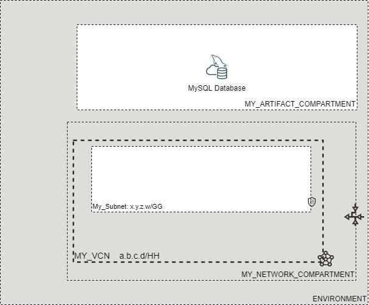

# OCI Cloud Bricks: Sample MySQL Database Deployment

[](https://img.shields.io/badge/license-UPL-green) [](https://sonarcloud.io/dashboard?id=oracle-devrel_terraform-oci-cloudbricks-examples)

## Introduction
The following system builds a Sample MySQL Database



## Getting Started
For details in how the Oracle CloudBricks Framework works, refer to the [following file](../../../README.md)

### Prerequisites
- A Pre-Created Object Storage Bucket to store tfstate files
- a Pre-Installed Executor with CLI installed. For instructions in how to install CLI, go to the [following link](https://docs.oracle.com/en-us/iaas/Content/API/SDKDocs/cliinstall.htm)
- A Pre-Configured .oci/config file with API Keys. For details in how to do this step, go to the [following link](https://docs.oracle.com/en-us/iaas/Content/API/Concepts/apisigningkey.htm). File should look similar to this: 
  
```shell

[DEFAULT]
user=ocid1.user.oc1..aaaaaaaafoobarfoobarfoobar
fingerprint=9a:9e:13:cf:94:6e:2c:b9:54:D1:60:0d:e4:14:8b:5e
tenancy=ocid1.tenancy.oc1..aaaaaaaaoqdyfoobarfoobarfoobar
region=re-region-1
key_file=/full/path/to/api/key/my_api_key.pem

```

- A Pre-Configured .aws/credentials file with values from pre-created Customer Secret Keys. File should look similar to this: 
  
```shell
[default]
aws_access_key_id=202ad26f6546c71cc8990c821eece00a6b543ssa21231
aws_secret_access_key=xgYpRAiel5Yxrc9G67MGddaskjdhalsdiujlewiH3NxX4ZMe4=
```

For instructions in how to create Customer Secret Keys, go to the [following link](https://docs.oracle.com/en-us/iaas/Content/Identity/Tasks/managingcredentials.htm#To4)

---

## Components
The following system contains the following components: 

### [backend.tf](./backend.tf)

This file defines the S3 compatibility API integration to store .tfstate file into an OCI Bucket. It's content is the following: 

```go
terraform {
  backend "s3" {
    bucket   = "Precreated_bucket_to_store_tfstate_files_name"
    key      = "Samples/mysql.tfstate"
    region   = "re-region-1"
    endpoint = "https://Tenancy_ObjectStorage_namespace.compat.objectstorage.re-region-1.oraclecloud.com"

    skip_region_validation      = true
    skip_credentials_validation = true
    skip_metadata_api_check     = true
    force_path_style            = true
  }
}
```

*Considerations*

- The `bucket` variable, requires the display name of the bucket where tfstate files will be stored
- The `key` variable, supports a structure of your choice, by providing `/` as separators. Name of the file should always be `system_name.tfstate`
- The `region` variable contains the name id of the region where the system is being deployed at
- The `endpoint` variable contains the concatenation of the tenancy namespace and the region as depicted on above example. For instructions in how to determine the Tenancy Object Storage namespace, refer to the [following documentation](https://docs.oracle.com/en-us/iaas/Content/Object/Tasks/understandingnamespaces.htm)
- The rest of *variables* require to be set as is. **Do not change nor update these values**

---

### [datasource.tf](./datasource.tf)
This file defines the datasources required for internal tracking lookup on Open Source Project. Do not alter this file

---

### [main.tf](./main.tf) 
This file defines the main orchestration of module. The following structure is expected

```go
module "ModuleName" {

  source = "git::ssh://git@github.com/oracle-devrel/module.git?ref=v1.0.0"
  providers = {
    oci.home = oci.home
  }
  ######################################## PROVIDER SPECIFIC VARIABLES ######################################
  tenancy_ocid     = var.tenancy_ocid
  region           = var.region
  user_ocid        = var.user_ocid
  fingerprint      = var.fingerprint
  private_key_path = var.private_key_path
  ######################################## PROVIDER SPECIFIC VARIABLES ######################################
  ######################################## COMPARTMENT SPECIFIC VARIABLES ######################################
  module  = foo
  variables = bar
  here      = bar
  ######################################## COMPARTMENT SPECIFIC VARIABLES ######################################
}
```

*Considerations*
- Whereas needed, apply variable and module overloading
- For module specifics, refer to module documentation: 
  - [terraform-oci-cloudbricks-mysql-database](https://github.com/oracle-devrel/terraform-oci-cloudbricks-mysql-database)
- For variable usage, refer to section *Variable Documentation*

---

### [output.tf](./output.tf)
The following file defines the output of system, for future forward integration use with Configuration Management Tools

---


### [README.md](./README.md)
This file

---

### [system.tfvars](./system.tfvars)
The following file defines the specific variables customized using variable overloading. Please refer to backend brick module documentation for details in how to fill.
For module specifics, refer to module documentation: 
  - [terraform-oci-cloudbricks-mysql-database](https://github.com/oracle-devrel/terraform-oci-cloudbricks-mysql-database/blob/main/README.md)

---

### [variables.tf](./variables.tf)
The following file defines all the variables used in this system. For details on it's content, refer to section *Variable Documentation*

---

## Variable Documentation
## Requirements

| Name | Version |
|------|---------|
| <a name="requirement_terraform"></a> [terraform](#requirement\_terraform) | >= 0.13.5 |
| <a name="requirement_oci"></a> [oci](#requirement\_oci) | >= 4.40 |

## Providers

| Name | Version |
|------|---------|
| <a name="provider_oci"></a> [oci](#provider\_oci) | 4.68.0 |

## Modules

| Name | Source | Version |
|------|--------|---------|
| <a name="module_mysql01"></a> [mysql01](#module\_mysql01) | git::ssh://git@github.com/oracle-devrel/terraform-oci-cloudbricks-mysql-database | v1.0.4.1 |

## Resources

| Name | Type |
|------|------|
| [oci_identity_region_subscriptions.home_region_subscriptions](https://registry.terraform.io/providers/hashicorp/oci/latest/docs/data-sources/identity_region_subscriptions) | data source |

## Inputs

| Name | Description | Type | Default | Required |
|------|-------------|------|---------|:--------:|
| <a name="input_fingerprint"></a> [fingerprint](#input\_fingerprint) | API Key Fingerprint for user\_ocid derived from public API Key imported in OCI User config | `any` | n/a | yes |
| <a name="input_mysql01_mysql_db_system_admin_password"></a> [mysql01\_mysql\_db\_system\_admin\_password](#input\_mysql01\_mysql\_db\_system\_admin\_password) | (Required) The password for the administrative user. The password must be between 8 and 32 characters long, and must contain at least 1 numeric character, 1 lowercase character, 1 uppercase character, and 1 special (nonalphanumeric) character. | `any` | n/a | yes |
| <a name="input_mysql01_mysql_db_system_admin_username"></a> [mysql01\_mysql\_db\_system\_admin\_username](#input\_mysql01\_mysql\_db\_system\_admin\_username) | (Required) The username for the administrative user. | `any` | n/a | yes |
| <a name="input_mysql01_mysql_db_system_availability_domain"></a> [mysql01\_mysql\_db\_system\_availability\_domain](#input\_mysql01\_mysql\_db\_system\_availability\_domain) | (Required) The availability domain on which to deploy the Read/Write endpoint. This defines the preferred primary instance. In a failover scenario, the Read/Write endpoint is redirected to one of the other availability domains and the MySQL instance in that domain is promoted to the primary instance. This redirection does not affect the IP address of the DB System in any way. For a standalone DB System, this defines the availability domain in which the DB System is placed. | `any` | n/a | yes |
| <a name="input_mysql01_mysql_db_system_backup_policy_is_enabled"></a> [mysql01\_mysql\_db\_system\_backup\_policy\_is\_enabled](#input\_mysql01\_mysql\_db\_system\_backup\_policy\_is\_enabled) | Boolean that defines if either backup is enabled or not | `bool` | `false` | no |
| <a name="input_mysql01_mysql_db_system_backup_policy_retention_in_days"></a> [mysql01\_mysql\_db\_system\_backup\_policy\_retention\_in\_days](#input\_mysql01\_mysql\_db\_system\_backup\_policy\_retention\_in\_days) | The number of days automated backups are retained. | `string` | `""` | no |
| <a name="input_mysql01_mysql_db_system_backup_policy_window_start_time"></a> [mysql01\_mysql\_db\_system\_backup\_policy\_window\_start\_time](#input\_mysql01\_mysql\_db\_system\_backup\_policy\_window\_start\_time) | The start of a 30-minute window of time in which daily, automated backups occur. This should be in the format of the Time portion of an RFC3339-formatted timestamp. Any second or sub-second time data will be truncated to zero. At some point in the window, the system may incur a brief service disruption as the backup is performed. | `string` | `""` | no |
| <a name="input_mysql01_mysql_db_system_data_storage_size_in_gb"></a> [mysql01\_mysql\_db\_system\_data\_storage\_size\_in\_gb](#input\_mysql01\_mysql\_db\_system\_data\_storage\_size\_in\_gb) | Initial size of the data volume in GiBs that will be created and attached. | `any` | n/a | yes |
| <a name="input_mysql01_mysql_db_system_defined_tags"></a> [mysql01\_mysql\_db\_system\_defined\_tags](#input\_mysql01\_mysql\_db\_system\_defined\_tags) | Defined tags for this resource. Each key is predefined and scoped to a namespace. | `map` | `{}` | no |
| <a name="input_mysql01_mysql_db_system_description"></a> [mysql01\_mysql\_db\_system\_description](#input\_mysql01\_mysql\_db\_system\_description) | User-provided data about the DB System. | `any` | n/a | yes |
| <a name="input_mysql01_mysql_db_system_display_name"></a> [mysql01\_mysql\_db\_system\_display\_name](#input\_mysql01\_mysql\_db\_system\_display\_name) | The user-friendly name for the DB System. It does not have to be unique. | `any` | n/a | yes |
| <a name="input_mysql01_mysql_db_system_fault_domain"></a> [mysql01\_mysql\_db\_system\_fault\_domain](#input\_mysql01\_mysql\_db\_system\_fault\_domain) | The fault domain on which to deploy the Read/Write endpoint. This defines the preferred primary instance. | `any` | n/a | yes |
| <a name="input_mysql01_mysql_db_system_freeform_tags"></a> [mysql01\_mysql\_db\_system\_freeform\_tags](#input\_mysql01\_mysql\_db\_system\_freeform\_tags) | Free-form tags for this resource. Each tag is a simple key-value pair with no predefined name, type, or namespace. | `map` | `{}` | no |
| <a name="input_mysql01_mysql_db_system_hostname_label"></a> [mysql01\_mysql\_db\_system\_hostname\_label](#input\_mysql01\_mysql\_db\_system\_hostname\_label) | The hostname for the primary endpoint of the DB System. Used for DNS. The value is the hostname portion of the primary private IP's fully qualified domain name (FQDN) (for example, dbsystem-1 in FQDN dbsystem-1.subnet123.vcn1.oraclevcn.com). Must be unique across all VNICs in the subnet and comply with RFC 952 and RFC 1123. | `any` | n/a | yes |
| <a name="input_mysql01_mysql_db_system_is_highly_available"></a> [mysql01\_mysql\_db\_system\_is\_highly\_available](#input\_mysql01\_mysql\_db\_system\_is\_highly\_available) | Boolean that describes if either HA is enabled or not | `bool` | `false` | no |
| <a name="input_mysql01_mysql_db_system_maintenance_window_start_time"></a> [mysql01\_mysql\_db\_system\_maintenance\_window\_start\_time](#input\_mysql01\_mysql\_db\_system\_maintenance\_window\_start\_time) | (Required) (Updatable) The start of the 2 hour maintenance window. This string is of the format: {day-of-week} {time-of-day}. {day-of-week} is a case-insensitive string like mon, tue, etc. {time-of-day} is the Time portion of an RFC3339-formatted timestamp. Any second or sub-second time data will be truncated to zero. | `any` | n/a | yes |
| <a name="input_mysql01_mysql_db_system_port"></a> [mysql01\_mysql\_db\_system\_port](#input\_mysql01\_mysql\_db\_system\_port) | (Optional) The port for primary endpoint of the DB System to listen on. | `string` | `"3306"` | no |
| <a name="input_mysql01_mysql_db_system_port_x"></a> [mysql01\_mysql\_db\_system\_port\_x](#input\_mysql01\_mysql\_db\_system\_port\_x) | (Optional) The TCP network port on which X Plugin listens for connections. This is the X Plugin equivalent of port. | `string` | `"33060"` | no |
| <a name="input_mysql01_mysql_heatwave_cluster_size"></a> [mysql01\_mysql\_heatwave\_cluster\_size](#input\_mysql01\_mysql\_heatwave\_cluster\_size) | Number of MySQL HeatWave nodes to be created | `number` | `2` | no |
| <a name="input_mysql01_mysql_heatwave_enabled"></a> [mysql01\_mysql\_heatwave\_enabled](#input\_mysql01\_mysql\_heatwave\_enabled) | Defines whether a MySQL HeatWave cluster is enabled | `bool` | `false` | no |
| <a name="input_mysql01_mysql_heatwave_shape"></a> [mysql01\_mysql\_heatwave\_shape](#input\_mysql01\_mysql\_heatwave\_shape) | The shape to be used instead of mysql01\_mysql\_shape\_name when mysql01\_mysql\_heatwave\_enabled = true. | `string` | `"MySQL.HeatWave.VM.Standard.E3"` | no |
| <a name="input_mysql01_mysql_instance_compartment_name"></a> [mysql01\_mysql\_instance\_compartment\_name](#input\_mysql01\_mysql\_instance\_compartment\_name) | Compartment where MySQL Instance will be created | `string` | `""` | no |
| <a name="input_mysql01_mysql_instance_compartment_ocid"></a> [mysql01\_mysql\_instance\_compartment\_ocid](#input\_mysql01\_mysql\_instance\_compartment\_ocid) | OCID of the compartment where MySQL Instance will be created. Use alternatively to mysql01\_mysql\_instance\_compartment\_name | `string` | `""` | no |
| <a name="input_mysql01_mysql_network_compartment_name"></a> [mysql01\_mysql\_network\_compartment\_name](#input\_mysql01\_mysql\_network\_compartment\_name) | Compartment where the network of MySQL artifact is | `string` | `""` | no |
| <a name="input_mysql01_mysql_network_compartment_ocid"></a> [mysql01\_mysql\_network\_compartment\_ocid](#input\_mysql01\_mysql\_network\_compartment\_ocid) | OCID of the compartment where the network of MySQL artifact is. Use alternatively to mysql01\_mysql\_network\_compartment\_name | `string` | `""` | no |
| <a name="input_mysql01_mysql_shape_name"></a> [mysql01\_mysql\_shape\_name](#input\_mysql01\_mysql\_shape\_name) | (Required) The name of the shape. The shape determines the resources allocated. CPU cores and memory for VM shapes; CPU cores, memory and storage for non-VM (or bare metal) shapes. To get a list of shapes, use the ListShapes operation. | `string` | `"MySQL.VM.Standard.E3.1.8GB"` | no |
| <a name="input_mysql01_network_subnet_name"></a> [mysql01\_network\_subnet\_name](#input\_mysql01\_network\_subnet\_name) | Defines the subnet display name where this resource will be created at | `string` | `""` | no |
| <a name="input_mysql01_subnet_id"></a> [mysql01\_subnet\_id](#input\_mysql01\_subnet\_id) | Subnet OCID. Use alternatively to network\_subnet\_name | `string` | `""` | no |
| <a name="input_mysql01_vcn_display_name"></a> [mysql01\_vcn\_display\_name](#input\_mysql01\_vcn\_display\_name) | VCN Display name to execute lookup | `string` | `""` | no |
| <a name="input_private_key_path"></a> [private\_key\_path](#input\_private\_key\_path) | Private Key Absolute path location where terraform is executed | `any` | n/a | yes |
| <a name="input_region"></a> [region](#input\_region) | Target region where artifacts are going to be created | `any` | n/a | yes |
| <a name="input_tenancy_ocid"></a> [tenancy\_ocid](#input\_tenancy\_ocid) | OCID of tenancy | `any` | n/a | yes |
| <a name="input_user_ocid"></a> [user\_ocid](#input\_user\_ocid) | User OCID in tenancy. | `any` | n/a | yes |

## Outputs

| Name | Description |
|------|-------------|
| <a name="output_mysql"></a> [mysql](#output\_mysql) | Instance of MySQL database |

## Contributing
This project is open source.  Please submit your contributions by forking this repository and submitting a pull request!  Oracle appreciates any contributions that are made by the open source community.

## License
Copyright (c) 2022 Oracle and/or its affiliates.

Licensed under the Universal Permissive License (UPL), Version 1.0.

See [LICENSE](LICENSE) for more details.
