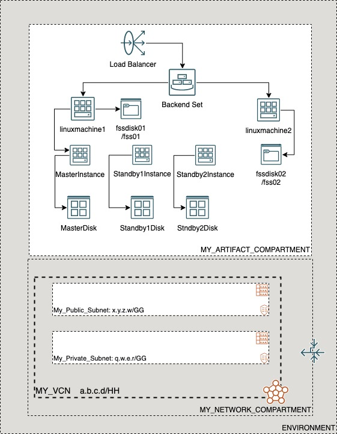

# OCI Cloud Bricks: Multiple Sample Django instances with a File Sotorage System, Load Balancer, and postgreSQL Database

[](https://img.shields.io/badge/license-UPL-green) [](https://sonarcloud.io/dashboard?id=oracle-devrel_terraform-oci-cloudbricks-examples)

## Introduction
The following system builds multiple Sample linux computes with a File Storage System, Load Balancer and a postgreSQL Database with the following reference architecture. Please note that a pre-set mount target is expected for this example to work. 



## Getting Started
For details in how the Oracle CloudBricks Framework works, refer to the [following file](../../../README.md)

### Prerequisites
- A Pre-Created Object Storage Bucket to store tfstate files
- a Pre-Installed Executor with CLI installed. For instructions in how to install CLI, go to the [following link](https://docs.oracle.com/en-us/iaas/Content/API/SDKDocs/cliinstall.htm)
- A Pre-Configured .oci/config file with API Keys. For details in how to do this step, go to the [following link](https://docs.oracle.com/en-us/iaas/Content/API/Concepts/apisigningkey.htm). File should look similar to this: 
  
```shell

[DEFAULT]
user=ocid1.user.oc1..aaaaaaaafoobarfoobarfoobar
fingerprint=9a:9e:13:cf:94:6e:2c:b9:54:D1:60:0d:e4:14:8b:5e
tenancy=ocid1.tenancy.oc1..aaaaaaaaoqdyfoobarfoobarfoobar
region=re-region-1
key_file=/full/path/to/api/key/my_api_key.pem

```

- A Pre-Configured .aws/credentials file with values from pre-created Customer Secret Keys. File should look similar to this: 
  
```shell
[default]
aws_access_key_id=202ad26f6546c71cc8990c821eece00a6b543ssa21231
aws_secret_access_key=xgYpRAiel5Yxrc9G67MGddaskjdhalsdiujlewiH3NxX4ZMe4=
```

For instructions in how to create Customer Secret Keys, go to the [following link](https://docs.oracle.com/en-us/iaas/Content/Identity/Tasks/managingcredentials.htm#To4)

---

## Components
The following system contains the following components: 

### [backend.tf](./backend.tf)

This file defines the S3 compatibility API integration to store .tfstate file into an OCI Bucket. It's content is the following: 

```go
terraform {
  backend "s3" {
    bucket   = "Precreated_bucket_to_store_tfstate_files_name"
    key      = "Samples/sample_hub_spoke_compartment_with_parent.tfstate"
    region   = "re-region-1"
    endpoint = "https://Tenancy_ObjectStorage_namespace.compat.objectstorage.re-region-1.oraclecloud.com"

    skip_region_validation      = true
    skip_credentials_validation = true
    skip_metadata_api_check     = true
    force_path_style            = true
  }
}
```

*Considerations*

- The `bucket` variable, requires the display name of the bucket where tfstate files will be stored
- The `key` variable, supports a structure of your choice, by providing `/`as separators. Name of the file should always be `system_name.tfstate`
- The `region` variable contains the name id of the region where the system is being deployed at
- The `endpoint` variable contains the concatenation of the tenancy namespace and the region as depicted on above example. For instructions in how to determine the Tenancy Object Storage namespace, refer to the [following documentation](https://docs.oracle.com/en-us/iaas/Content/Object/Tasks/understandingnamespaces.htm)
- The rest of *variables* require to be set as is. **Do not change nor update these values**

---

### [datasource.tf](./datasource.tf)
This file defines the datasources required for internal tracking lookup on Open Source Project. Do not alter this file

---

### [main.tf](./main.tf) 
This file defines the main orchestration of module. The following structure is expected

```go
module "ModuleName" {

  source = "git::ssh://git@github.com/oracle-devrel/module.git?ref=v1.0.0"
  providers = {
    oci.home = oci.home
  }
  ######################################## PROVIDER SPECIFIC VARIABLES ######################################
  tenancy_ocid     = var.tenancy_ocid
  region           = var.region
  user_ocid        = var.user_ocid
  fingerprint      = var.fingerprint
  private_key_path = var.private_key_path
  ######################################## PROVIDER SPECIFIC VARIABLES ######################################
  ######################################## COMPARTMENT SPECIFIC VARIABLES ######################################
  module  = foo
  variables = bar
  here      = bar
  ######################################## COMPARTMENT SPECIFIC VARIABLES ######################################
}
```

*Considerations*
- Whereas needed, apply variable and module overloading
- For module specifics, refer to module documentation: 
  - [terraform-oci-cloudbricks-linux-compute](https://github.com/oracle-devrel/terraform-oci-cloudbricks-linux-compute/blob/main/README.md)
  - [terraform-oci-cloudbricks-linux-fss](https://github.com/oracle-devrel/terraform-oci-cloudbricks-linux-fss/blob/main/README.md)
  - [terraform-oci-cloudbricks-postgresql](https://github.com/oracle-devrel/terraform-oci-cloudbricks-postgresql/blob/main/README.md)
  - [terraform-oci-cloudbricks-remote-linux-executor](https://github.com/oracle-devrel/terraform-oci-cloudbricks-remote-linux-executor/blob/main/README.md)
  - [terraform-oci-cloudbricks-lbaas](https://github.com/oracle-devrel/terraform-oci-cloudbricks-lbaas/blob/main/README.md)
  - [terraform-oci-cloudbricks-lbaas-bes-single](https://github.com/oracle-devrel/terraform-oci-cloudbricks-lbaas-bes-single/blob/main/README.md)
- For variable usage, refer to section *Variable Documentation*

---

### [output.tf](./output.tf)
The following file defines the output of system, for future forward integration use with Configuration Management Tools

---


### [README.md](./README.md)
This file

---

### [system.tfvars](./system.tfvars)
The following file defines the specific variables customized using variable overloading. Please refer to backend brick module documentation for details in how to fill.
For module specifics, refer to module documentation: 
  - [terraform-oci-cloudbricks-linux-compute](https://github.com/oracle-devrel/terraform-oci-cloudbricks-linux-compute/blob/main/README.md)
  - [terraform-oci-cloudbricks-linux-fss](https://github.com/oracle-devrel/terraform-oci-cloudbricks-linux-fss/blob/main/README.md)
  - [terraform-oci-cloudbricks-postgresql](https://github.com/oracle-devrel/terraform-oci-cloudbricks-postgresql/blob/main/README.md)
  - [terraform-oci-cloudbricks-remote-linux-executor](https://github.com/oracle-devrel/terraform-oci-cloudbricks-remote-linux-executor/blob/main/README.md)
  - [terraform-oci-cloudbricks-lbaas](https://github.com/oracle-devrel/terraform-oci-cloudbricks-lbaas/blob/main/README.md)
  - [terraform-oci-cloudbricks-lbaas-bes-single](https://github.com/oracle-devrel/terraform-oci-cloudbricks-lbaas-bes-single/blob/main/README.md)


---


### [variables.tf](./variables.tf)
The following file defines all the variables used in this system. For details on it's content, refer to section *Variable Documentation*

---
## Variable Documentation
## Requirements

| Name | Version |
|------|---------|
| <a name="requirement_terraform"></a> [terraform](#requirement\_terraform) | >= 0.13.5 |
| <a name="requirement_oci"></a> [oci](#requirement\_oci) | >= 4.36.0 |

## Providers

| Name | Version |
|------|---------|
| <a name="provider_oci"></a> [oci](#provider\_oci) | 4.68.0 |

## Modules

| Name | Source | Version |
|------|--------|---------|
| <a name="module_backendset01"></a> [backendset01](#module\_backendset01) | git::ssh://git@github.com/oracle-devrel/terraform-oci-cloudbricks-lbaas-bes-single.git | v1.0.0 |
| <a name="module_djangoconfig01"></a> [djangoconfig01](#module\_djangoconfig01) | git::ssh://git@github.com/oracle-devrel/terraform-oci-cloudbricks-remote-linux-executor.git | v1.0.0 |
| <a name="module_fssdisk01"></a> [fssdisk01](#module\_fssdisk01) | git::ssh://git@github.com/oracle-devrel/terraform-oci-cloudbricks-fss.git | v1.0.0 |
| <a name="module_instance01"></a> [instance01](#module\_instance01) | git::ssh://git@github.com/oracle-devrel/terraform-oci-cloudbricks-linux-compute.git | v1.0.2 |
| <a name="module_loadbalancer01"></a> [loadbalancer01](#module\_loadbalancer01) | git::ssh://git@github.com/oracle-devrel/terraform-oci-cloudbricks-lbaas.git | v1.0.0 |
| <a name="module_postgre01"></a> [postgre01](#module\_postgre01) | git::ssh://git@github.com/oracle-devrel/terraform-oci-cloudbricks-postgresql | v1.0.6 |

## Resources

| Name | Type |
|------|------|
| [oci_identity_region_subscriptions.home_region_subscriptions](https://registry.terraform.io/providers/hashicorp/oci/latest/docs/data-sources/identity_region_subscriptions) | data source |

## Inputs

| Name | Description | Type | Default | Required |
|------|-------------|------|---------|:--------:|
| <a name="input_backendset01_backend_port"></a> [backendset01\_backend\_port](#input\_backendset01\_backend\_port) | The port used to interact with the backend instances | `any` | n/a | yes |
| <a name="input_backendset01_backend_set_is_preserve_source"></a> [backendset01\_backend\_set\_is\_preserve\_source](#input\_backendset01\_backend\_set\_is\_preserve\_source) | If this optional parameter is enabled, then the network load balancer preserves the source IP of the packet when it is forwarded to backends. Backends see the original source IP. If the isPreserveSourceDestination parameter is enabled for the network load balancer resource, then this parameter cannot be disabled. The value is true by default. | `bool` | `false` | no |
| <a name="input_backendset01_backend_set_name"></a> [backendset01\_backend\_set\_name](#input\_backendset01\_backend\_set\_name) | LBaaS Backend Set Name to be provided on provisioning time | `any` | n/a | yes |
| <a name="input_backendset01_balanced_artifact"></a> [backendset01\_balanced\_artifact](#input\_backendset01\_balanced\_artifact) | Integration variable which encapsulates any generic resource that may be balanced by this LBaaS | `string` | `""` | no |
| <a name="input_backendset01_certificate_name"></a> [backendset01\_certificate\_name](#input\_backendset01\_certificate\_name) | A friendly name for the certificate bundle. It must be unique and it cannot be changed. Valid certificate bundle names include only alphanumeric characters, dashes, and underscores. Certificate bundle names cannot contain spaces. Avoid entering confidential information. | `string` | `""` | no |
| <a name="input_backendset01_certificate_passphrase"></a> [backendset01\_certificate\_passphrase](#input\_backendset01\_certificate\_passphrase) | A passphrase for encrypted private keys. This is needed only if you created your certificate with a passphrase. | `string` | `""` | no |
| <a name="input_backendset01_certificate_private_key"></a> [backendset01\_certificate\_private\_key](#input\_backendset01\_certificate\_private\_key) | The SSL private key for your certificate, in PEM format. | `string` | `""` | no |
| <a name="input_backendset01_check_protocol"></a> [backendset01\_check\_protocol](#input\_backendset01\_check\_protocol) | Protocol to be used on healthcheck | `any` | n/a | yes |
| <a name="input_backendset01_checkport"></a> [backendset01\_checkport](#input\_backendset01\_checkport) | Port where the healthcheck will be performed | `any` | n/a | yes |
| <a name="input_backendset01_is_app_bes"></a> [backendset01\_is\_app\_bes](#input\_backendset01\_is\_app\_bes) | Boolean that determines if an application backend set should be provisioned or not | `bool` | `false` | no |
| <a name="input_backendset01_is_instancepool_bes"></a> [backendset01\_is\_instancepool\_bes](#input\_backendset01\_is\_instancepool\_bes) | Boolean that determines if an instancepool backend set should be provisioned or not | `bool` | `false` | no |
| <a name="input_backendset01_is_network_bes"></a> [backendset01\_is\_network\_bes](#input\_backendset01\_is\_network\_bes) | Boolean that determines if a network backend set should be provisioned or not | `bool` | `false` | no |
| <a name="input_backendset01_lbaas_bes_single_instance_compartment_name"></a> [backendset01\_lbaas\_bes\_single\_instance\_compartment\_name](#input\_backendset01\_lbaas\_bes\_single\_instance\_compartment\_name) | LBaaS Backend Set Artifact Compartment Location | `any` | n/a | yes |
| <a name="input_backendset01_lbaas_bes_single_network_compartment_name"></a> [backendset01\_lbaas\_bes\_single\_network\_compartment\_name](#input\_backendset01\_lbaas\_bes\_single\_network\_compartment\_name) | LBaaS Backend Set Network Compartment Location | `any` | n/a | yes |
| <a name="input_backendset01_lbaas_ca_cert"></a> [backendset01\_lbaas\_ca\_cert](#input\_backendset01\_lbaas\_ca\_cert) | The Certificate Authority certificate, or any interim certificate, that you received from your SSL certificate provider. | `string` | `""` | no |
| <a name="input_backendset01_lbaas_cert_is_path"></a> [backendset01\_lbaas\_cert\_is\_path](#input\_backendset01\_lbaas\_cert\_is\_path) | Describes if LbaaS certificate is located on file or inside code | `bool` | `true` | no |
| <a name="input_backendset01_lbaas_policy"></a> [backendset01\_lbaas\_policy](#input\_backendset01\_lbaas\_policy) | Load balancing policy chosen | `any` | n/a | yes |
| <a name="input_backendset01_lbaas_pub_cert_is_path"></a> [backendset01\_lbaas\_pub\_cert\_is\_path](#input\_backendset01\_lbaas\_pub\_cert\_is\_path) | Describes if LbaaS public certificate is located on file or inside code | `bool` | `true` | no |
| <a name="input_backendset01_lbaas_public_cert"></a> [backendset01\_lbaas\_public\_cert](#input\_backendset01\_lbaas\_public\_cert) | The SSL public certificate, in PEM format. | `string` | `""` | no |
| <a name="input_backendset01_lbaas_pvt_key_is_path"></a> [backendset01\_lbaas\_pvt\_key\_is\_path](#input\_backendset01\_lbaas\_pvt\_key\_is\_path) | Describes if LbaaS certificate private key is located on file or inside code | `bool` | `true` | no |
| <a name="input_backendset01_listen_port"></a> [backendset01\_listen\_port](#input\_backendset01\_listen\_port) | Port where listener will receive communication | `string` | `""` | no |
| <a name="input_backendset01_listen_protocol"></a> [backendset01\_listen\_protocol](#input\_backendset01\_listen\_protocol) | Protocol where Listener will receive communication | `string` | `""` | no |
| <a name="input_backendset01_listener_name"></a> [backendset01\_listener\_name](#input\_backendset01\_listener\_name) | Name of the listener attached to the backend LBaaS and points to backends | `string` | `""` | no |
| <a name="input_backendset01_network_subnet_name"></a> [backendset01\_network\_subnet\_name](#input\_backendset01\_network\_subnet\_name) | Defines the subnet display name where this resource will be created at | `any` | n/a | yes |
| <a name="input_backendset01_routing_policy_actions_name"></a> [backendset01\_routing\_policy\_actions\_name](#input\_backendset01\_routing\_policy\_actions\_name) | Actions to take place when conditons are met | `string` | `""` | no |
| <a name="input_backendset01_routing_policy_condition_language_version"></a> [backendset01\_routing\_policy\_condition\_language\_version](#input\_backendset01\_routing\_policy\_condition\_language\_version) | Version used to parse routing policy language | `string` | `""` | no |
| <a name="input_backendset01_routing_policy_conditions"></a> [backendset01\_routing\_policy\_conditions](#input\_backendset01\_routing\_policy\_conditions) | Map of routing policy rule names to routing policy conditions | `string` | `""` | no |
| <a name="input_backendset01_routing_policy_name"></a> [backendset01\_routing\_policy\_name](#input\_backendset01\_routing\_policy\_name) | Routing Policy name to be provided when provisioning | `string` | `""` | no |
| <a name="input_backendset01_session_persistance_cookie_name"></a> [backendset01\_session\_persistance\_cookie\_name](#input\_backendset01\_session\_persistance\_cookie\_name) | Name of the cookie related to maintain session persistance for balanced application | `string` | `""` | no |
| <a name="input_backendset01_vcn_display_name"></a> [backendset01\_vcn\_display\_name](#input\_backendset01\_vcn\_display\_name) | VCN Display name to execute lookup | `any` | n/a | yes |
| <a name="input_backendset01_verify_peer_certificate"></a> [backendset01\_verify\_peer\_certificate](#input\_backendset01\_verify\_peer\_certificate) | Whether the load balancer listener should verify peer certificates | `bool` | `false` | no |
| <a name="input_djangoconfig01_script_args"></a> [djangoconfig01\_script\_args](#input\_djangoconfig01\_script\_args) | Arguments that are passed on to the script | `any` | `null` | no |
| <a name="input_djangoconfig01_script_name"></a> [djangoconfig01\_script\_name](#input\_djangoconfig01\_script\_name) | Name of .sh script | `string` | `"script.sh"` | no |
| <a name="input_djangoconfig01_ssh_private_is_path"></a> [djangoconfig01\_ssh\_private\_is\_path](#input\_djangoconfig01\_ssh\_private\_is\_path) | Describes if SSH Private Key is located on file or inside code | `bool` | `false` | no |
| <a name="input_djangoconfig01_ssh_private_key"></a> [djangoconfig01\_ssh\_private\_key](#input\_djangoconfig01\_ssh\_private\_key) | Private key to log into machine | `any` | n/a | yes |
| <a name="input_djangoconfig01_ssh_public_is_path"></a> [djangoconfig01\_ssh\_public\_is\_path](#input\_djangoconfig01\_ssh\_public\_is\_path) | Describes if SSH Public Key is located on file or inside code | `bool` | `false` | no |
| <a name="input_djangoconfig01_ssh_public_key"></a> [djangoconfig01\_ssh\_public\_key](#input\_djangoconfig01\_ssh\_public\_key) | Defines SSH Public Key to be used in order to remotely connect to compute instance | `string` | n/a | yes |
| <a name="input_fingerprint"></a> [fingerprint](#input\_fingerprint) | API Key Fingerprint for user\_ocid derived from public API Key imported in OCI User config | `any` | n/a | yes |
| <a name="input_fssdisk01_disk_unit"></a> [fssdisk01\_disk\_unit](#input\_fssdisk01\_disk\_unit) | Disk Unit Assigned to NFS Disk | `string` | `""` | no |
| <a name="input_fssdisk01_export_path_base"></a> [fssdisk01\_export\_path\_base](#input\_fssdisk01\_export\_path\_base) | Export path for File Storage Service | `any` | n/a | yes |
| <a name="input_fssdisk01_fss_display_name_base"></a> [fssdisk01\_fss\_display\_name\_base](#input\_fssdisk01\_fss\_display\_name\_base) | User friendly name for File Storage Service | `any` | n/a | yes |
| <a name="input_fssdisk01_fss_instance_compartment_id"></a> [fssdisk01\_fss\_instance\_compartment\_id](#input\_fssdisk01\_fss\_instance\_compartment\_id) | Defines the compartment OCID where the infrastructure will be created | `string` | `""` | no |
| <a name="input_fssdisk01_fss_instance_compartment_name"></a> [fssdisk01\_fss\_instance\_compartment\_name](#input\_fssdisk01\_fss\_instance\_compartment\_name) | Defines the compartment name where the infrastructure will be created | `string` | `""` | no |
| <a name="input_fssdisk01_fss_mount_target_availability_domain"></a> [fssdisk01\_fss\_mount\_target\_availability\_domain](#input\_fssdisk01\_fss\_mount\_target\_availability\_domain) | Availability domain where the mount target is located at | `any` | n/a | yes |
| <a name="input_fssdisk01_fss_mount_target_name"></a> [fssdisk01\_fss\_mount\_target\_name](#input\_fssdisk01\_fss\_mount\_target\_name) | User friendly name for Mount Target | `any` | n/a | yes |
| <a name="input_fssdisk01_fss_network_compartment_name"></a> [fssdisk01\_fss\_network\_compartment\_name](#input\_fssdisk01\_fss\_network\_compartment\_name) | Defines the compartment where the Network is currently located | `any` | n/a | yes |
| <a name="input_fssdisk01_is_winrm_configured_for_image"></a> [fssdisk01\_is\_winrm\_configured\_for\_image](#input\_fssdisk01\_is\_winrm\_configured\_for\_image) | Defines if winrm is being used in this installation | `bool` | `true` | no |
| <a name="input_fssdisk01_is_winrm_configured_with_ssl"></a> [fssdisk01\_is\_winrm\_configured\_with\_ssl](#input\_fssdisk01\_is\_winrm\_configured\_with\_ssl) | Use the https 5986 port for winrm by default. If that fails with a http response error: 401 - invalid content type, the SSL may not be configured correctly | `bool` | `true` | no |
| <a name="input_fssdisk01_label_zs"></a> [fssdisk01\_label\_zs](#input\_fssdisk01\_label\_zs) | n/a | `list(any)` | <pre>[<br>  "0",<br>  ""<br>]</pre> | no |
| <a name="input_fssdisk01_mt_compartment_id"></a> [fssdisk01\_mt\_compartment\_id](#input\_fssdisk01\_mt\_compartment\_id) | Mount Target Compartment Location OCID | `string` | `""` | no |
| <a name="input_fssdisk01_mt_compartment_name"></a> [fssdisk01\_mt\_compartment\_name](#input\_fssdisk01\_mt\_compartment\_name) | Mount Target Compartment Location | `string` | `""` | no |
| <a name="input_fssdisk01_network_subnet_name"></a> [fssdisk01\_network\_subnet\_name](#input\_fssdisk01\_network\_subnet\_name) | Name of the subnet where the artifact is located | `any` | n/a | yes |
| <a name="input_fssdisk01_num_of_fss"></a> [fssdisk01\_num\_of\_fss](#input\_fssdisk01\_num\_of\_fss) | Amount of FSS that will be created | `any` | n/a | yes |
| <a name="input_fssdisk01_os_type"></a> [fssdisk01\_os\_type](#input\_fssdisk01\_os\_type) | Describes the type of OS currently in place. Valid values are: linux, ubuntu, windows | `string` | n/a | yes |
| <a name="input_fssdisk01_ssh_private_is_path"></a> [fssdisk01\_ssh\_private\_is\_path](#input\_fssdisk01\_ssh\_private\_is\_path) | Determines if key is supposed to be on file or in text | `bool` | `true` | no |
| <a name="input_fssdisk01_ssh_private_key"></a> [fssdisk01\_ssh\_private\_key](#input\_fssdisk01\_ssh\_private\_key) | Determines what is the private key to connect to machine | `string` | `""` | no |
| <a name="input_fssdisk01_vcn_display_name"></a> [fssdisk01\_vcn\_display\_name](#input\_fssdisk01\_vcn\_display\_name) | Display Name associated to VCN | `any` | n/a | yes |
| <a name="input_fssdisk01_win_os_password"></a> [fssdisk01\_win\_os\_password](#input\_fssdisk01\_win\_os\_password) | Windows Server OS Password | `string` | `""` | no |
| <a name="input_instance01_assign_public_ip_flag"></a> [instance01\_assign\_public\_ip\_flag](#input\_instance01\_assign\_public\_ip\_flag) | Defines either machine will have or not a Public IP assigned. All Pvt networks this variable must be false | `bool` | `false` | no |
| <a name="input_instance01_bkp_policy_boot_volume"></a> [instance01\_bkp\_policy\_boot\_volume](#input\_instance01\_bkp\_policy\_boot\_volume) | Describes the backup policy attached to the boot volume | `string` | `"gold"` | no |
| <a name="input_instance01_compute_availability_domain_list"></a> [instance01\_compute\_availability\_domain\_list](#input\_instance01\_compute\_availability\_domain\_list) | Defines the availability domain list where OCI artifact will be created. This is a numeric value greater than 0 | `list(any)` | n/a | yes |
| <a name="input_instance01_compute_display_name_base"></a> [instance01\_compute\_display\_name\_base](#input\_instance01\_compute\_display\_name\_base) | Defines the compute and hostname Label for created compute | `any` | n/a | yes |
| <a name="input_instance01_compute_nsg_name"></a> [instance01\_compute\_nsg\_name](#input\_instance01\_compute\_nsg\_name) | Name of the NSG associated to the compute | `any` | n/a | yes |
| <a name="input_instance01_fault_domain_name"></a> [instance01\_fault\_domain\_name](#input\_instance01\_fault\_domain\_name) | Describes the fault domain to be used by machine | `list(any)` | <pre>[<br>  "FAULT-DOMAIN-1",<br>  "FAULT-DOMAIN-2",<br>  "FAULT-DOMAIN-3"<br>]</pre> | no |
| <a name="input_instance01_instance_image_ocid"></a> [instance01\_instance\_image\_ocid](#input\_instance01\_instance\_image\_ocid) | Defines the OCID for the OS image to be used on artifact creation. Extract OCID from: https://docs.cloud.oracle.com/iaas/images/ or designated custom image OCID created by packer | `any` | n/a | yes |
| <a name="input_instance01_instance_shape"></a> [instance01\_instance\_shape](#input\_instance01\_instance\_shape) | Defines the shape to be used on compute creation | `any` | n/a | yes |
| <a name="input_instance01_instance_shape_config_memory_in_gbs"></a> [instance01\_instance\_shape\_config\_memory\_in\_gbs](#input\_instance01\_instance\_shape\_config\_memory\_in\_gbs) | (Updatable) The total amount of memory available to the instance, in gigabytes. | `string` | `""` | no |
| <a name="input_instance01_instance_shape_config_ocpus"></a> [instance01\_instance\_shape\_config\_ocpus](#input\_instance01\_instance\_shape\_config\_ocpus) | (Updatable) The total number of OCPUs available to the instance. | `string` | `""` | no |
| <a name="input_instance01_is_flex_shape"></a> [instance01\_is\_flex\_shape](#input\_instance01\_is\_flex\_shape) | Boolean that describes if the shape is flex or not | `bool` | `false` | no |
| <a name="input_instance01_is_nsg_required"></a> [instance01\_is\_nsg\_required](#input\_instance01\_is\_nsg\_required) | Boolean that describes if an NSG is associated to the machine | `bool` | `false` | no |
| <a name="input_instance01_label_zs"></a> [instance01\_label\_zs](#input\_instance01\_label\_zs) | Auxiliary variable to concatenate with compute number | `list(any)` | <pre>[<br>  "0",<br>  ""<br>]</pre> | no |
| <a name="input_instance01_linux_compute_instance_compartment_name"></a> [instance01\_linux\_compute\_instance\_compartment\_name](#input\_instance01\_linux\_compute\_instance\_compartment\_name) | Defines the compartment name where the infrastructure will be created | `any` | n/a | yes |
| <a name="input_instance01_linux_compute_network_compartment_name"></a> [instance01\_linux\_compute\_network\_compartment\_name](#input\_instance01\_linux\_compute\_network\_compartment\_name) | Defines the compartment where the Network is currently located | `any` | n/a | yes |
| <a name="input_instance01_network_subnet_name"></a> [instance01\_network\_subnet\_name](#input\_instance01\_network\_subnet\_name) | Defines the subnet display name where this resource will be created at | `any` | n/a | yes |
| <a name="input_instance01_num_instances"></a> [instance01\_num\_instances](#input\_instance01\_num\_instances) | Amount of instances to create | `number` | `0` | no |
| <a name="input_instance01_primary_vnic_display_name"></a> [instance01\_primary\_vnic\_display\_name](#input\_instance01\_primary\_vnic\_display\_name) | Defines the Primary VNIC Display Name | `string` | `"primaryvnic"` | no |
| <a name="input_instance01_private_ip"></a> [instance01\_private\_ip](#input\_instance01\_private\_ip) | Describes the private IP required for machine | `any` | `null` | no |
| <a name="input_instance01_ssh_private_is_path"></a> [instance01\_ssh\_private\_is\_path](#input\_instance01\_ssh\_private\_is\_path) | Describes if SSH Private Key is located on file or inside code | `bool` | `false` | no |
| <a name="input_instance01_ssh_private_key"></a> [instance01\_ssh\_private\_key](#input\_instance01\_ssh\_private\_key) | Private key to log into machine | `any` | n/a | yes |
| <a name="input_instance01_ssh_public_is_path"></a> [instance01\_ssh\_public\_is\_path](#input\_instance01\_ssh\_public\_is\_path) | Describes if SSH Public Key is located on file or inside code | `bool` | `false` | no |
| <a name="input_instance01_ssh_public_key"></a> [instance01\_ssh\_public\_key](#input\_instance01\_ssh\_public\_key) | Defines SSH Public Key to be used in order to remotely connect to compute instance | `string` | n/a | yes |
| <a name="input_instance01_vcn_display_name"></a> [instance01\_vcn\_display\_name](#input\_instance01\_vcn\_display\_name) | VCN Display name to execute lookup | `any` | n/a | yes |
| <a name="input_loadbalancer01_is_app_lbaas"></a> [loadbalancer01\_is\_app\_lbaas](#input\_loadbalancer01\_is\_app\_lbaas) | Determines whether load balancer is an application load balancer, setting this to false will generate a network load balancer | `bool` | `true` | no |
| <a name="input_loadbalancer01_is_preserve_source_destination"></a> [loadbalancer01\_is\_preserve\_source\_destination](#input\_loadbalancer01\_is\_preserve\_source\_destination) | This optional parameter can be enabled only if backends are compute OCIDs. When enabled, the skipSourceDestinationCheck parameter is automatically enabled on the load balancer VNIC, and packets are sent to the backend with the entire IP header intact. | `bool` | `false` | no |
| <a name="input_loadbalancer01_is_private"></a> [loadbalancer01\_is\_private](#input\_loadbalancer01\_is\_private) | Whether the load balancer has a VCN-local (private) IP address. | `bool` | `true` | no |
| <a name="input_loadbalancer01_is_reserved_ip"></a> [loadbalancer01\_is\_reserved\_ip](#input\_loadbalancer01\_is\_reserved\_ip) | Boolean that determines if reserved ip should be used | `bool` | `false` | no |
| <a name="input_loadbalancer01_lb_nsg_name"></a> [loadbalancer01\_lb\_nsg\_name](#input\_loadbalancer01\_lb\_nsg\_name) | Display Name of an optional Network Security Group | `string` | `""` | no |
| <a name="input_loadbalancer01_lbaas_display_name"></a> [loadbalancer01\_lbaas\_display\_name](#input\_loadbalancer01\_lbaas\_display\_name) | A user-friendly name. It does not have to be unique, and it is changeable. Avoid entering confidential information. Example: example\_load\_balancer | `any` | n/a | yes |
| <a name="input_loadbalancer01_lbaas_instance_compartment_name"></a> [loadbalancer01\_lbaas\_instance\_compartment\_name](#input\_loadbalancer01\_lbaas\_instance\_compartment\_name) | Defines the compartment name where the infrastructure will be created | `any` | n/a | yes |
| <a name="input_loadbalancer01_lbaas_network_compartment_name"></a> [loadbalancer01\_lbaas\_network\_compartment\_name](#input\_loadbalancer01\_lbaas\_network\_compartment\_name) | Defines the compartment where the Network is currently located | `any` | n/a | yes |
| <a name="input_loadbalancer01_lbaas_shape"></a> [loadbalancer01\_lbaas\_shape](#input\_loadbalancer01\_lbaas\_shape) | A template that determines the total pre-provisioned bandwidth (ingress plus egress). To get a list of available shapes, use the ListShapes operation. Example: 100Mbps | `string` | `"flexible"` | no |
| <a name="input_loadbalancer01_lbaas_shape_max_bw_mbps"></a> [loadbalancer01\_lbaas\_shape\_max\_bw\_mbps](#input\_loadbalancer01\_lbaas\_shape\_max\_bw\_mbps) | Bandwidth in Mbps that determines the maximum bandwidth (ingress plus egress) that the load balancer can achieve. This bandwidth cannot always guaranteed. For a guaranteed bandwidth use the minimumBandwidthInMbps parameter. The values must be between minimumBandwidthInMbps and the highest limit available in multiples of 10. The highest limit available is defined in Service Limits. Example: 1500 | `string` | `"10"` | no |
| <a name="input_loadbalancer01_lbaas_shape_min_bw_mbps"></a> [loadbalancer01\_lbaas\_shape\_min\_bw\_mbps](#input\_loadbalancer01\_lbaas\_shape\_min\_bw\_mbps) | Bandwidth in Mbps that determines the total pre-provisioned bandwidth (ingress plus egress). The values must be between 0 and the maximumBandwidthInMbps in multiples of 10. The current allowed maximum value is defined in Service Limits. Example: 150 | `string` | `"10"` | no |
| <a name="input_loadbalancer01_network_subnet_name"></a> [loadbalancer01\_network\_subnet\_name](#input\_loadbalancer01\_network\_subnet\_name) | Defines the specific Subnet to be used for this resource | `any` | n/a | yes |
| <a name="input_loadbalancer01_reserved_ip_id"></a> [loadbalancer01\_reserved\_ip\_id](#input\_loadbalancer01\_reserved\_ip\_id) | Resereved ip address OCID | `string` | `""` | no |
| <a name="input_loadbalancer01_vcn_display_name"></a> [loadbalancer01\_vcn\_display\_name](#input\_loadbalancer01\_vcn\_display\_name) | VCN Display name to execute lookup | `any` | n/a | yes |
| <a name="input_postgre01_compute_nsg_name"></a> [postgre01\_compute\_nsg\_name](#input\_postgre01\_compute\_nsg\_name) | Name of the NSG associated to the compute | `string` | `""` | no |
| <a name="input_postgre01_database_backup_policy_level"></a> [postgre01\_database\_backup\_policy\_level](#input\_postgre01\_database\_backup\_policy\_level) | Backup policy level for Database ISCSI disks | `any` | n/a | yes |
| <a name="input_postgre01_database_size_in_gb"></a> [postgre01\_database\_size\_in\_gb](#input\_postgre01\_database\_size\_in\_gb) | Disk Capacity for Database | `any` | n/a | yes |
| <a name="input_postgre01_database_vpus_per_gb"></a> [postgre01\_database\_vpus\_per\_gb](#input\_postgre01\_database\_vpus\_per\_gb) | Disk VPUS for the Database | `any` | n/a | yes |
| <a name="input_postgre01_instance_backup_policy_level"></a> [postgre01\_instance\_backup\_policy\_level](#input\_postgre01\_instance\_backup\_policy\_level) | Backup policy level for instance boot volume disks | `any` | n/a | yes |
| <a name="input_postgre01_instance_os"></a> [postgre01\_instance\_os](#input\_postgre01\_instance\_os) | Operating system for compute instances | `string` | `"Oracle Linux"` | no |
| <a name="input_postgre01_linux_compute_instance_compartment_name"></a> [postgre01\_linux\_compute\_instance\_compartment\_name](#input\_postgre01\_linux\_compute\_instance\_compartment\_name) | Defines the compartment name where the infrastructure will be created | `any` | n/a | yes |
| <a name="input_postgre01_linux_compute_network_compartment_name"></a> [postgre01\_linux\_compute\_network\_compartment\_name](#input\_postgre01\_linux\_compute\_network\_compartment\_name) | Defines the compartment where the Network is currently located | `any` | n/a | yes |
| <a name="input_postgre01_linux_os_version"></a> [postgre01\_linux\_os\_version](#input\_postgre01\_linux\_os\_version) | Operating system version for all Linux instances | `string` | `"7.9"` | no |
| <a name="input_postgre01_postgresql_deploy_hotstandby1"></a> [postgre01\_postgresql\_deploy\_hotstandby1](#input\_postgre01\_postgresql\_deploy\_hotstandby1) | Boolean to determine if to provision hotstandby1 | `bool` | `false` | no |
| <a name="input_postgre01_postgresql_deploy_hotstandby2"></a> [postgre01\_postgresql\_deploy\_hotstandby2](#input\_postgre01\_postgresql\_deploy\_hotstandby2) | Boolean to determine if to provision hotstandby2 | `bool` | `false` | no |
| <a name="input_postgre01_postgresql_hotstandby1_ad"></a> [postgre01\_postgresql\_hotstandby1\_ad](#input\_postgre01\_postgresql\_hotstandby1\_ad) | The availability domain to provision the hoststandby1 instance in | `string` | `""` | no |
| <a name="input_postgre01_postgresql_hotstandby1_fd"></a> [postgre01\_postgresql\_hotstandby1\_fd](#input\_postgre01\_postgresql\_hotstandby1\_fd) | The fault domain to provision the hoststandby1 instance in | `string` | `""` | no |
| <a name="input_postgre01_postgresql_hotstandby2_ad"></a> [postgre01\_postgresql\_hotstandby2\_ad](#input\_postgre01\_postgresql\_hotstandby2\_ad) | The availability domain to provision the hoststandby2 instance in | `string` | `""` | no |
| <a name="input_postgre01_postgresql_hotstandby2_fd"></a> [postgre01\_postgresql\_hotstandby2\_fd](#input\_postgre01\_postgresql\_hotstandby2\_fd) | The fault domain to provision the hoststandby2 instance in | `string` | `""` | no |
| <a name="input_postgre01_postgresql_hotstandby_is_flex_shape"></a> [postgre01\_postgresql\_hotstandby\_is\_flex\_shape](#input\_postgre01\_postgresql\_hotstandby\_is\_flex\_shape) | Boolean to determine if the standy instances are flex or not | `bool` | `false` | no |
| <a name="input_postgre01_postgresql_hotstandby_memory_in_gb"></a> [postgre01\_postgresql\_hotstandby\_memory\_in\_gb](#input\_postgre01\_postgresql\_hotstandby\_memory\_in\_gb) | The amount of memory in GB for the standby instances to use when flex shape is enabled | `string` | `""` | no |
| <a name="input_postgre01_postgresql_hotstandby_ocpus"></a> [postgre01\_postgresql\_hotstandby\_ocpus](#input\_postgre01\_postgresql\_hotstandby\_ocpus) | The number of OCPUS for the flex instances to use when flex shape is enabled | `string` | `""` | no |
| <a name="input_postgre01_postgresql_hotstandby_shape"></a> [postgre01\_postgresql\_hotstandby\_shape](#input\_postgre01\_postgresql\_hotstandby\_shape) | The shape for the hotstandby instances to use | `string` | `""` | no |
| <a name="input_postgre01_postgresql_master_ad"></a> [postgre01\_postgresql\_master\_ad](#input\_postgre01\_postgresql\_master\_ad) | The availability domain to provision the master instance in | `any` | n/a | yes |
| <a name="input_postgre01_postgresql_master_fd"></a> [postgre01\_postgresql\_master\_fd](#input\_postgre01\_postgresql\_master\_fd) | The fault domain to provision the master instance in | `any` | n/a | yes |
| <a name="input_postgre01_postgresql_master_is_flex_shape"></a> [postgre01\_postgresql\_master\_is\_flex\_shape](#input\_postgre01\_postgresql\_master\_is\_flex\_shape) | Boolean to determine if the master instance is flex or not | `bool` | `false` | no |
| <a name="input_postgre01_postgresql_master_memory_in_gb"></a> [postgre01\_postgresql\_master\_memory\_in\_gb](#input\_postgre01\_postgresql\_master\_memory\_in\_gb) | The amount of memory in GB for the master instance to use when flex shape is enabled | `string` | `""` | no |
| <a name="input_postgre01_postgresql_master_name"></a> [postgre01\_postgresql\_master\_name](#input\_postgre01\_postgresql\_master\_name) | The name given to the master instance | `any` | n/a | yes |
| <a name="input_postgre01_postgresql_master_ocpus"></a> [postgre01\_postgresql\_master\_ocpus](#input\_postgre01\_postgresql\_master\_ocpus) | The number of OCPUS for the master instance to use when flex shape is enabled | `string` | `""` | no |
| <a name="input_postgre01_postgresql_master_shape"></a> [postgre01\_postgresql\_master\_shape](#input\_postgre01\_postgresql\_master\_shape) | The shape for the master instance to use | `any` | n/a | yes |
| <a name="input_postgre01_postgresql_password"></a> [postgre01\_postgresql\_password](#input\_postgre01\_postgresql\_password) | The password used in setup of the PostgreSQL database | `any` | n/a | yes |
| <a name="input_postgre01_postgresql_replicat_username"></a> [postgre01\_postgresql\_replicat\_username](#input\_postgre01\_postgresql\_replicat\_username) | The username used in setup of PostgreSQL replication | `string` | `"replicator"` | no |
| <a name="input_postgre01_postgresql_standyby1_name"></a> [postgre01\_postgresql\_standyby1\_name](#input\_postgre01\_postgresql\_standyby1\_name) | The name given to the standby1 instance | `string` | `""` | no |
| <a name="input_postgre01_postgresql_standyby2_name"></a> [postgre01\_postgresql\_standyby2\_name](#input\_postgre01\_postgresql\_standyby2\_name) | The name given to the standby2 instance | `string` | `""` | no |
| <a name="input_postgre01_postgresql_version"></a> [postgre01\_postgresql\_version](#input\_postgre01\_postgresql\_version) | The version of PostgreSQL used in the setup | `any` | n/a | yes |
| <a name="input_postgre01_private_network_subnet_name"></a> [postgre01\_private\_network\_subnet\_name](#input\_postgre01\_private\_network\_subnet\_name) | Defines the subnet display name where this resource will be created at | `any` | n/a | yes |
| <a name="input_postgre01_ssh_private_key"></a> [postgre01\_ssh\_private\_key](#input\_postgre01\_ssh\_private\_key) | Defines SSH Private Key to be used in order to remotely connect to compute instances | `any` | n/a | yes |
| <a name="input_postgre01_ssh_public_key"></a> [postgre01\_ssh\_public\_key](#input\_postgre01\_ssh\_public\_key) | Defines SSH Public Key to be used in order to remotely connect to compute instances | `any` | n/a | yes |
| <a name="input_postgre01_vcn_display_name"></a> [postgre01\_vcn\_display\_name](#input\_postgre01\_vcn\_display\_name) | VCN Display name to execute lookup | `any` | n/a | yes |
| <a name="input_private_key_path"></a> [private\_key\_path](#input\_private\_key\_path) | Private Key Absolute path location where terraform is executed | `any` | n/a | yes |
| <a name="input_region"></a> [region](#input\_region) | Target region where artifacts are going to be created | `any` | n/a | yes |
| <a name="input_tenancy_ocid"></a> [tenancy\_ocid](#input\_tenancy\_ocid) | OCID of tenancy | `any` | n/a | yes |
| <a name="input_user_ocid"></a> [user\_ocid](#input\_user\_ocid) | User OCID in tenancy. Currently hardcoded to user denny.alquinta@oracle.com | `any` | n/a | yes |

## Outputs

| Name | Description |
|------|-------------|
| <a name="output_MasterNode"></a> [MasterNode](#output\_MasterNode) | Master Node Information |
| <a name="output_Username"></a> [Username](#output\_Username) | Username for PostgreSQL |
| <a name="output_backendset01"></a> [backendset01](#output\_backendset01) | backendset01 data |
| <a name="output_fssdisk01"></a> [fssdisk01](#output\_fssdisk01) | File Storage System |
| <a name="output_instance01"></a> [instance01](#output\_instance01) | Compute Instances |
| <a name="output_loadbalancer01"></a> [loadbalancer01](#output\_loadbalancer01) | loadbalancer01 data |
---

## Known issues

### Problems with API on creating several FSS at the same time

```shell

Error: 409-Conflict 
│ Provider version: 4.42.0, released on 2021-09-01.  
│ Service: File Storage System 
│ Error Message: Another filesystem is currently being provisioned, try again later 
│ OPC request ID: 1d398d3d1bdb39ebce7ab9c00ec074ff/62490F339342C2592DC8F82BB81BF543/B2690CE55D3ADB426B94A73C074F4408 
│ Suggestion: The resource is in a conflicted state. Please retry again or contact support for help with service: File Storage System
│ 
│ 
│   with module.fssdisk01[1].oci_file_storage_file_system.FileStorage[1],
│   on .terraform/modules/fssdisk01/fss.tf line 2, in resource "oci_file_storage_file_system" "FileStorage":
│    2: resource "oci_file_storage_file_system" "FileStorage" {
│ 
```

## Contributing
This project is open source.  Please submit your contributions by forking this repository and submitting a pull request!  Oracle appreciates any contributions that are made by the open source community.

## License
Copyright (c) 2021 Oracle and/or its affiliates.

Licensed under the Universal Permissive License (UPL), Version 1.0.

See [LICENSE](LICENSE) for more details.