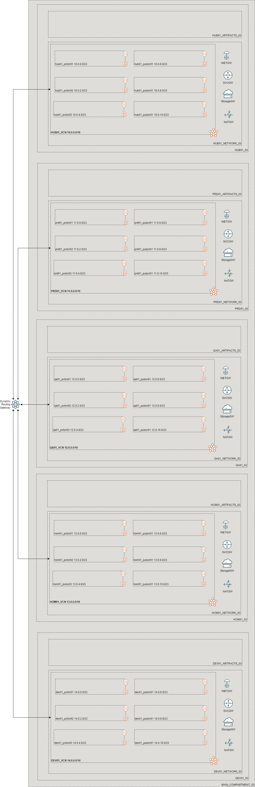

# OCI Cloud Bricks: Sample Landing Zone - HUB PRD QA HOM DEV

[](https://img.shields.io/badge/license-UPL-green) [](https://sonarcloud.io/dashboard?id=oracle-devrel_terraform-oci-cloudbricks-examples)

## Introduction
The following collection of systems provision a full landing zone containing both compartment and network structure. The following is the reference architecture for both systems:



## Getting Started
For details in how the Oracle CloudBricks Framework works, refer to the [following file](../README.md)

### Prerequisites
- A Pre-Created Object Storage Bucket to store tfstate files
- a Pre-Installed Executor with CLI installed. For instructions in how to install CLI, go to the [following link](https://docs.oracle.com/en-us/iaas/Content/API/SDKDocs/cliinstall.htm)
- A Pre-Configured .oci/config file with API Keys. For details in how to do this step, go to the [following link](https://docs.oracle.com/en-us/iaas/Content/API/Concepts/apisigningkey.htm). File should look similar to this: 
  
```shell
[DEFAULT]
user=ocid1.user.oc1..aaaaaaaafoobarfoobarfoobar
fingerprint=9a:9e:13:cf:94:6e:2c:b9:54:D1:60:0d:e4:14:8b:5e
tenancy=ocid1.tenancy.oc1..aaaaaaaaoqdyfoobarfoobarfoobar
region=re-region-1
key_file=/full/path/to/api/key/my_api_key.pem
```

- A Pre-Configured .aws/credentials file with values from pre-created Customer Secret Keys. File should look similar to this: 

```shell
[default]
aws_access_key_id=202ad26f6546c71cc8990c821eece00a6b543ssa21231
aws_secret_access_key=xgYpRAiel5Yxrc9G67MGddaskjdhalsdiujlewiH3NxX4ZMe4=
```

For instructions in how to create Customer Secret Keys, go to the [following link](https://docs.oracle.com/en-us/iaas/Content/Identity/Tasks/managingcredentials.htm#To4)

## System Creation

In order to create the systems, execute as follows: 

0. Update the system's corresponding `system.tfvars`file to specific needs. Example included complies with reference architecture diagram
   - For Compartment System: 

```shell
# Copyright (c) 2021 Oracle and/or its affiliates.
# All rights reserved. The Universal Permissive License (UPL), Version 1.0 as shown at http://oss.oracle.com/licenses/upl
# system.tfvars
#
# Purpose: The following script defines the system particular variables to provision environment


######################################## PROVIDER SPECIFIC VARIABLES ######################################
tenancy_ocid     = "ocid1.tenancy.oc1..foobarbar"
region           = "re-region-1"
user_ocid        = "ocid1.user.oc1..foobarbar"
fingerprint      = "fo:oo:ba:ar:ba:ar"
private_key_path = "/foo/bar/path/oci_api_key.pem"
######################################## PROVIDER SPECIFIC VARIABLES ######################################


######################################## mainbizcomp SPECIFIC VARIABLES ######################################
mainbizcomp_is_root_parent          = true
mainbizcomp_root_compartment_ocid   = "ocid1.tenancy.oc1..aaaaaaaaoqdygmiidrabhv3y4hkr3rb3z6dpmgotvq2scffra6jt7rubresa"
mainbizcomp_compartment_name        = "MAIN_COMPARTMENT_01"
mainbizcomp_compartment_description = "Terraform created Main Business Compartment"
mainbizcomp_enable_delete           = true
######################################## mainbizcomp SPECIFIC VARIABLES ######################################


######################################## hub01 SPECIFIC VARIABLES ######################################
hub01_compartment_name        = "HUB01_01"
hub01_compartment_description = "Terraform created HUB Compartment"
hub01_enable_delete           = true
######################################## hub01 SPECIFIC VARIABLES ######################################
######################################## hub01 Artifact SPECIFIC VARIABLES ######################################
hub01_artifacts_compartment_name        = "HUB01_ARTIFACTS_01"
hub01_artifacts_compartment_description = "Terraform created HUB Artifact Compartment"
hub01_artifacts_enable_delete           = true
######################################## hub01 Artifact SPECIFIC VARIABLES ######################################
######################################## hub01 Network SPECIFIC VARIABLES ######################################
hub01_network_compartment_name        = "HUB01_NETWORK_01"
hub01_network_compartment_description = "Terraform created HUB Network Compartment"
hub01_network_enable_delete           = true
######################################## hub01 Network SPECIFIC VARIABLES ######################################

######################################## prd01 SPECIFIC VARIABLES ######################################
prd01_compartment_name        = "PRD01_01"
prd01_compartment_description = "Terraform created prd01 Compartment"
prd01_enable_delete           = true
######################################## prd01 SPECIFIC VARIABLES ######################################
######################################## prd01 Artifact SPECIFIC VARIABLES ######################################
prd01_artifacts_compartment_name        = "PRD01_ARTIFACTS_01"
prd01_artifacts_compartment_description = "Terraform created prd01 Artifact Compartment"
prd01_artifacts_enable_delete           = true
######################################## prd01 Artifact SPECIFIC VARIABLES ######################################
######################################## prd01 Network SPECIFIC VARIABLES ######################################
prd01_network_compartment_name        = "PRD01_NETWORK_01"
prd01_network_compartment_description = "Terraform created prd01 Network Compartment"
prd01_network_enable_delete           = true
######################################## prd01 Network SPECIFIC VARIABLES ######################################

######################################## qa01 SPECIFIC VARIABLES ######################################
qa01_compartment_name        = "QA01_01"
qa01_compartment_description = "Terraform created qa01 Compartment"
qa01_enable_delete           = true
######################################## qa01 SPECIFIC VARIABLES ######################################
######################################## qa01 Artifact SPECIFIC VARIABLES ######################################
qa01_artifacts_compartment_name        = "QA01_ARTIFACTS_01"
qa01_artifacts_compartment_description = "Terraform created qa01 Artifact Compartment"
qa01_artifacts_enable_delete           = true
######################################## qa01 Artifact SPECIFIC VARIABLES ######################################
######################################## qa01 Network SPECIFIC VARIABLES ######################################
qa01_network_compartment_name        = "QA01_NETWORK_01"
qa01_network_compartment_description = "Terraform created qa01 Network Compartment"
qa01_network_enable_delete           = true
######################################## qa01 Network SPECIFIC VARIABLES ######################################

######################################## hom01 SPECIFIC VARIABLES ######################################
hom01_compartment_name        = "HOM01_01"
hom01_compartment_description = "Terraform created hom01 Compartment"
hom01_enable_delete           = true
######################################## hom01 SPECIFIC VARIABLES ######################################
######################################## hom01 Artifact SPECIFIC VARIABLES ######################################
hom01_artifacts_compartment_name        = "HOM01_ARTIFACTS_01"
hom01_artifacts_compartment_description = "Terraform created hom01 Artifact Compartment"
hom01_artifacts_enable_delete           = true
######################################## hom01 Artifact SPECIFIC VARIABLES ######################################
######################################## hom01 Network SPECIFIC VARIABLES ######################################
hom01_network_compartment_name        = "HOM01_NETWORK_01"
hom01_network_compartment_description = "Terraform created hom01 Network Compartment"
hom01_network_enable_delete           = true
######################################## hom01 Network SPECIFIC VARIABLES ######################################

######################################## dev01 SPECIFIC VARIABLES ######################################
dev01_compartment_name        = "DEV01_01"
dev01_compartment_description = "Terraform created dev01 Compartment"
dev01_enable_delete           = true
######################################## dev01 SPECIFIC VARIABLES ######################################
######################################## dev01 Artifact SPECIFIC VARIABLES ######################################
dev01_artifacts_compartment_name        = "DEV01_ARTIFACTS_01"
dev01_artifacts_compartment_description = "Terraform created dev01 Artifact Compartment"
dev01_artifacts_enable_delete           = true
######################################## dev01 Artifact SPECIFIC VARIABLES ######################################
######################################## dev01 Network SPECIFIC VARIABLES ######################################
dev01_network_compartment_name        = "DEV01_NETWORK_01"
dev01_network_compartment_description = "Terraform created dev01 Network Compartment"
dev01_network_enable_delete           = true
######################################## dev01 Network SPECIFIC VARIABLES ######################################
```

- For Network System

```shell
# Copyright (c) 2021 Oracle and/or its affiliates.
# All rights reserved. The Universal Permissive License (UPL), Version 1.0 as shown at http://oss.oracle.com/licenses/upl
# system.tfvars
#
# Purpose: The following script defines the system particular variables to provision environment


######################################## PROVIDER SPECIFIC VARIABLES ######################################
tenancy_ocid     = "ocid1.tenancy.oc1..foobarbar"
region           = "re-region-1"
user_ocid        = "ocid1.user.oc1..foobarbar"
fingerprint      = "fo:oo:ba:ar:ba:ar"
private_key_path = "/foo/bar/path/oci_api_key.pem"
######################################## PROVIDER SPECIFIC VARIABLES ######################################


######################################## HUB NETWORK SPECIFIC VARIABLES ######################################
hub01_network_vcn_cidr_blocks                     = ["10.0.0.0/16"]
hub01_network_private_subnet_cidr_block_map       = { "hub01_pvtsn01" : "10.0.0.0/23", "hub01_pvtsn02" : "10.0.2.0/23", "hub01_pvtsn03" : "10.0.4.0/23" }
hub01_network_public_subnet_cidr_block_map        = { "hub01_pubsn01" : "10.0.6.0/23", "hub01_pubsn02" : "10.0.8.0/23", "hub01_pubsn03" : "10.0.10.0/23" }
hub01_network_vcn_display_name                    = "HUB01_VCN"
hub01_network_vcn_network_compartment_name        = "HUB01_NETWORK_01"
hub01_network_dhcp_options_display_name           = "hub01_DHCP_Options"
hub01_network_custom_search_domain                = "test.com"
hub01_network_private_route_table_display_name    = "hub01_pvt_hub_rt"
hub01_network_public_route_table_display_name     = "hub01_pub_hub_rt"
hub01_network_private_security_list_display_name  = "hub01_pvt_hub_sl"
hub01_network_public_security_list_display_name   = "hub01_pub_hub_sl"
hub01_network_service_gateway_display_name        = "hub01_SVC_GW"
hub01_network_nat_gateway_display_name            = "hub01_NAT_GW"
hub01_network_internet_gateway_display_name       = "hub01_INET_GW"
hub01_network_drg_display_name                    = "hub01_DRG"
hub01_network_peered_vcn_cidr_blocks              = ["11.0.0.0/16", "12.0.0.0/16", "13.0.0.0/16", "14.0.0.0/16"]
hub01_network_is_spoke                            = false
######################################## HUB NETWORK SPECIFIC VARIABLES SPECIFIC VARIABLES ######################################

######################################## prd01 NETWORK SPECIFIC VARIABLES ######################################
prd01_network_vcn_cidr_blocks                     = ["11.0.0.0/16"]
prd01_network_private_subnet_cidr_block_map       = { "prd01_pvtsn01" : "11.0.0.0/23", "prd01_pvtsn02" : "11.0.2.0/23", "prd01_pvtsn03" : "11.0.4.0/23" }
prd01_network_public_subnet_cidr_block_map        = { "prd01_pubsn01" : "11.0.6.0/23", "prd01_pubsn02" : "11.0.8.0/23", "prd01_pubsn03" : "11.0.10.0/23" }
prd01_network_vcn_display_name                    = "PRD01_VCN"
prd01_network_vcn_network_compartment_name        = "PRD01_NETWORK_01"
prd01_network_dhcp_options_display_name           = "prd01_DHCP_Options"
prd01_network_custom_search_domain                = "test.com"
prd01_network_private_route_table_display_name    = "prd01_pvt_hub_rt"
prd01_network_public_route_table_display_name     = "prd01_pub_hub_rt"
prd01_network_private_security_list_display_name  = "prd01_pvt_hub_sl"
prd01_network_public_security_list_display_name   = "prd01_pub_hub_sl"
prd01_network_service_gateway_display_name        = "prd01_SVC_GW"
prd01_network_nat_gateway_display_name            = "prd01_NAT_GW"
prd01_network_internet_gateway_display_name       = "INET_GW"
prd01_network_is_spoke                            = true
######################################## prd01 NETWORK SPECIFIC VARIABLES SPECIFIC VARIABLES ######################################

######################################## qa01 NETWORK SPECIFIC VARIABLES ######################################
qa01_network_vcn_cidr_blocks                     = ["12.0.0.0/16"]
qa01_network_private_subnet_cidr_block_map       = { "qa01_pvtsn01" : "12.0.0.0/23", "qa01_pvtsn02" : "12.0.2.0/23", "qa01_pvtsn03" : "12.0.4.0/23" }
qa01_network_public_subnet_cidr_block_map        = { "qa01_pubsn01" : "12.0.6.0/23", "qa01_pubsn02" : "12.0.8.0/23", "qa01_pubsn03" : "12.0.10.0/23" }
qa01_network_vcn_display_name                    = "QA01_VCN"
qa01_network_vcn_network_compartment_name        = "QA01_NETWORK_01"
qa01_network_dhcp_options_display_name           = "qa01_DHCP_Options"
qa01_network_custom_search_domain                = "test.com"
qa01_network_private_route_table_display_name    = "qa01_pvt_hub_rt"
qa01_network_public_route_table_display_name     = "qa01_pub_hub_rt"
qa01_network_private_security_list_display_name  = "qa01_pvt_hub_sl"
qa01_network_public_security_list_display_name   = "qa01_pub_hub_sl"
qa01_network_service_gateway_display_name        = "qa01_SVC_GW"
qa01_network_nat_gateway_display_name            = "qa01_NAT_GW"
qa01_network_internet_gateway_display_name       = "INET_GW"
qa01_network_is_spoke                            = true
######################################## qa01 NETWORK SPECIFIC VARIABLES SPECIFIC VARIABLES ######################################

######################################## hom01 NETWORK SPECIFIC VARIABLES ######################################
hom01_network_vcn_cidr_blocks                     = ["13.0.0.0/16"]
hom01_network_private_subnet_cidr_block_map       = { "hom01_pvtsn01" : "13.0.0.0/23", "hom01_pvtsn02" : "13.0.2.0/23", "hom01_pvtsn03" : "13.0.4.0/23" }
hom01_network_public_subnet_cidr_block_map        = { "hom01_pubsn01" : "13.0.6.0/23", "hom01_pubsn02" : "13.0.8.0/23", "hom01_pubsn03" : "13.0.10.0/23" }
hom01_network_vcn_display_name                    = "HOM01_VCN"
hom01_network_vcn_network_compartment_name        = "HOM01_NETWORK_01"
hom01_network_dhcp_options_display_name           = "hom01_DHCP_Options"
hom01_network_custom_search_domain                = "test.com"
hom01_network_private_route_table_display_name    = "hom01_pvt_hub_rt"
hom01_network_public_route_table_display_name     = "hom01_pub_hub_rt"
hom01_network_private_security_list_display_name  = "hom01_pvt_hub_sl"
hom01_network_public_security_list_display_name   = "hom01_pub_hub_sl"
hom01_network_service_gateway_display_name        = "hom01_SVC_GW"
hom01_network_nat_gateway_display_name            = "hom01_NAT_GW"
hom01_network_internet_gateway_display_name       = "hom01_INET_GW"
hom01_network_is_spoke                            = true
######################################## hom01 NETWORK SPECIFIC VARIABLES SPECIFIC VARIABLES ###################

######################################## dev01 NETWORK SPECIFIC VARIABLES ######################################
dev01_network_vcn_cidr_blocks                     = ["14.0.0.0/16"]
dev01_network_private_subnet_cidr_block_map       = { "dev01_pvtsn01" : "14.0.0.0/23", "dev01_pvtsn02" : "14.0.2.0/23", "dev01_pvtsn03" : "14.0.4.0/23" }
dev01_network_public_subnet_cidr_block_map        = { "dev01_pubsn01" : "14.0.6.0/23", "dev01_pubsn02" : "14.0.8.0/23", "dev01_pubsn03" : "14.0.10.0/23" }
dev01_network_vcn_display_name                    = "DEV01_VCN"
dev01_network_vcn_network_compartment_name        = "DEV01_NETWORK_01"
dev01_network_dhcp_options_display_name           = "dev01_DHCP_Options"
dev01_network_custom_search_domain                = "test.com"
dev01_network_private_route_table_display_name    = "dev01_pvt_hub_rt"
dev01_network_public_route_table_display_name     = "dev01_pub_hub_rt"
dev01_network_private_security_list_display_name  = "dev01_pvt_hub_sl"
dev01_network_public_security_list_display_name   = "dev01_pub_hub_sl"
dev01_network_service_gateway_display_name        = "dev01_SVC_GW"
dev01_network_nat_gateway_display_name            = "dev01_NAT_GW"
dev01_network_internet_gateway_display_name       = "dev01_INET_GW"
dev01_network_is_spoke                            = true
######################################## dev01 NETWORK SPECIFIC VARIABLES SPECIFIC VARIABLES ###################

```

1. Create Compartment System
   - Run: `./provisionInfra.sh CLI/landing_zones/lz_HUB_PRD_QA_HOM_DEV/network_system/`
   - A dialog as follows will appear: 

```shell
[opc@dalquintdevhubscl terraform-oci-cloudbricks-examples]$ ./provisionInfra.sh CLI/landing_zones/lz_HUB_PRD_QA_HOM_DEV/compartment_system/
Sourcing environment variables
**************************************************************************  WARNING  *********************************************************************************
*   The following script will provision infrastructure. Type 'yes' and hit enter, if you want to continue. Neglecting something here may drop entire infrastructure  *
**************************************************************************  WARNING  *********************************************************************************
```
   - Type in `yes`
   - Compartment System will initiate its creation

2. Create Network System
   - Run: `./provisionInfra.sh CLI/landing_zones/lz_HUB_PRD_QA_HOM_DEV/network_system/`
   - A dialog as follows will appear: 

```shell
[opc@dalquintdevhubscl terraform-oci-cloudbricks-examples]$ ./provisionInfra.sh CLI/landing_zones/lz_HUB_PRD_QA_HOM_DEV/network_system/
Sourcing environment variables
**************************************************************************  WARNING  *********************************************************************************
*   The following script will provision infrastructure. Type 'yes' and hit enter, if you want to continue. Neglecting something here may drop entire infrastructure  *
**************************************************************************  WARNING  *********************************************************************************
```
   - Type in `yes`
   - Network System will initiate its creation

## Components
Each system contains the following components: 

### [backend.tf](./backend.tf)

This file defines the S3 compatibility API integration to store .tfstate file into an OCI Bucket. It's content is the following: 

```go
terraform {
  backend "s3" {
    bucket   = "Precreated_bucket_to_store_tfstate_files_name"
    key      = "Samples/system_name.tfstate"
    region   = "re-region-1"
    endpoint = "https://Tenancy_ObjectStorage_namespace.compat.objectstorage.re-region-1.oraclecloud.com"

    skip_region_validation      = true
    skip_credentials_validation = true
    skip_metadata_api_check     = true
    force_path_style            = true
  }
}
```

*Considerations*

- The `bucket` variable, requires the display name of the bucket where tfstate files will be stored
- The `key` variable, supports a structure of your choice, by providing `/`as separators. Name of the file should always be `system_name.tfstate`
- The `region` variable contains the name id of the region where the system is being deployed at
- The `endpoint` variable contains the concatenation of the tenancy namespace and the region as depicted on above example. For instructions in how to determine the Tenancy Object Storage namespace, refer to the [following documentation](https://docs.oracle.com/en-us/iaas/Content/Object/Tasks/understandingnamespaces.htm)
- The rest of *variables* require to be set as is. **Do not change nor update these values**


### [datasource.tf](./datasource.tf)
This file defines the datasources required for internal tracking lookup on Open Source Project. Do not alter this file

### [main.tf](./main.tf) 
This file defines the main orchestration of module. 

For compartment System, the following structure is expected

```go
module "ModuleName" {
  source = "git::ssh://git@github.com/oracle-devrel/terraform-oci-cloudbricks-compartment.git?ref=v1.0.1"
  providers = {
    oci.home = oci.home
  }
  ######################################## PROVIDER SPECIFIC VARIABLES ######################################
  tenancy_ocid     = var.tenancy_ocid
  region           = var.region
  user_ocid        = var.user_ocid
  fingerprint      = var.fingerprint
  private_key_path = var.private_key_path
  ######################################## PROVIDER SPECIFIC VARIABLES ######################################
  ######################################## COMPARTMENT SPECIFIC VARIABLES ######################################
  is_root_parent          = var.ModuleName_is_root_parent
  root_compartment_ocid   = var.ModuleName_root_compartment_ocid
  compartment_name        = var.ModuleName_compartment_name
  compartment_description = var.ModuleName_compartment_description
  enable_delete           = var.ModuleName_enable_delete
  ######################################## COMPARTMENT SPECIFIC VARIABLES ######################################
}
```

For Network System, the following structure is expected

```shell
module "Hub_ModuleName" {
  source = "git::ssh://git@github.com/oracle-devrel/terraform-oci-cloudbricks-network-artifacts.git?ref=v2.0.1"
  ######################################## PROVIDER SPECIFIC VARIABLES ######################################
  tenancy_ocid     = var.tenancy_ocid
  region           = var.region
  user_ocid        = var.user_ocid
  fingerprint      = var.fingerprint
  private_key_path = var.private_key_path
  ######################################## PROVIDER SPECIFIC VARIABLES ######################################
  ######################################## ARTIFACT SPECIFIC VARIABLES ######################################
  vcn_network_compartment_name        = var.Hub_ModuleName_vcn_network_compartment_name
  vcn_cidr_blocks                     = var.Hub_ModuleName_vcn_cidr_blocks
  private_subnet_cidr_block_map       = var.Hub_ModuleName_private_subnet_cidr_block_map
  public_subnet_cidr_block_map        = var.Hub_ModuleName_public_subnet_cidr_block_map
  vcn_display_name                    = var.Hub_ModuleName_vcn_display_name
  dhcp_options_display_name           = var.Hub_ModuleName_dhcp_options_display_name
  custom_search_domain                = var.Hub_ModuleName_custom_search_domain
  private_route_table_display_name    = var.Hub_ModuleName_private_route_table_display_name
  public_route_table_display_name     = var.Hub_ModuleName_public_route_table_display_name
  private_security_list_display_name  = var.Hub_ModuleName_private_security_list_display_name
  public_security_list_display_name   = var.Hub_ModuleName_public_security_list_display_name
  service_gateway_display_name        = var.Hub_ModuleName_service_gateway_display_name
  nat_gateway_display_name            = var.Hub_ModuleName_nat_gateway_display_name
  internet_gateway_display_name       = var.Hub_ModuleName_internet_gateway_display_name
  drg_display_name                    = var.Hub_ModuleName_drg_display_name
  peered_vcn_cidr_blocks              = var.Hub_ModuleName_peered_vcn_cidr_blocks
  is_spoke                            = var.Hub_ModuleName_is_spoke
  ######################################## ARTIFACT SPECIFIC VARIABLES ######################################
}

module "Spoke_ModuleName" {
  source = "git::ssh://git@github.com/oracle-devrel/terraform-oci-cloudbricks-network-artifacts.git?ref=v2.0.1"
  ######################################## PROVIDER SPECIFIC VARIABLES ######################################
  tenancy_ocid     = var.tenancy_ocid
  region           = var.region
  user_ocid        = var.user_ocid
  fingerprint      = var.fingerprint
  private_key_path = var.private_key_path
  ######################################## PROVIDER SPECIFIC VARIABLES ######################################
  ######################################## ARTIFACT SPECIFIC VARIABLES ######################################
  vcn_network_compartment_name        = var.Spoke_ModuleName_vcn_network_compartment_name
  vcn_cidr_blocks                     = var.Spoke_ModuleName_vcn_cidr_blocks
  private_subnet_cidr_block_map       = var.Spoke_ModuleName_private_subnet_cidr_block_map
  public_subnet_cidr_block_map        = var.Spoke_ModuleName_public_subnet_cidr_block_map
  vcn_display_name                    = var.Spoke_ModuleName_vcn_display_name
  dhcp_options_display_name           = var.Spoke_ModuleName_dhcp_options_display_name
  custom_search_domain                = var.Spoke_ModuleName_custom_search_domain
  private_route_table_display_name    = var.Spoke_ModuleName_private_route_table_display_name
  public_route_table_display_name     = var.Spoke_ModuleName_public_route_table_display_name
  private_security_list_display_name  = var.Spoke_ModuleName_private_security_list_display_name
  public_security_list_display_name   = var.Spoke_ModuleName_public_security_list_display_name
  service_gateway_display_name        = var.Spoke_ModuleName_service_gateway_display_name
  nat_gateway_display_name            = var.Spoke_ModuleName_nat_gateway_display_name
  internet_gateway_display_name       = var.Spoke_ModuleName_internet_gateway_display_name
  hub_vcn_compartment_name            = var.Hub_ModuleName_vcn_network_compartment_name
  hub_vcn_display_name                = var.Hub_ModuleName_vcn_display_name
  is_spoke                            = var.Spoke_ModuleName_is_spoke
  ######################################## ARTIFACT SPECIFIC VARIABLES ######################################
}
```


*Considerations*
- Whereas needed, apply variable and module overloading
- For module specifics, refer to module documentation: 
  - [terraform-oci-cloudbricks-compartment](https://github.com/oracle-devrel/terraform-oci-cloudbricks-compartment/blob/main/README.md)
  - [terraform-oci-cloudbricks-network-artifacts](https://github.com/oracle-devrel/terraform-oci-cloudbricks-network-artifacts/blob/main/README.md)  
- For variable usage, refer to section *Variable Documentation*

### [output.tf](./output.tf)
The following file defines the output of system, for future forward integration use with Configuration Management Tools

### [README.md](./README.md)
This file

### [system.tfvars](./system.tfvars)
The following file defines the specific variables customized using variable overloading. Please refer to backend brick module documentation for details in how to fill.
For module specifics, refer to module documentation: 
  - [terraform-oci-cloudbricks-compartment](https://github.com/oracle-devrel/terraform-oci-cloudbricks-compartment/blob/main/README.md)
  - [terraform-oci-cloudbricks-network-artifacts](https://github.com/oracle-devrel/terraform-oci-cloudbricks-network-artifacts/blob/main/README.md)  

### [variables.tf](./variables.tf)
The following file defines all the variables used in this system. For details on it's content, refer to section *Variable Documentation*

---

## Variable Documentation

### Compartment System
 

### Network System


## Contributing
This project is open source.  Please submit your contributions by forking this repository and submitting a pull request!  Oracle appreciates any contributions that are made by the open source community.

## License
Copyright (c) 2021 Oracle and/or its affiliates.

Licensed under the Universal Permissive License (UPL), Version 1.0.

See [LICENSE](LICENSE) for more details.

