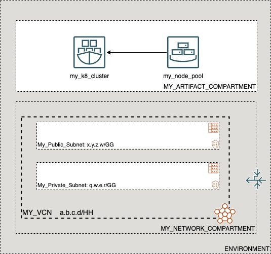

# OCI Cloud Bricks: Sample OKE Nodepool

[](https://img.shields.io/badge/license-UPL-green) [](https://sonarcloud.io/dashboard?id=oracle-devrel_terraform-oci-cloudbricks-examples)

## Introduction
The following system builds an an Oracle Kubernetes Engine Nodepool associated to a particular compartment and subnets. This architecture assumes that a Kubernetes Cluster has been pre-provisioned.



## Getting Started
For details on how the Oracle CloudBricks Framework works, refer to the [following file](../../../README.md)

### Prerequisites
- A Pre-Created Object Storage Bucket to store tfstate files
- a Pre-Installed Executor with CLI installed. For instructions in how to install CLI, go to the [following link](https://docs.oracle.com/en-us/iaas/Content/API/SDKDocs/cliinstall.htm)
- A Pre-Configured .oci/config file with API Keys. For details in how to do this step, go to the [following link](https://docs.oracle.com/en-us/iaas/Content/API/Concepts/apisigningkey.htm). File should look similar to this: 
  
```shell

[DEFAULT]
user=ocid1.user.oc1..aaaaaaaafoobarfoobarfoobar
fingerprint=9a:9e:13:cf:94:6e:2c:b9:54:D1:60:0d:e4:14:8b:5e
tenancy=ocid1.tenancy.oc1..aaaaaaaaoqdyfoobarfoobarfoobar
region=re-region-1
key_file=/full/path/to/api/key/my_api_key.pem

```

- A Pre-Configured .aws/credentials file with values from pre-created Customer Secret Keys. File should look similar to this: 
  
```shell
[default]
aws_access_key_id=202ad26f6546c71cc8990c821eece00a6b543ssa21231
aws_secret_access_key=xgYpRAiel5Yxrc9G67MGddaskjdhalsdiujlewiH3NxX4ZMe4=
```

For instructions in how to create Customer Secret Keys, go to the [following link](https://docs.oracle.com/en-us/iaas/Content/Identity/Tasks/managingcredentials.htm#To4)

---

## Components
The following system contains the following components: 

### [backend.tf](./backend.tf)

This file defines the S3 compatibility API integration to store .tfstate file into an OCI Bucket. It's content is the following: 

```go
terraform {
  backend "s3" {
    bucket   = "Precreated_bucket_to_store_tfstate_files_name"
    key      = "Samples/sample_hub_spoke_compartment_with_parent.tfstate"
    region   = "re-region-1"
    endpoint = "https://Tenancy_ObjectStorage_namespace.compat.objectstorage.re-region-1.oraclecloud.com"

    skip_region_validation      = true
    skip_credentials_validation = true
    skip_metadata_api_check     = true
    force_path_style            = true
  }
}
```

*Considerations*

- The `bucket` variable, requires the display name of the bucket where tfstate files will be stored
- The `key` variable, supports a structure of your choice, by providing `/` as separators. Name of the file should always be `system_name.tfstate`
- The `region` variable contains the name id of the region where the system is being deployed at
- The `endpoint` variable contains the concatenation of the tenancy namespace and the region as depicted on above example. For instructions in how to determine the Tenancy Object Storage namespace, refer to the [following documentation](https://docs.oracle.com/en-us/iaas/Content/Object/Tasks/understandingnamespaces.htm)
- The rest of *variables* require to be set as is. **Do not change nor update these values**

---

### [datasource.tf](./datasource.tf)
This file defines the datasources required for internal tracking lookup on Open Source Project. Do not alter this file

---

### [main.tf](./main.tf) 
This file defines the main orchestration of module. The following structure is expected

```go
module "ModuleName" {

  source = "git::ssh://git@github.com/oracle-devrel/module.git?ref=v1.0.0"
  providers = {
    oci.home = oci.home
  }
  ######################################## PROVIDER SPECIFIC VARIABLES ######################################
  tenancy_ocid     = var.tenancy_ocid
  region           = var.region
  user_ocid        = var.user_ocid
  fingerprint      = var.fingerprint
  private_key_path = var.private_key_path
  ######################################## PROVIDER SPECIFIC VARIABLES ######################################
  ######################################## COMPARTMENT SPECIFIC VARIABLES ######################################
  module  = foo
  variables = bar
  here      = bar
  ######################################## COMPARTMENT SPECIFIC VARIABLES ######################################
}
```

*Considerations*
- Whereas needed, apply variable and module overloading
- For module specifics, refer to module documentation: 
  - [terraform-oci-cloudbricks-oke-cluster](https://github.com/oracle-devrel/terraform-oci-cloudbricks-oke-cluster/blob/main/README.md)
  - [terraform-oci-cloudbricks-oke-nodepool](https://github.com/oracle-devrel/terraform-oci-cloudbricks-oke-nodepool/blob/main/README.md)
- For variable usage, refer to section *Variable Documentation*

---

### [output.tf](./output.tf)
The following file defines the output of system, for future forward integration use with Configuration Management Tools

---


### [README.md](./README.md)
This file

---

### [system.tfvars](./system.tfvars)
The following file defines the specific variables customized using variable overloading. Please refer to backend brick module documentation for details in how to fill.
For module specifics, refer to module documentation: 
  - [terraform-oci-cloudbricks-oke-cluster](https://github.com/oracle-devrel/terraform-oci-cloudbricks-oke-cluster/blob/main/README.md)
  - [terraform-oci-cloudbricks-oke-nodepool](https://github.com/oracle-devrel/terraform-oci-cloudbricks-oke-nodepool/blob/main/README.md)

---

### [variables.tf](./variables.tf)
The following file defines all the variables used in this system. For details on it's content, refer to section *Variable Documentation*

---

## Variable Documentation

## Requirements

| Name | Version |
|------|---------|
| <a name="requirement_terraform"></a> [terraform](#requirement\_terraform) | >= 0.13.5 |
| <a name="requirement_oci"></a> [oci](#requirement\_oci) | >= 4.36.0 |

## Providers

| Name | Version |
|------|---------|
| <a name="provider_oci"></a> [oci](#provider\_oci) | 4.67.0 |

## Modules

| Name | Source | Version |
|------|--------|---------|
| <a name="module_node01"></a> [node01](#module\_node01) | git::ssh://git@github.com/oracle-devrel/terraform-oci-cloudbricks-oke-nodepool.git | v1.0.2 |

## Resources

| Name | Type |
|------|------|
| [oci_identity_region_subscriptions.home_region_subscriptions](https://registry.terraform.io/providers/hashicorp/oci/latest/docs/data-sources/identity_region_subscriptions) | data source |

## Inputs

| Name | Description | Type | Default | Required |
|------|-------------|------|---------|:--------:|
| <a name="input_fingerprint"></a> [fingerprint](#input\_fingerprint) | API Key Fingerprint for user\_ocid derived from public API Key imported in OCI User config | `any` | n/a | yes |
| <a name="input_node01_is_flex_shape"></a> [node01\_is\_flex\_shape](#input\_node01\_is\_flex\_shape) | Boolean that describes if the shape is flex or not | `bool` | `false` | no |
| <a name="input_node01_k8s_label_map"></a> [node01\_k8s\_label\_map](#input\_node01\_k8s\_label\_map) | Define the list of Kubernetes Labels to apply in nodepool | `map(any)` | n/a | yes |
| <a name="input_node01_k8s_version"></a> [node01\_k8s\_version](#input\_node01\_k8s\_version) | Declares K8 Version | `any` | n/a | yes |
| <a name="input_node01_node_metadata"></a> [node01\_node\_metadata](#input\_node01\_node\_metadata) | A list of key/value pairs to add to each underlying Oracle Cloud Infrastructure nodepool in the node pool on launch. | `map(any)` | `{}` | no |
| <a name="input_node01_node_pool_name"></a> [node01\_node\_pool\_name](#input\_node01\_node\_pool\_name) | Node Pool Name for K8 Cluster | `any` | n/a | yes |
| <a name="input_node01_node_pool_shape"></a> [node01\_node\_pool\_shape](#input\_node01\_node\_pool\_shape) | Shape to be used in node pool members | `any` | n/a | yes |
| <a name="input_node01_nodepool_shape_config_memory_in_gbs"></a> [node01\_nodepool\_shape\_config\_memory\_in\_gbs](#input\_node01\_nodepool\_shape\_config\_memory\_in\_gbs) | (Updatable) The total amount of memory available to the nodepool, in gigabytes. | `string` | `""` | no |
| <a name="input_node01_nodepool_shape_config_ocpus"></a> [node01\_nodepool\_shape\_config\_ocpus](#input\_node01\_nodepool\_shape\_config\_ocpus) | (Updatable) The total number of OCPUs available to the nodepool. | `string` | `""` | no |
| <a name="input_node01_number_of_nodes"></a> [node01\_number\_of\_nodes](#input\_node01\_number\_of\_nodes) | Number of Nodes inside Node Pool | `any` | n/a | yes |
| <a name="input_node01_oke_availability_domain_map"></a> [node01\_oke\_availability\_domain\_map](#input\_node01\_oke\_availability\_domain\_map) | The name of the availability domain in which this node is placed | `map(any)` | n/a | yes |
| <a name="input_node01_oke_cluster_compartment_id"></a> [node01\_oke\_cluster\_compartment\_id](#input\_node01\_oke\_cluster\_compartment\_id) | Defines the compartment OCID where the OKE cluster was created | `string` | `""` | no |
| <a name="input_node01_oke_cluster_compartment_name"></a> [node01\_oke\_cluster\_compartment\_name](#input\_node01\_oke\_cluster\_compartment\_name) | Defines the compartment name where the OKE cluster was created | `string` | `""` | no |
| <a name="input_node01_oke_cluster_name"></a> [node01\_oke\_cluster\_name](#input\_node01\_oke\_cluster\_name) | OKE cluster display name | `any` | n/a | yes |
| <a name="input_node01_oke_network_compartment_name"></a> [node01\_oke\_network\_compartment\_name](#input\_node01\_oke\_network\_compartment\_name) | Defines the compartment where the Network is currently located | `any` | n/a | yes |
| <a name="input_node01_oke_nodepool_compartment_name"></a> [node01\_oke\_nodepool\_compartment\_name](#input\_node01\_oke\_nodepool\_compartment\_name) | Defines the compartment name where the OKE nodepool is created | `string` | `""` | no |
| <a name="input_node01_oke_nodepool_network_subnet_name"></a> [node01\_oke\_nodepool\_network\_subnet\_name](#input\_node01\_oke\_nodepool\_network\_subnet\_name) | Defines the specific Subnet to be used for this resource | `any` | n/a | yes |
| <a name="input_node01_source_type"></a> [node01\_source\_type](#input\_node01\_source\_type) | The source type of this option. IMAGE means the OCID is of an image | `string` | `"IMAGE"` | no |
| <a name="input_node01_ssh_private_is_path"></a> [node01\_ssh\_private\_is\_path](#input\_node01\_ssh\_private\_is\_path) | Describes if SSH Private Key is located on file or inside code | `bool` | `false` | no |
| <a name="input_node01_ssh_private_key"></a> [node01\_ssh\_private\_key](#input\_node01\_ssh\_private\_key) | Private key to log into machine | `any` | n/a | yes |
| <a name="input_node01_ssh_public_is_path"></a> [node01\_ssh\_public\_is\_path](#input\_node01\_ssh\_public\_is\_path) | Describes if SSH Public Key is located on file or inside code | `bool` | `false` | no |
| <a name="input_node01_ssh_public_key"></a> [node01\_ssh\_public\_key](#input\_node01\_ssh\_public\_key) | Defines SSH Public Key to be used in order to remotely connect to compute nodepool | `string` | n/a | yes |
| <a name="input_oke_nodepool_compartment_id"></a> [oke\_nodepool\_compartment\_id](#input\_oke\_nodepool\_compartment\_id) | Defines the compartment OCID where the OKE nodepool is created | `string` | `""` | no |
| <a name="input_private_key_path"></a> [private\_key\_path](#input\_private\_key\_path) | Private Key Absolute path location where terraform is executed | `any` | n/a | yes |
| <a name="input_region"></a> [region](#input\_region) | Target region where artifacts are going to be created | `any` | n/a | yes |
| <a name="input_tenancy_ocid"></a> [tenancy\_ocid](#input\_tenancy\_ocid) | OCID of tenancy | `any` | n/a | yes |
| <a name="input_user_ocid"></a> [user\_ocid](#input\_user\_ocid) | User OCID in tenancy. | `any` | n/a | yes |

## Outputs

| Name | Description |
|------|-------------|
| <a name="output_node01"></a> [node01](#output\_node01) | Node Pools configured inside OKE |


## Contributing
This project is open source.  Please submit your contributions by forking this repository and submitting a pull request!  Oracle appreciates any contributions that are made by the open source community.

## License
Copyright (c) 2021 Oracle and/or its affiliates.

Licensed under the Universal Permissive License (UPL), Version 1.0.

See [LICENSE](LICENSE) for more details.