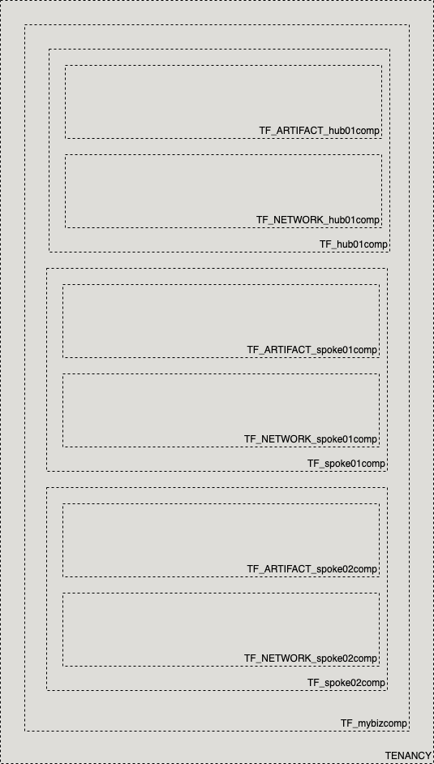

# OCI Cloud Bricks: Sample HUB and SPOKE Compartment Artifacts

[](https://img.shields.io/badge/license-UPL-green) [](https://sonarcloud.io/dashboard?id=oracle-devrel_terraform-oci-cloudbricks-examples)

## Introduction
The following system builds a Sample Compartment Structure reflecting a HUB and SPOKE with the following reference architecture: 



## Getting Started
For details in how the Oracle CloudBricks Framework works, refer to the [following file](../README.md)

### Prerequisites
- A Pre-Created Object Storage Bucket to store tfstate files
- a Pre-Installed Executor with CLI installed. For instructions in how to install CLI, go to the [following link](https://docs.oracle.com/en-us/iaas/Content/API/SDKDocs/cliinstall.htm)
- A Pre-Configured .oci/config file with API Keys. For details in how to do this step, go to the [following link](https://docs.oracle.com/en-us/iaas/Content/API/Concepts/apisigningkey.htm). File should look similar to this: 
  
```shell

[DEFAULT]
user=ocid1.user.oc1..aaaaaaaafoobarfoobarfoobar
fingerprint=9a:9e:13:cf:94:6e:2c:b9:54:D1:60:0d:e4:14:8b:5e
tenancy=ocid1.tenancy.oc1..aaaaaaaaoqdyfoobarfoobarfoobar
region=re-region-1
key_file=/full/path/to/api/key/my_api_key.pem

```

- A Pre-Configured .aws/credentials file with values from pre-created Customer Secret Keys. File should look similar to this: 
  
```shell
[default]
aws_access_key_id=202ad26f6546c71cc8990c821eece00a6b543ssa21231
aws_secret_access_key=xgYpRAiel5Yxrc9G67MGddaskjdhalsdiujlewiH3NxX4ZMe4=
```

For instructions in how to create Customer Secret Keys, go to the [following link](https://docs.oracle.com/en-us/iaas/Content/Identity/Tasks/managingcredentials.htm#To4)

---

## Components
The following system contains the following components: 

### [backend.tf](./backend.tf)

This file defines the S3 compatibility API integration to store .tfstate file into an OCI Bucket. It's content is the following: 

```go
terraform {
  backend "s3" {
    bucket   = "Precreated_bucket_to_store_tfstate_files_name"
    key      = "Samples/sample_hub_spoke_compartment_with_parent.tfstate"
    region   = "re-region-1"
    endpoint = "https://Tenancy_ObjectStorage_namespace.compat.objectstorage.re-region-1.oraclecloud.com"

    skip_region_validation      = true
    skip_credentials_validation = true
    skip_metadata_api_check     = true
    force_path_style            = true
  }
}
```

*Considerations*

- The `bucket` variable, requires the display name of the bucket where tfstate files will be stored
- The `key` variable, supports a structure of your choice, by providing `/`as separators. Name of the file should always be `system_name.tfstate`
- The `region` variable contains the name id of the region where the system is being deployed at
- The `endpoint` variable contains the concatenation of the tenancy namespace and the region as depicted on above example. For instructions in how to determine the Tenancy Object Storage namespace, refer to the [following documentation](https://docs.oracle.com/en-us/iaas/Content/Object/Tasks/understandingnamespaces.htm)
- The rest of *variables* require to be set as is. **Do not change nor update these values**

---

### [datasource.tf](./datasource.tf)
This file defines the datasources required for internal tracking lookup on Open Source Project. Do not alter this file

---

### [main.tf](./main.tf) 
This file defines the main orchestration of module. The following structure is expected

```go
module "ModuleName" {

  source = "git::ssh://git@github.com/oracle-devrel/terraform-oci-cloudbricks-compartment.git?ref=v1.0.0"
  providers = {
    oci.home = oci.home
  }
  ######################################## PROVIDER SPECIFIC VARIABLES ######################################
  tenancy_ocid     = var.tenancy_ocid
  region           = var.region
  user_ocid        = var.user_ocid
  fingerprint      = var.fingerprint
  private_key_path = var.private_key_path
  ######################################## PROVIDER SPECIFIC VARIABLES ######################################
  ######################################## COMPARTMENT SPECIFIC VARIABLES ######################################
  is_root_parent          = var.ModuleName_is_root_parent
  root_compartment_ocid   = var.ModuleName_root_compartment_ocid
  compartment_name        = var.ModuleName_compartment_name
  compartment_description = var.ModuleName_compartment_description
  enable_delete           = var.ModuleName_enable_delete
  ######################################## COMPARTMENT SPECIFIC VARIABLES ######################################
}
```

*Considerations*
- Whereas needed, apply variable and module overloading
- For module specifics, refer to module documentation: 
  - [terraform-oci-cloudbricks-compartment](https://github.com/oracle-devrel/terraform-oci-cloudbricks-compartment/blob/main/README.md)
- For variable usage, refer to section *Variable Documentation*

---

### [output.tf](./output.tf)
The following file defines the output of system, for future forward integration use with Configuration Management Tools

---


### [README.md](./README.md)
This file

---

### [system.tfvars](./system.tfvars)
The following file defines the specific variables customized using variable overloading. Please refer to backend brick module documentation for details in how to fill.
For module specifics, refer to module documentation: 
  - [terraform-oci-cloudbricks-compartment](https://github.com/oracle-devrel/terraform-oci-cloudbricks-compartment/blob/main/README.md)


---


### [variables.tf](./variables.tf)
The following file defines all the variables used in this system. For details on it's content, refer to section *Variable Documentation*

---
## Variable Documentation
## Requirements

| Name | Version |
|------|---------|
| <a name="requirement_terraform"></a> [terraform](#requirement\_terraform) | >= 0.13.5 |
| <a name="requirement_oci"></a> [oci](#requirement\_oci) | >= 4.36.0 |

## Providers

| Name | Version |
|------|---------|
| <a name="provider_oci"></a> [oci](#provider\_oci) | 4.36.0 |

## Modules

| Name | Source | Version |
|------|--------|---------|
| <a name="module_artifact_hub01comp"></a> [artifact\_hub01comp](#module\_artifact\_hub01comp) | git::ssh://git@github.com/oracle-devrel/terraform-oci-cloudbricks-compartment.git | v1.0.0 |
| <a name="module_artifact_spoke01comp"></a> [artifact\_spoke01comp](#module\_artifact\_spoke01comp) | git::ssh://git@github.com/oracle-devrel/terraform-oci-cloudbricks-compartment.git | v1.0.0 |
| <a name="module_artifact_spoke02comp"></a> [artifact\_spoke02comp](#module\_artifact\_spoke02comp) | git::ssh://git@github.com/oracle-devrel/terraform-oci-cloudbricks-compartment.git | v1.0.0 |
| <a name="module_hub01comp"></a> [hub01comp](#module\_hub01comp) | git::ssh://git@github.com/oracle-devrel/terraform-oci-cloudbricks-compartment.git | v1.0.0 |
| <a name="module_mainbizcomp"></a> [mainbizcomp](#module\_mainbizcomp) | git::ssh://git@github.com/oracle-devrel/terraform-oci-cloudbricks-compartment.git | v1.0.0 |
| <a name="module_network_hub01comp"></a> [network\_hub01comp](#module\_network\_hub01comp) | git::ssh://git@github.com/oracle-devrel/terraform-oci-cloudbricks-compartment.git | v1.0.0 |
| <a name="module_network_spoke01comp"></a> [network\_spoke01comp](#module\_network\_spoke01comp) | git::ssh://git@github.com/oracle-devrel/terraform-oci-cloudbricks-compartment.git | v1.0.0 |
| <a name="module_network_spoke02comp"></a> [network\_spoke02comp](#module\_network\_spoke02comp) | git::ssh://git@github.com/oracle-devrel/terraform-oci-cloudbricks-compartment.git | v1.0.0 |
| <a name="module_spoke01comp"></a> [spoke01comp](#module\_spoke01comp) | git::ssh://git@github.com/oracle-devrel/terraform-oci-cloudbricks-compartment.git | v1.0.0 |
| <a name="module_spoke02comp"></a> [spoke02comp](#module\_spoke02comp) | git::ssh://git@github.com/oracle-devrel/terraform-oci-cloudbricks-compartment.git | v1.0.0 |

## Resources

| Name | Type |
|------|------|
| [oci_identity_region_subscriptions.home_region_subscriptions](https://registry.terraform.io/providers/hashicorp/oci/latest/docs/data-sources/identity_region_subscriptions) | data source |

## Inputs

| Name | Description | Type | Default | Required |
|------|-------------|------|---------|:--------:|
| <a name="input_artifact_hub01comp_compartment_description"></a> [artifact\_hub01comp\_compartment\_description](#input\_artifact\_hub01comp\_compartment\_description) | Compartment Description | `any` | n/a | yes |
| <a name="input_artifact_hub01comp_compartment_name"></a> [artifact\_hub01comp\_compartment\_name](#input\_artifact\_hub01comp\_compartment\_name) | Compartment Display Name | `any` | n/a | yes |
| <a name="input_artifact_hub01comp_enable_delete"></a> [artifact\_hub01comp\_enable\_delete](#input\_artifact\_hub01comp\_enable\_delete) | Defines if this compartment can be programatically deleted by terraform destroy | `any` | n/a | yes |
| <a name="input_artifact_spoke01comp_compartment_description"></a> [artifact\_spoke01comp\_compartment\_description](#input\_artifact\_spoke01comp\_compartment\_description) | Compartment Description | `any` | n/a | yes |
| <a name="input_artifact_spoke01comp_compartment_name"></a> [artifact\_spoke01comp\_compartment\_name](#input\_artifact\_spoke01comp\_compartment\_name) | Compartment Display Name | `any` | n/a | yes |
| <a name="input_artifact_spoke01comp_enable_delete"></a> [artifact\_spoke01comp\_enable\_delete](#input\_artifact\_spoke01comp\_enable\_delete) | Defines if this compartment can be programatically deleted by terraform destroy | `any` | n/a | yes |
| <a name="input_artifact_spoke02comp_compartment_description"></a> [artifact\_spoke02comp\_compartment\_description](#input\_artifact\_spoke02comp\_compartment\_description) | Compartment Description | `any` | n/a | yes |
| <a name="input_artifact_spoke02comp_compartment_name"></a> [artifact\_spoke02comp\_compartment\_name](#input\_artifact\_spoke02comp\_compartment\_name) | Compartment Display Name | `any` | n/a | yes |
| <a name="input_artifact_spoke02comp_enable_delete"></a> [artifact\_spoke02comp\_enable\_delete](#input\_artifact\_spoke02comp\_enable\_delete) | Defines if this compartment can be programatically deleted by terraform destroy | `any` | n/a | yes |
| <a name="input_fingerprint"></a> [fingerprint](#input\_fingerprint) | API Key Fingerprint for user\_ocid derived from public API Key imported in OCI User config | `any` | n/a | yes |
| <a name="input_hub01comp_compartment_description"></a> [hub01comp\_compartment\_description](#input\_hub01comp\_compartment\_description) | Enters a description of the compartment | `any` | n/a | yes |
| <a name="input_hub01comp_compartment_name"></a> [hub01comp\_compartment\_name](#input\_hub01comp\_compartment\_name) | Defines the display name of compartment | `any` | n/a | yes |
| <a name="input_hub01comp_enable_delete"></a> [hub01comp\_enable\_delete](#input\_hub01comp\_enable\_delete) | Defines if this compartment can be programatically deleted by terraform destroy | `any` | n/a | yes |
| <a name="input_mainbizcomp_compartment_description"></a> [mainbizcomp\_compartment\_description](#input\_mainbizcomp\_compartment\_description) | Enters a description of the compartment | `any` | n/a | yes |
| <a name="input_mainbizcomp_compartment_name"></a> [mainbizcomp\_compartment\_name](#input\_mainbizcomp\_compartment\_name) | Defines the display name of compartment | `any` | n/a | yes |
| <a name="input_mainbizcomp_enable_delete"></a> [mainbizcomp\_enable\_delete](#input\_mainbizcomp\_enable\_delete) | Defines if this compartment can be programatically deleted by terraform destroy | `any` | n/a | yes |
| <a name="input_mainbizcomp_is_root_parent"></a> [mainbizcomp\_is\_root\_parent](#input\_mainbizcomp\_is\_root\_parent) | The following variable describes if Root compartment is the parent of this | `any` | n/a | yes |
| <a name="input_mainbizcomp_root_compartment_ocid"></a> [mainbizcomp\_root\_compartment\_ocid](#input\_mainbizcomp\_root\_compartment\_ocid) | Defines the OCID of the root compartment | `any` | n/a | yes |
| <a name="input_network_hub01comp_compartment_description"></a> [network\_hub01comp\_compartment\_description](#input\_network\_hub01comp\_compartment\_description) | Compartment Description | `any` | n/a | yes |
| <a name="input_network_hub01comp_compartment_name"></a> [network\_hub01comp\_compartment\_name](#input\_network\_hub01comp\_compartment\_name) | Compartment Display Name | `any` | n/a | yes |
| <a name="input_network_hub01comp_enable_delete"></a> [network\_hub01comp\_enable\_delete](#input\_network\_hub01comp\_enable\_delete) | Defines if this compartment can be programatically deleted by terraform destroy | `any` | n/a | yes |
| <a name="input_network_spoke01comp_compartment_description"></a> [network\_spoke01comp\_compartment\_description](#input\_network\_spoke01comp\_compartment\_description) | Compartment Description | `any` | n/a | yes |
| <a name="input_network_spoke01comp_compartment_name"></a> [network\_spoke01comp\_compartment\_name](#input\_network\_spoke01comp\_compartment\_name) | Compartment Display Name | `any` | n/a | yes |
| <a name="input_network_spoke01comp_enable_delete"></a> [network\_spoke01comp\_enable\_delete](#input\_network\_spoke01comp\_enable\_delete) | Defines if this compartment can be programatically deleted by terraform destroy | `any` | n/a | yes |
| <a name="input_network_spoke02comp_compartment_description"></a> [network\_spoke02comp\_compartment\_description](#input\_network\_spoke02comp\_compartment\_description) | Compartment Description | `any` | n/a | yes |
| <a name="input_network_spoke02comp_compartment_name"></a> [network\_spoke02comp\_compartment\_name](#input\_network\_spoke02comp\_compartment\_name) | Compartment Display Name | `any` | n/a | yes |
| <a name="input_network_spoke02comp_enable_delete"></a> [network\_spoke02comp\_enable\_delete](#input\_network\_spoke02comp\_enable\_delete) | Defines if this compartment can be programatically deleted by terraform destroy | `any` | n/a | yes |
| <a name="input_private_key_path"></a> [private\_key\_path](#input\_private\_key\_path) | Private Key Absolute path location where terraform is executed | `any` | n/a | yes |
| <a name="input_region"></a> [region](#input\_region) | Target region where artifacts are going to be created | `any` | n/a | yes |
| <a name="input_spoke01comp_compartment_description"></a> [spoke01comp\_compartment\_description](#input\_spoke01comp\_compartment\_description) | Enters a description of the compartment | `any` | n/a | yes |
| <a name="input_spoke01comp_compartment_name"></a> [spoke01comp\_compartment\_name](#input\_spoke01comp\_compartment\_name) | Defines the display name of compartment | `any` | n/a | yes |
| <a name="input_spoke01comp_enable_delete"></a> [spoke01comp\_enable\_delete](#input\_spoke01comp\_enable\_delete) | Defines if this compartment can be programatically deleted by terraform destroy | `any` | n/a | yes |
| <a name="input_spoke02comp_compartment_description"></a> [spoke02comp\_compartment\_description](#input\_spoke02comp\_compartment\_description) | Enters a description of the compartment | `any` | n/a | yes |
| <a name="input_spoke02comp_compartment_name"></a> [spoke02comp\_compartment\_name](#input\_spoke02comp\_compartment\_name) | Defines the display name of compartment | `any` | n/a | yes |
| <a name="input_spoke02comp_enable_delete"></a> [spoke02comp\_enable\_delete](#input\_spoke02comp\_enable\_delete) | Defines if this compartment can be programatically deleted by terraform destroy | `any` | n/a | yes |
| <a name="input_tenancy_ocid"></a> [tenancy\_ocid](#input\_tenancy\_ocid) | OCID of tenancy | `any` | n/a | yes |
| <a name="input_user_ocid"></a> [user\_ocid](#input\_user\_ocid) | User OCID in tenancy. Currently hardcoded to user denny.alquinta@oracle.com | `any` | n/a | yes |

## Outputs

| Name | Description |
|------|-------------|
| <a name="output_artifact_spoke01comp"></a> [artifact\_spoke01comp](#output\_artifact\_spoke01comp) | Artifact spoke01comp Data |
| <a name="output_artifact_spoke02comp"></a> [artifact\_spoke02comp](#output\_artifact\_spoke02comp) | Artifact spoke01comp Data |
| <a name="output_hub01comp"></a> [hub01comp](#output\_hub01comp) | hub01comp Data |
| <a name="output_network_spoke01comp"></a> [network\_spoke01comp](#output\_network\_spoke01comp) | Network spoke01comp Data |
| <a name="output_network_spoke02comp"></a> [network\_spoke02comp](#output\_network\_spoke02comp) | Network spoke02comp Data |
| <a name="output_spoke01comp"></a> [spoke01comp](#output\_spoke01comp) | spoke01comp Data |
| <a name="output_spoke02comp"></a> [spoke02comp](#output\_spoke02comp) | spoke02comp Data |

---

## Contributing
This project is open source.  Please submit your contributions by forking this repository and submitting a pull request!  Oracle appreciates any contributions that are made by the open source community.

## License
Copyright (c) 2021 Oracle and/or its affiliates.

Licensed under the Universal Permissive License (UPL), Version 1.0.

See [LICENSE](LICENSE) for more details.