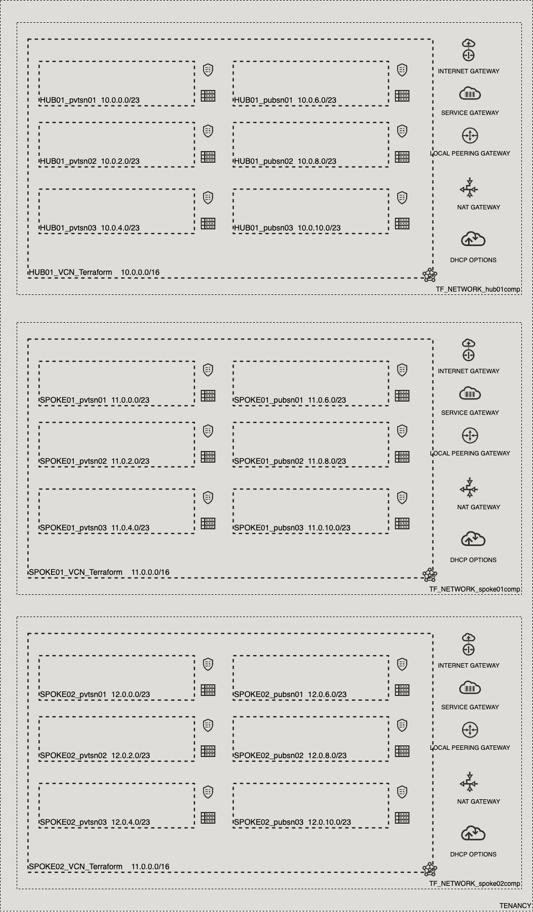

# OCI Cloud Bricks: Sample HUB and SPOKE Network Artifacts

[](https://img.shields.io/badge/license-UPL-green) [](https://sonarcloud.io/dashboard?id=oracle-devrel_terraform-oci-cloudbricks-examples)

## Introduction
The following system builds a Sample Network Structure reflecting a HUB and SPOKE with the following reference architecture: 


## Getting Started
For details in how the Oracle CloudBricks Framework works, refer to the [following file](../README.md)

### Prerequisites
- A Pre-Created Object Storage Bucket to store tfstate files
- a Pre-Installed Executor with CLI installed. For instructions in how to install CLI, go to the [following link](https://docs.oracle.com/en-us/iaas/Content/API/SDKDocs/cliinstall.htm)
- A Pre-Configured .oci/config file with API Keys. For details in how to do this step, go to the [following link](https://docs.oracle.com/en-us/iaas/Content/API/Concepts/apisigningkey.htm). File should look similar to this: 
  
```shell
[DEFAULT]
user=ocid1.user.oc1..aaaaaaaafoobarfoobarfoobar
fingerprint=9a:9e:13:cf:94:6e:2c:b9:54:D1:60:0d:e4:14:8b:5e
tenancy=ocid1.tenancy.oc1..aaaaaaaaoqdyfoobarfoobarfoobar
region=re-region-1
key_file=/full/path/to/api/key/my_api_key.pem
```

- A Pre-Configured .aws/credentials file with values from pre-created Customer Secret Keys. File should look similar to this: 

```shell
[default]
aws_access_key_id=202ad26f6546c71cc8990c821eece00a6b543ssa21231
aws_secret_access_key=xgYpRAiel5Yxrc9G67MGddaskjdhalsdiujlewiH3NxX4ZMe4=
```

For instructions in how to create Customer Secret Keys, go to the [following link](https://docs.oracle.com/en-us/iaas/Content/Identity/Tasks/managingcredentials.htm#To4)

## Components
The following system contains the following components: 

### [backend.tf](./backend.tf)

This file defines the S3 compatibility API integration to store .tfstate file into an OCI Bucket. It's content is the following: 

```go
terraform {
  backend "s3" {
    bucket   = "Precreated_bucket_to_store_tfstate_files_name"
    key      = "Samples/sample_hub_spoke_compartment_with_parent.tfstate"
    region   = "re-region-1"
    endpoint = "https://Tenancy_ObjectStorage_namespace.compat.objectstorage.re-region-1.oraclecloud.com"

    skip_region_validation      = true
    skip_credentials_validation = true
    skip_metadata_api_check     = true
    force_path_style            = true
  }
}
```

*Considerations*

- The `bucket` variable, requires the display name of the bucket where tfstate files will be stored
- The `key` variable, supports a structure of your choice, by providing `/`as separators. Name of the file should always be `system_name.tfstate`
- The `region` variable contains the name id of the region where the system is being deployed at
- The `endpoint` variable contains the concatenation of the tenancy namespace and the region as depicted on above example. For instructions in how to determine the Tenancy Object Storage namespace, refer to the [following documentation](https://docs.oracle.com/en-us/iaas/Content/Object/Tasks/understandingnamespaces.htm)
- The rest of *variables* require to be set as is. **Do not change nor update these values**


### [datasource.tf](./datasource.tf)
This file defines the datasources required for internal tracking lookup on Open Source Project. Do not alter this file

### [main.tf](./main.tf) 
This file defines the main orchestration of module. The following structure is expected

```go
module "ModuleName" {
  source = "git::ssh://git@github.com/oracle-devrel/terraform-oci-cloudbricks-network-artifacts.git?ref=v1.0.0"
    providers = {
    oci.home = oci.home
  }
  ######################################## PROVIDER SPECIFIC VARIABLES ######################################
  tenancy_ocid     = var.tenancy_ocid
  region           = var.region
  user_ocid        = var.user_ocid
  fingerprint      = var.fingerprint
  private_key_path = var.private_key_path
  ######################################## PROVIDER SPECIFIC VARIABLES ######################################
  ######################################## ARTIFACT SPECIFIC VARIABLES ######################################
  vcn_network_compartment_name        = var.ModuleName_vcn_network_compartment_name
  vcn_cidr_blocks                     = var.ModuleName_vcn_cidr_blocks
  private_subnet_cidr_block_map       = var.ModuleName_private_subnet_cidr_block_map
  public_subnet_cidr_block_map        = var.ModuleName_public_subnet_cidr_block_map
  vcn_display_name                    = var.ModuleName_vcn_display_name
  dhcp_options_display_name           = var.ModuleName_dhcp_options_display_name
  custom_search_domain                = var.ModuleName_custom_search_domain
  private_route_table_display_name    = var.ModuleName_private_route_table_display_name
  public_route_table_display_name     = var.ModuleName_public_route_table_display_name
  private_security_list_display_name  = var.ModuleName_private_security_list_display_name
  public_security_list_display_name   = var.ModuleName_public_security_list_display_name
  service_gateway_display_name        = var.ModuleName_service_gateway_display_name
  nat_gateway_display_name            = var.ModuleName_nat_gateway_display_name
  internet_gateway_display_name       = var.ModuleName_internet_gateway_display_name
  lpg_count                           = var.ModuleName_lpg_count
  lpg_display_name_base               = var.ModuleName_lpg_display_name_base
  peered_vcn_network_compartment_name = var.ModuleName_peered_vcn_network_compartment_name
  peered_lpg_display_name             = var.ModuleName_peered_lpg_display_name
  is_spoke                            = var.ModuleName_is_spoke
  ######################################## ARTIFACT SPECIFIC VARIABLES ######################################
}
```

*Considerations*
- Whereas needed, apply variable and module overloading
- For module specifics, refer to module documentation: 
  - [terraform-oci-cloudbricks-network-artifacts](https://github.com/oracle-devrel/terraform-oci-cloudbricks-network-artifacts/blob/main/README.md)
- For variable usage, refer to section *Variable Documentation*


### [output.tf](./output.tf)
The following file defines the output of system, for future forward integration use with Configuration Management Tools

### [README.md](./README.md)
This file

### [system.tfvars](./system.tfvars)
The following file defines the specific variables customized using variable overloading. Please refer to backend brick module documentation for details in how to fill.
For module specifics, refer to module documentation: 
  - [terraform-oci-cloudbricks-network-artifacts](https://github.com/oracle-devrel/terraform-oci-cloudbricks-network-artifacts/blob/main/README.md)

### [variables.tf](./variables.tf)
The following file defines all the variables used in this system. For details on it's content, refer to section *Variable Documentation*

---
## Variable Documentation
## Requirements

| Name | Version |
|------|---------|
| <a name="requirement_terraform"></a> [terraform](#requirement\_terraform) | >= 0.13.5 |
| <a name="requirement_oci"></a> [oci](#requirement\_oci) | >= 4.36.0 |

## Providers

| Name | Version |
|------|---------|
| <a name="provider_oci"></a> [oci](#provider\_oci) | 4.36.0 |

## Modules

| Name | Source | Version |
|------|--------|---------|
| <a name="module_artifact_hub01comp"></a> [artifact\_hub01comp](#module\_artifact\_hub01comp) | git::ssh://git@github.com/oracle-devrel/terraform-oci-cloudbricks-compartment.git | v1.0.0 |
| <a name="module_artifact_spoke01comp"></a> [artifact\_spoke01comp](#module\_artifact\_spoke01comp) | git::ssh://git@github.com/oracle-devrel/terraform-oci-cloudbricks-compartment.git | v1.0.0 |
| <a name="module_artifact_spoke02comp"></a> [artifact\_spoke02comp](#module\_artifact\_spoke02comp) | git::ssh://git@github.com/oracle-devrel/terraform-oci-cloudbricks-compartment.git | v1.0.0 |
| <a name="module_hub01comp"></a> [hub01comp](#module\_hub01comp) | git::ssh://git@github.com/oracle-devrel/terraform-oci-cloudbricks-compartment.git | v1.0.0 |
| <a name="module_mainbizcomp"></a> [mainbizcomp](#module\_mainbizcomp) | git::ssh://git@github.com/oracle-devrel/terraform-oci-cloudbricks-compartment.git | v1.0.0 |
| <a name="module_network_hub01comp"></a> [network\_hub01comp](#module\_network\_hub01comp) | git::ssh://git@github.com/oracle-devrel/terraform-oci-cloudbricks-compartment.git | v1.0.0 |
| <a name="module_network_spoke01comp"></a> [network\_spoke01comp](#module\_network\_spoke01comp) | git::ssh://git@github.com/oracle-devrel/terraform-oci-cloudbricks-compartment.git | v1.0.0 |
| <a name="module_network_spoke02comp"></a> [network\_spoke02comp](#module\_network\_spoke02comp) | git::ssh://git@github.com/oracle-devrel/terraform-oci-cloudbricks-compartment.git | v1.0.0 |
| <a name="module_spoke01comp"></a> [spoke01comp](#module\_spoke01comp) | git::ssh://git@github.com/oracle-devrel/terraform-oci-cloudbricks-compartment.git | v1.0.0 |
| <a name="module_spoke02comp"></a> [spoke02comp](#module\_spoke02comp) | git::ssh://git@github.com/oracle-devrel/terraform-oci-cloudbricks-compartment.git | v1.0.0 |

## Resources

| Name | Type |
|------|------|
| [oci_identity_region_subscriptions.home_region_subscriptions](https://registry.terraform.io/providers/hashicorp/oci/latest/docs/data-sources/identity_region_subscriptions) | data source |

## Inputs

| Name | Description | Type | Default | Required |
|------|-------------|------|---------|:--------:|
| <a name="input_artifact_hub01comp_compartment_description"></a> [artifact\_hub01comp\_compartment\_description](#input\_artifact\_hub01comp\_compartment\_description) | Compartment Description | `any` | n/a | yes |
| <a name="input_artifact_hub01comp_compartment_name"></a> [artifact\_hub01comp\_compartment\_name](#input\_artifact\_hub01comp\_compartment\_name) | Compartment Display Name | `any` | n/a | yes |
| <a name="input_artifact_hub01comp_enable_delete"></a> [artifact\_hub01comp\_enable\_delete](#input\_artifact\_hub01comp\_enable\_delete) | Defines if this compartment can be programatically deleted by terraform destroy | `any` | n/a | yes |
| <a name="input_artifact_spoke01comp_compartment_description"></a> [artifact\_spoke01comp\_compartment\_description](#input\_artifact\_spoke01comp\_compartment\_description) | Compartment Description | `any` | n/a | yes |
| <a name="input_artifact_spoke01comp_compartment_name"></a> [artifact\_spoke01comp\_compartment\_name](#input\_artifact\_spoke01comp\_compartment\_name) | Compartment Display Name | `any` | n/a | yes |
| <a name="input_artifact_spoke01comp_enable_delete"></a> [artifact\_spoke01comp\_enable\_delete](#input\_artifact\_spoke01comp\_enable\_delete) | Defines if this compartment can be programatically deleted by terraform destroy | `any` | n/a | yes |
| <a name="input_artifact_spoke02comp_compartment_description"></a> [artifact\_spoke02comp\_compartment\_description](#input\_artifact\_spoke02comp\_compartment\_description) | Compartment Description | `any` | n/a | yes |
| <a name="input_artifact_spoke02comp_compartment_name"></a> [artifact\_spoke02comp\_compartment\_name](#input\_artifact\_spoke02comp\_compartment\_name) | Compartment Display Name | `any` | n/a | yes |
| <a name="input_artifact_spoke02comp_enable_delete"></a> [artifact\_spoke02comp\_enable\_delete](#input\_artifact\_spoke02comp\_enable\_delete) | Defines if this compartment can be programatically deleted by terraform destroy | `any` | n/a | yes |
| <a name="input_fingerprint"></a> [fingerprint](#input\_fingerprint) | API Key Fingerprint for user\_ocid derived from public API Key imported in OCI User config | `any` | n/a | yes |
| <a name="input_hub01comp_compartment_description"></a> [hub01comp\_compartment\_description](#input\_hub01comp\_compartment\_description) | Enters a description of the compartment | `any` | n/a | yes |
| <a name="input_hub01comp_compartment_name"></a> [hub01comp\_compartment\_name](#input\_hub01comp\_compartment\_name) | Defines the display name of compartment | `any` | n/a | yes |
| <a name="input_hub01comp_enable_delete"></a> [hub01comp\_enable\_delete](#input\_hub01comp\_enable\_delete) | Defines if this compartment can be programatically deleted by terraform destroy | `any` | n/a | yes |
| <a name="input_mainbizcomp_compartment_description"></a> [mainbizcomp\_compartment\_description](#input\_mainbizcomp\_compartment\_description) | Enters a description of the compartment | `any` | n/a | yes |
| <a name="input_mainbizcomp_compartment_name"></a> [mainbizcomp\_compartment\_name](#input\_mainbizcomp\_compartment\_name) | Defines the display name of compartment | `any` | n/a | yes |
| <a name="input_mainbizcomp_enable_delete"></a> [mainbizcomp\_enable\_delete](#input\_mainbizcomp\_enable\_delete) | Defines if this compartment can be programatically deleted by terraform destroy | `any` | n/a | yes |
| <a name="input_mainbizcomp_is_root_parent"></a> [mainbizcomp\_is\_root\_parent](#input\_mainbizcomp\_is\_root\_parent) | The following variable describes if Root compartment is the parent of this | `any` | n/a | yes |
| <a name="input_mainbizcomp_root_compartment_ocid"></a> [mainbizcomp\_root\_compartment\_ocid](#input\_mainbizcomp\_root\_compartment\_ocid) | Defines the OCID of the root compartment | `any` | n/a | yes |
| <a name="input_network_hub01comp_compartment_description"></a> [network\_hub01comp\_compartment\_description](#input\_network\_hub01comp\_compartment\_description) | Compartment Description | `any` | n/a | yes |
| <a name="input_network_hub01comp_compartment_name"></a> [network\_hub01comp\_compartment\_name](#input\_network\_hub01comp\_compartment\_name) | Compartment Display Name | `any` | n/a | yes |
| <a name="input_network_hub01comp_enable_delete"></a> [network\_hub01comp\_enable\_delete](#input\_network\_hub01comp\_enable\_delete) | Defines if this compartment can be programatically deleted by terraform destroy | `any` | n/a | yes |
| <a name="input_network_spoke01comp_compartment_description"></a> [network\_spoke01comp\_compartment\_description](#input\_network\_spoke01comp\_compartment\_description) | Compartment Description | `any` | n/a | yes |
| <a name="input_network_spoke01comp_compartment_name"></a> [network\_spoke01comp\_compartment\_name](#input\_network\_spoke01comp\_compartment\_name) | Compartment Display Name | `any` | n/a | yes |
| <a name="input_network_spoke01comp_enable_delete"></a> [network\_spoke01comp\_enable\_delete](#input\_network\_spoke01comp\_enable\_delete) | Defines if this compartment can be programatically deleted by terraform destroy | `any` | n/a | yes |
| <a name="input_network_spoke02comp_compartment_description"></a> [network\_spoke02comp\_compartment\_description](#input\_network\_spoke02comp\_compartment\_description) | Compartment Description | `any` | n/a | yes |
| <a name="input_network_spoke02comp_compartment_name"></a> [network\_spoke02comp\_compartment\_name](#input\_network\_spoke02comp\_compartment\_name) | Compartment Display Name | `any` | n/a | yes |
| <a name="input_network_spoke02comp_enable_delete"></a> [network\_spoke02comp\_enable\_delete](#input\_network\_spoke02comp\_enable\_delete) | Defines if this compartment can be programatically deleted by terraform destroy | `any` | n/a | yes |
| <a name="input_private_key_path"></a> [private\_key\_path](#input\_private\_key\_path) | Private Key Absolute path location where terraform is executed | `any` | n/a | yes |
| <a name="input_region"></a> [region](#input\_region) | Target region where artifacts are going to be created | `any` | n/a | yes |
| <a name="input_spoke01comp_compartment_description"></a> [spoke01comp\_compartment\_description](#input\_spoke01comp\_compartment\_description) | Enters a description of the compartment | `any` | n/a | yes |
| <a name="input_spoke01comp_compartment_name"></a> [spoke01comp\_compartment\_name](#input\_spoke01comp\_compartment\_name) | Defines the display name of compartment | `any` | n/a | yes |
| <a name="input_spoke01comp_enable_delete"></a> [spoke01comp\_enable\_delete](#input\_spoke01comp\_enable\_delete) | Defines if this compartment can be programatically deleted by terraform destroy | `any` | n/a | yes |
| <a name="input_spoke02comp_compartment_description"></a> [spoke02comp\_compartment\_description](#input\_spoke02comp\_compartment\_description) | Enters a description of the compartment | `any` | n/a | yes |
| <a name="input_spoke02comp_compartment_name"></a> [spoke02comp\_compartment\_name](#input\_spoke02comp\_compartment\_name) | Defines the display name of compartment | `any` | n/a | yes |
| <a name="input_spoke02comp_enable_delete"></a> [spoke02comp\_enable\_delete](#input\_spoke02comp\_enable\_delete) | Defines if this compartment can be programatically deleted by terraform destroy | `any` | n/a | yes |
| <a name="input_tenancy_ocid"></a> [tenancy\_ocid](#input\_tenancy\_ocid) | OCID of tenancy | `any` | n/a | yes |
| <a name="input_user_ocid"></a> [user\_ocid](#input\_user\_ocid) | User OCID in tenancy. Currently hardcoded to user denny.alquinta@oracle.com | `any` | n/a | yes |

## Outputs

| Name | Description |
[opc@dalquintdevhubscl sample_hub_spoke_network_components]$ terraform-docs markdown .
## Requirements

| Name | Version |
|------|---------|
| <a name="requirement_terraform"></a> [terraform](#requirement\_terraform) | >= 0.13.5 |
| <a name="requirement_oci"></a> [oci](#requirement\_oci) | >= 4.36.0 |

## Providers

| Name | Version |
|------|---------|
| <a name="provider_oci"></a> [oci](#provider\_oci) | 4.36.0 |

## Modules

| Name | Source | Version |
|------|--------|---------|
| <a name="module_hub01network"></a> [hub01network](#module\_hub01network) | git::ssh://git@github.com/oracle-devrel/terraform-oci-cloudbricks-network-artifacts.git | v1.0.0 |
| <a name="module_lpg_route_pub_hub_to_spoke01"></a> [lpg\_route\_pub\_hub\_to\_spoke01](#module\_lpg\_route\_pub\_hub\_to\_spoke01) | git::ssh://git@github.com/oraclecloudbricks/lpg_config.git | v1.0 |
| <a name="module_lpg_route_pub_hub_to_spoke02"></a> [lpg\_route\_pub\_hub\_to\_spoke02](#module\_lpg\_route\_pub\_hub\_to\_spoke02) | git::ssh://git@github.com/oraclecloudbricks/lpg_config.git | v1.0 |
| <a name="module_lpg_route_pvt_hub_to_spoke01"></a> [lpg\_route\_pvt\_hub\_to\_spoke01](#module\_lpg\_route\_pvt\_hub\_to\_spoke01) | git::ssh://git@github.com/oraclecloudbricks/lpg_config.git | v1.0 |
| <a name="module_lpg_route_pvt_hub_to_spoke02"></a> [lpg\_route\_pvt\_hub\_to\_spoke02](#module\_lpg\_route\_pvt\_hub\_to\_spoke02) | git::ssh://git@github.com/oraclecloudbricks/lpg_config.git | v1.0 |
| <a name="module_spoke01network"></a> [spoke01network](#module\_spoke01network) | git::ssh://git@github.com/oracle-devrel/terraform-oci-cloudbricks-network-artifacts.git | v1.0.0 |
| <a name="module_spoke02network"></a> [spoke02network](#module\_spoke02network) | git::ssh://git@github.com/oracle-devrel/terraform-oci-cloudbricks-network-artifacts.git | v1.0.0 |

## Resources

| Name | Type |
|------|------|
| [oci_identity_region_subscriptions.home_region_subscriptions](https://registry.terraform.io/providers/hashicorp/oci/latest/docs/data-sources/identity_region_subscriptions) | data source |

## Inputs

| Name | Description | Type | Default | Required |
|------|-------------|------|---------|:--------:|
| <a name="input_fingerprint"></a> [fingerprint](#input\_fingerprint) | API Key Fingerprint for user\_ocid derived from public API Key imported in OCI User config | `any` | n/a | yes |
| <a name="input_hub01network_custom_search_domain"></a> [hub01network\_custom\_search\_domain](#input\_hub01network\_custom\_search\_domain) | A domain name where the custom option can be applied | `any` | n/a | yes |
| <a name="input_hub01network_dhcp_options_display_name"></a> [hub01network\_dhcp\_options\_display\_name](#input\_hub01network\_dhcp\_options\_display\_name) | (Optional) (Updatable) A user-friendly name. Does not have to be unique, and it's changeable. Avoid entering confidential information. | `any` | n/a | yes |
| <a name="input_hub01network_internet_gateway_display_name"></a> [hub01network\_internet\_gateway\_display\_name](#input\_hub01network\_internet\_gateway\_display\_name) | (Optional) (Updatable) A user-friendly name. Does not have to be unique, and it's changeable. Avoid entering confidential information. | `any` | n/a | yes |
| <a name="input_hub01network_internet_gateway_enabled"></a> [hub01network\_internet\_gateway\_enabled](#input\_hub01network\_internet\_gateway\_enabled) | Describes if the Internet Gateway is enabled upon creation or not | `bool` | `true` | no |
| <a name="input_hub01network_is_private_subnet_private"></a> [hub01network\_is\_private\_subnet\_private](#input\_hub01network\_is\_private\_subnet\_private) | Describes if the subnet is private or not | `bool` | `true` | no |
| <a name="input_hub01network_is_public_subnet_private"></a> [hub01network\_is\_public\_subnet\_private](#input\_hub01network\_is\_public\_subnet\_private) | Describes if the subnet is private or not | `bool` | `false` | no |
| <a name="input_hub01network_is_spoke"></a> [hub01network\_is\_spoke](#input\_hub01network\_is\_spoke) | Boolean that describes if the compartment is a spoke or not | `bool` | `true` | no |
| <a name="input_hub01network_lpg_count"></a> [hub01network\_lpg\_count](#input\_hub01network\_lpg\_count) | Number of LPG to create | `number` | `1` | no |
| <a name="input_hub01network_lpg_display_name_base"></a> [hub01network\_lpg\_display\_name\_base](#input\_hub01network\_lpg\_display\_name\_base) | Local Peering Gateway Display Name Base | `any` | n/a | yes |
| <a name="input_hub01network_nat_gateway_display_name"></a> [hub01network\_nat\_gateway\_display\_name](#input\_hub01network\_nat\_gateway\_display\_name) | NAT Gateway Display Name | `any` | n/a | yes |
| <a name="input_hub01network_peered_lpg_display_name"></a> [hub01network\_peered\_lpg\_display\_name](#input\_hub01network\_peered\_lpg\_display\_name) | Display name of peered network | `string` | `""` | no |
| <a name="input_hub01network_peered_vcn_network_compartment_name"></a> [hub01network\_peered\_vcn\_network\_compartment\_name](#input\_hub01network\_peered\_vcn\_network\_compartment\_name) | Compartment name of origin VCN to peer | `string` | `""` | no |
| <a name="input_hub01network_private_route_table_display_name"></a> [hub01network\_private\_route\_table\_display\_name](#input\_hub01network\_private\_route\_table\_display\_name) | Private Route Table Display Name. | `any` | n/a | yes |
| <a name="input_hub01network_private_route_table_nat_route_rules_description"></a> [hub01network\_private\_route\_table\_nat\_route\_rules\_description](#input\_hub01network\_private\_route\_table\_nat\_route\_rules\_description) | (Optional) (Updatable) An optional description of your choice for the rule. | `string` | `"NAT Gateway default route"` | no |
| <a name="input_hub01network_private_route_table_nat_route_rules_destination"></a> [hub01network\_private\_route\_table\_nat\_route\_rules\_destination](#input\_hub01network\_private\_route\_table\_nat\_route\_rules\_destination) | private\_route\_table\_route\_rules\_destination | `string` | `"0.0.0.0/0"` | no |
| <a name="input_hub01network_private_route_table_nat_route_rules_destination_type"></a> [hub01network\_private\_route\_table\_nat\_route\_rules\_destination\_type](#input\_hub01network\_private\_route\_table\_nat\_route\_rules\_destination\_type) | (Optional) (Updatable) Type of destination for the rule. Required if you provide a destination. | `string` | `"CIDR_BLOCK"` | no |
| <a name="input_hub01network_private_route_table_svc_route_rules_description"></a> [hub01network\_private\_route\_table\_svc\_route\_rules\_description](#input\_hub01network\_private\_route\_table\_svc\_route\_rules\_description) | (Optional) (Updatable) An optional description of your choice for the rule. | `string` | `"Service Gateway default route"` | no |
| <a name="input_hub01network_private_route_table_svc_route_rules_destination_type"></a> [hub01network\_private\_route\_table\_svc\_route\_rules\_destination\_type](#input\_hub01network\_private\_route\_table\_svc\_route\_rules\_destination\_type) | (Optional) (Updatable) Type of destination for the rule. Required if you provide a destination. | `string` | `"SERVICE_CIDR_BLOCK"` | no |
| <a name="input_hub01network_private_security_list_display_name"></a> [hub01network\_private\_security\_list\_display\_name](#input\_hub01network\_private\_security\_list\_display\_name) | (Optional) (Updatable) A user-friendly name. Does not have to be unique, and it's changeable. Avoid entering confidential information. | `any` | n/a | yes |
| <a name="input_hub01network_private_security_list_egress_security_rules_description"></a> [hub01network\_private\_security\_list\_egress\_security\_rules\_description](#input\_hub01network\_private\_security\_list\_egress\_security\_rules\_description) | (Optional) (Updatable) An optional description of your choice for the rule. | `string` | `"All egress rule for all protocols and IP Addresses"` | no |
| <a name="input_hub01network_private_security_list_egress_security_rules_destination"></a> [hub01network\_private\_security\_list\_egress\_security\_rules\_destination](#input\_hub01network\_private\_security\_list\_egress\_security\_rules\_destination) | (Required) (Updatable) Conceptually, this is the range of IP addresses that a packet originating from the instance can go to. | `string` | `"0.0.0.0/0"` | no |
| <a name="input_hub01network_private_security_list_egress_security_rules_destination_type"></a> [hub01network\_private\_security\_list\_egress\_security\_rules\_destination\_type](#input\_hub01network\_private\_security\_list\_egress\_security\_rules\_destination\_type) | Optional) (Updatable) Type of destination for the rule. The default is CIDR\_BLOCK | `string` | `"CIDR_BLOCK"` | no |
| <a name="input_hub01network_private_security_list_egress_security_rules_protocol"></a> [hub01network\_private\_security\_list\_egress\_security\_rules\_protocol](#input\_hub01network\_private\_security\_list\_egress\_security\_rules\_protocol) | (Required) (Updatable) The transport protocol. Specify either all or an IPv4 protocol number as defined in Protocol Numbers. Options are supported only for ICMP (1), TCP (6), UDP (17), and ICMPv6 (58). | `string` | `"all"` | no |
| <a name="input_hub01network_private_security_list_egress_security_rules_stateless"></a> [hub01network\_private\_security\_list\_egress\_security\_rules\_stateless](#input\_hub01network\_private\_security\_list\_egress\_security\_rules\_stateless) | (Optional) (Updatable) A stateless rule allows traffic in one direction. Remember to add a corresponding stateless rule in the other direction if you need to support bidirectional traffic. For example, if egress traffic allows TCP destination port 80, there should be an ingress rule to allow TCP source port 80. Defaults to false, which means the rule is stateful and a corresponding rule is not necessary for bidirectional traffic. | `bool` | `true` | no |
| <a name="input_hub01network_private_security_list_ingress_security_rules_description"></a> [hub01network\_private\_security\_list\_ingress\_security\_rules\_description](#input\_hub01network\_private\_security\_list\_ingress\_security\_rules\_description) | (Optional) (Updatable) An optional description of your choice for the rule. | `string` | `"All traffic in for private security List"` | no |
| <a name="input_hub01network_private_security_list_ingress_security_rules_protocol"></a> [hub01network\_private\_security\_list\_ingress\_security\_rules\_protocol](#input\_hub01network\_private\_security\_list\_ingress\_security\_rules\_protocol) | (Required) (Updatable) The transport protocol. Specify either all or an IPv4 protocol number as defined in Protocol Numbers. Options are supported only for ICMP (1), TCP (6), UDP (17), and ICMPv6 (58). | `string` | `"all"` | no |
| <a name="input_hub01network_private_security_list_ingress_security_rules_source"></a> [hub01network\_private\_security\_list\_ingress\_security\_rules\_source](#input\_hub01network\_private\_security\_list\_ingress\_security\_rules\_source) | (Required) (Updatable) Conceptually, this is the range of IP addresses that a packet coming into the instance can come from. | `string` | `"0.0.0.0/0"` | no |
| <a name="input_hub01network_private_security_list_ingress_security_rules_source_type"></a> [hub01network\_private\_security\_list\_ingress\_security\_rules\_source\_type](#input\_hub01network\_private\_security\_list\_ingress\_security\_rules\_source\_type) | Type of source for the rule. | `string` | `"CIDR_BLOCK"` | no |
| <a name="input_hub01network_private_security_list_ingress_security_rules_stateless"></a> [hub01network\_private\_security\_list\_ingress\_security\_rules\_stateless](#input\_hub01network\_private\_security\_list\_ingress\_security\_rules\_stateless) | A stateless rule allows traffic in one direction. Remember to add a corresponding stateless rule in the other direction if you need to support bidirectional traffic. For example, if ingress traffic allows TCP destination port 80, there should be an egress rule to allow TCP source port 80. Defaults to false, which means the rule is stateful and a corresponding rule is not necessary for bidirectional traffic. | `bool` | `true` | no |
| <a name="input_hub01network_private_subnet_cidr_block_map"></a> [hub01network\_private\_subnet\_cidr\_block\_map](#input\_hub01network\_private\_subnet\_cidr\_block\_map) | Map of CIDR Blocks associated to private subnets and it's corresponding names | `map(any)` | n/a | yes |
| <a name="input_hub01network_public_route_table_display_name"></a> [hub01network\_public\_route\_table\_display\_name](#input\_hub01network\_public\_route\_table\_display\_name) | Public Route Table Display Name. | `any` | n/a | yes |
| <a name="input_hub01network_public_route_table_inet_route_rules_description"></a> [hub01network\_public\_route\_table\_inet\_route\_rules\_description](#input\_hub01network\_public\_route\_table\_inet\_route\_rules\_description) | Description of Route Table Entry for Internet Gateway | `string` | `"Route entry for Internet Gateway"` | no |
| <a name="input_hub01network_public_route_table_inet_route_rules_destination"></a> [hub01network\_public\_route\_table\_inet\_route\_rules\_destination](#input\_hub01network\_public\_route\_table\_inet\_route\_rules\_destination) | private\_route\_table\_route\_rules\_destination | `string` | `"0.0.0.0/0"` | no |
| <a name="input_hub01network_public_route_table_inet_route_rules_destination_type"></a> [hub01network\_public\_route\_table\_inet\_route\_rules\_destination\_type](#input\_hub01network\_public\_route\_table\_inet\_route\_rules\_destination\_type) | (Optional) (Updatable) Type of destination for the rule. Required if you provide a destination. | `string` | `"CIDR_BLOCK"` | no |
| <a name="input_hub01network_public_route_table_svc_route_rules_description"></a> [hub01network\_public\_route\_table\_svc\_route\_rules\_description](#input\_hub01network\_public\_route\_table\_svc\_route\_rules\_description) | (Optional) (Updatable) An optional description of your choice for the rule. | `string` | `"Service Gateway default route"` | no |
| <a name="input_hub01network_public_route_table_svc_route_rules_destination_type"></a> [hub01network\_public\_route\_table\_svc\_route\_rules\_destination\_type](#input\_hub01network\_public\_route\_table\_svc\_route\_rules\_destination\_type) | (Optional) (Updatable) Type of destination for the rule. Required if you provide a destination. | `string` | `"SERVICE_CIDR_BLOCK"` | no |
| <a name="input_hub01network_public_security_list_display_name"></a> [hub01network\_public\_security\_list\_display\_name](#input\_hub01network\_public\_security\_list\_display\_name) | (Optional) (Updatable) A user-friendly name. Does not have to be unique, and it's changeable. Avoid entering confidential information. | `any` | n/a | yes |
| <a name="input_hub01network_public_security_list_egress_security_rules_description"></a> [hub01network\_public\_security\_list\_egress\_security\_rules\_description](#input\_hub01network\_public\_security\_list\_egress\_security\_rules\_description) | (Optional) (Updatable) An optional description of your choice for the rule. | `string` | `"All egress rule for all protocols and IP Addresses"` | no |
| <a name="input_hub01network_public_security_list_egress_security_rules_destination"></a> [hub01network\_public\_security\_list\_egress\_security\_rules\_destination](#input\_hub01network\_public\_security\_list\_egress\_security\_rules\_destination) | (Required) (Updatable) Conceptually, this is the range of IP addresses that a packet originating from the instance can go to. | `string` | `"0.0.0.0/0"` | no |
| <a name="input_hub01network_public_security_list_egress_security_rules_destination_type"></a> [hub01network\_public\_security\_list\_egress\_security\_rules\_destination\_type](#input\_hub01network\_public\_security\_list\_egress\_security\_rules\_destination\_type) | Optional) (Updatable) Type of destination for the rule. The default is CIDR\_BLOCK | `string` | `"CIDR_BLOCK"` | no |
| <a name="input_hub01network_public_security_list_egress_security_rules_protocol"></a> [hub01network\_public\_security\_list\_egress\_security\_rules\_protocol](#input\_hub01network\_public\_security\_list\_egress\_security\_rules\_protocol) | (Required) (Updatable) The transport protocol. Specify either all or an IPv4 protocol number as defined in Protocol Numbers. Options are supported only for ICMP (1), TCP (6), UDP (17), and ICMPv6 (58). | `string` | `"all"` | no |
| <a name="input_hub01network_public_security_list_egress_security_rules_stateless"></a> [hub01network\_public\_security\_list\_egress\_security\_rules\_stateless](#input\_hub01network\_public\_security\_list\_egress\_security\_rules\_stateless) | (Optional) (Updatable) A stateless rule allows traffic in one direction. Remember to add a corresponding stateless rule in the other direction if you need to support bidirectional traffic. For example, if egress traffic allows TCP destination port 80, there should be an ingress rule to allow TCP source port 80. Defaults to false, which means the rule is stateful and a corresponding rule is not necessary for bidirectional traffic. | `bool` | `true` | no |
| <a name="input_hub01network_public_security_list_ingress_security_rules_description"></a> [hub01network\_public\_security\_list\_ingress\_security\_rules\_description](#input\_hub01network\_public\_security\_list\_ingress\_security\_rules\_description) | (Optional) (Updatable) An optional description of your choice for the rule. | `string` | `"All traffic in for Public Security List"` | no |
| <a name="input_hub01network_public_security_list_ingress_security_rules_protocol"></a> [hub01network\_public\_security\_list\_ingress\_security\_rules\_protocol](#input\_hub01network\_public\_security\_list\_ingress\_security\_rules\_protocol) | (Required) (Updatable) The transport protocol. Specify either all or an IPv4 protocol number as defined in Protocol Numbers. Options are supported only for ICMP (1), TCP (6), UDP (17), and ICMPv6 (58). | `string` | `"all"` | no |
| <a name="input_hub01network_public_security_list_ingress_security_rules_source"></a> [hub01network\_public\_security\_list\_ingress\_security\_rules\_source](#input\_hub01network\_public\_security\_list\_ingress\_security\_rules\_source) | (Required) (Updatable) Conceptually, this is the range of IP addresses that a packet coming into the instance can come from. | `string` | `"0.0.0.0/0"` | no |
| <a name="input_hub01network_public_security_list_ingress_security_rules_source_type"></a> [hub01network\_public\_security\_list\_ingress\_security\_rules\_source\_type](#input\_hub01network\_public\_security\_list\_ingress\_security\_rules\_source\_type) | Type of source for the rule. | `string` | `"CIDR_BLOCK"` | no |
| <a name="input_hub01network_public_security_list_ingress_security_rules_stateless"></a> [hub01network\_public\_security\_list\_ingress\_security\_rules\_stateless](#input\_hub01network\_public\_security\_list\_ingress\_security\_rules\_stateless) | A stateless rule allows traffic in one direction. Remember to add a corresponding stateless rule in the other direction if you need to support bidirectional traffic. For example, if ingress traffic allows TCP destination port 80, there should be an egress rule to allow TCP source port 80. Defaults to false, which means the rule is stateful and a corresponding rule is not necessary for bidirectional traffic. | `bool` | `true` | no |
| <a name="input_hub01network_public_subnet_cidr_block_map"></a> [hub01network\_public\_subnet\_cidr\_block\_map](#input\_hub01network\_public\_subnet\_cidr\_block\_map) | Map of CIDR Blocks associated to private subnets and it's corresponding names | `map(any)` | n/a | yes |
| <a name="input_hub01network_service_gateway_display_name"></a> [hub01network\_service\_gateway\_display\_name](#input\_hub01network\_service\_gateway\_display\_name) | Service Gateway Display Name | `any` | n/a | yes |
| <a name="input_hub01network_vcn_cidr_blocks"></a> [hub01network\_vcn\_cidr\_blocks](#input\_hub01network\_vcn\_cidr\_blocks) | The list of one or more IPv4 CIDR blocks for the VCN | `any` | n/a | yes |
| <a name="input_hub01network_vcn_display_name"></a> [hub01network\_vcn\_display\_name](#input\_hub01network\_vcn\_display\_name) | (Optional) (Updatable) A user-friendly name. Does not have to be unique, and it's changeable. Avoid entering confidential information. | `any` | n/a | yes |
| <a name="input_hub01network_vcn_network_compartment_name"></a> [hub01network\_vcn\_network\_compartment\_name](#input\_hub01network\_vcn\_network\_compartment\_name) | Name of the compartment where the VCN will be created | `any` | n/a | yes |
| <a name="input_private_key_path"></a> [private\_key\_path](#input\_private\_key\_path) | Private Key Absolute path location where terraform is executed | `any` | n/a | yes |
| <a name="input_region"></a> [region](#input\_region) | Target region where artifacts are going to be created | `any` | n/a | yes |
| <a name="input_spoke01network_custom_search_domain"></a> [spoke01network\_custom\_search\_domain](#input\_spoke01network\_custom\_search\_domain) | A domain name where the custom option can be applied | `any` | n/a | yes |
| <a name="input_spoke01network_dhcp_options_display_name"></a> [spoke01network\_dhcp\_options\_display\_name](#input\_spoke01network\_dhcp\_options\_display\_name) | (Optional) (Updatable) A user-friendly name. Does not have to be unique, and it's changeable. Avoid entering confidential information. | `any` | n/a | yes |
| <a name="input_spoke01network_internet_gateway_display_name"></a> [spoke01network\_internet\_gateway\_display\_name](#input\_spoke01network\_internet\_gateway\_display\_name) | (Optional) (Updatable) A user-friendly name. Does not have to be unique, and it's changeable. Avoid entering confidential information. | `any` | n/a | yes |
| <a name="input_spoke01network_internet_gateway_enabled"></a> [spoke01network\_internet\_gateway\_enabled](#input\_spoke01network\_internet\_gateway\_enabled) | Describes if the Internet Gateway is enabled upon creation or not | `bool` | `true` | no |
| <a name="input_spoke01network_is_private_subnet_private"></a> [spoke01network\_is\_private\_subnet\_private](#input\_spoke01network\_is\_private\_subnet\_private) | Describes if the subnet is private or not | `bool` | `true` | no |
| <a name="input_spoke01network_is_public_subnet_private"></a> [spoke01network\_is\_public\_subnet\_private](#input\_spoke01network\_is\_public\_subnet\_private) | Describes if the subnet is private or not | `bool` | `false` | no |
| <a name="input_spoke01network_is_spoke"></a> [spoke01network\_is\_spoke](#input\_spoke01network\_is\_spoke) | Boolean that describes if the compartment is a spoke or not | `bool` | `true` | no |
| <a name="input_spoke01network_lpg_count"></a> [spoke01network\_lpg\_count](#input\_spoke01network\_lpg\_count) | Number of LPG to create | `number` | `1` | no |
| <a name="input_spoke01network_lpg_display_name_base"></a> [spoke01network\_lpg\_display\_name\_base](#input\_spoke01network\_lpg\_display\_name\_base) | Local Peering Gateway Display Name Base | `any` | n/a | yes |
| <a name="input_spoke01network_nat_gateway_display_name"></a> [spoke01network\_nat\_gateway\_display\_name](#input\_spoke01network\_nat\_gateway\_display\_name) | NAT Gateway Display Name | `any` | n/a | yes |
| <a name="input_spoke01network_peered_lpg_display_name"></a> [spoke01network\_peered\_lpg\_display\_name](#input\_spoke01network\_peered\_lpg\_display\_name) | Display name of peered network | `string` | `""` | no |
| <a name="input_spoke01network_peered_vcn_network_compartment_name"></a> [spoke01network\_peered\_vcn\_network\_compartment\_name](#input\_spoke01network\_peered\_vcn\_network\_compartment\_name) | Compartment name of origin VCN to peer | `string` | `""` | no |
| <a name="input_spoke01network_private_route_table_display_name"></a> [spoke01network\_private\_route\_table\_display\_name](#input\_spoke01network\_private\_route\_table\_display\_name) | Private Route Table Display Name. | `any` | n/a | yes |
| <a name="input_spoke01network_private_route_table_nat_route_rules_description"></a> [spoke01network\_private\_route\_table\_nat\_route\_rules\_description](#input\_spoke01network\_private\_route\_table\_nat\_route\_rules\_description) | (Optional) (Updatable) An optional description of your choice for the rule. | `string` | `"NAT Gateway default route"` | no |
| <a name="input_spoke01network_private_route_table_nat_route_rules_destination"></a> [spoke01network\_private\_route\_table\_nat\_route\_rules\_destination](#input\_spoke01network\_private\_route\_table\_nat\_route\_rules\_destination) | private\_route\_table\_route\_rules\_destination | `string` | `"0.0.0.0/0"` | no |
| <a name="input_spoke01network_private_route_table_nat_route_rules_destination_type"></a> [spoke01network\_private\_route\_table\_nat\_route\_rules\_destination\_type](#input\_spoke01network\_private\_route\_table\_nat\_route\_rules\_destination\_type) | (Optional) (Updatable) Type of destination for the rule. Required if you provide a destination. | `string` | `"CIDR_BLOCK"` | no |
| <a name="input_spoke01network_private_route_table_svc_route_rules_description"></a> [spoke01network\_private\_route\_table\_svc\_route\_rules\_description](#input\_spoke01network\_private\_route\_table\_svc\_route\_rules\_description) | (Optional) (Updatable) An optional description of your choice for the rule. | `string` | `"Service Gateway default route"` | no |
| <a name="input_spoke01network_private_route_table_svc_route_rules_destination_type"></a> [spoke01network\_private\_route\_table\_svc\_route\_rules\_destination\_type](#input\_spoke01network\_private\_route\_table\_svc\_route\_rules\_destination\_type) | (Optional) (Updatable) Type of destination for the rule. Required if you provide a destination. | `string` | `"SERVICE_CIDR_BLOCK"` | no |
| <a name="input_spoke01network_private_security_list_display_name"></a> [spoke01network\_private\_security\_list\_display\_name](#input\_spoke01network\_private\_security\_list\_display\_name) | (Optional) (Updatable) A user-friendly name. Does not have to be unique, and it's changeable. Avoid entering confidential information. | `any` | n/a | yes |
| <a name="input_spoke01network_private_security_list_egress_security_rules_description"></a> [spoke01network\_private\_security\_list\_egress\_security\_rules\_description](#input\_spoke01network\_private\_security\_list\_egress\_security\_rules\_description) | (Optional) (Updatable) An optional description of your choice for the rule. | `string` | `"All egress rule for all protocols and IP Addresses"` | no |
| <a name="input_spoke01network_private_security_list_egress_security_rules_destination"></a> [spoke01network\_private\_security\_list\_egress\_security\_rules\_destination](#input\_spoke01network\_private\_security\_list\_egress\_security\_rules\_destination) | (Required) (Updatable) Conceptually, this is the range of IP addresses that a packet originating from the instance can go to. | `string` | `"0.0.0.0/0"` | no |
| <a name="input_spoke01network_private_security_list_egress_security_rules_destination_type"></a> [spoke01network\_private\_security\_list\_egress\_security\_rules\_destination\_type](#input\_spoke01network\_private\_security\_list\_egress\_security\_rules\_destination\_type) | Optional) (Updatable) Type of destination for the rule. The default is CIDR\_BLOCK | `string` | `"CIDR_BLOCK"` | no |
| <a name="input_spoke01network_private_security_list_egress_security_rules_protocol"></a> [spoke01network\_private\_security\_list\_egress\_security\_rules\_protocol](#input\_spoke01network\_private\_security\_list\_egress\_security\_rules\_protocol) | (Required) (Updatable) The transport protocol. Specify either all or an IPv4 protocol number as defined in Protocol Numbers. Options are supported only for ICMP (1), TCP (6), UDP (17), and ICMPv6 (58). | `string` | `"all"` | no |
| <a name="input_spoke01network_private_security_list_egress_security_rules_stateless"></a> [spoke01network\_private\_security\_list\_egress\_security\_rules\_stateless](#input\_spoke01network\_private\_security\_list\_egress\_security\_rules\_stateless) | (Optional) (Updatable) A stateless rule allows traffic in one direction. Remember to add a corresponding stateless rule in the other direction if you need to support bidirectional traffic. For example, if egress traffic allows TCP destination port 80, there should be an ingress rule to allow TCP source port 80. Defaults to false, which means the rule is stateful and a corresponding rule is not necessary for bidirectional traffic. | `bool` | `true` | no |
| <a name="input_spoke01network_private_security_list_ingress_security_rules_description"></a> [spoke01network\_private\_security\_list\_ingress\_security\_rules\_description](#input\_spoke01network\_private\_security\_list\_ingress\_security\_rules\_description) | (Optional) (Updatable) An optional description of your choice for the rule. | `string` | `"All traffic in for private security List"` | no |
| <a name="input_spoke01network_private_security_list_ingress_security_rules_protocol"></a> [spoke01network\_private\_security\_list\_ingress\_security\_rules\_protocol](#input\_spoke01network\_private\_security\_list\_ingress\_security\_rules\_protocol) | (Required) (Updatable) The transport protocol. Specify either all or an IPv4 protocol number as defined in Protocol Numbers. Options are supported only for ICMP (1), TCP (6), UDP (17), and ICMPv6 (58). | `string` | `"all"` | no |
| <a name="input_spoke01network_private_security_list_ingress_security_rules_source"></a> [spoke01network\_private\_security\_list\_ingress\_security\_rules\_source](#input\_spoke01network\_private\_security\_list\_ingress\_security\_rules\_source) | (Required) (Updatable) Conceptually, this is the range of IP addresses that a packet coming into the instance can come from. | `string` | `"0.0.0.0/0"` | no |
| <a name="input_spoke01network_private_security_list_ingress_security_rules_source_type"></a> [spoke01network\_private\_security\_list\_ingress\_security\_rules\_source\_type](#input\_spoke01network\_private\_security\_list\_ingress\_security\_rules\_source\_type) | Type of source for the rule. | `string` | `"CIDR_BLOCK"` | no |
| <a name="input_spoke01network_private_security_list_ingress_security_rules_stateless"></a> [spoke01network\_private\_security\_list\_ingress\_security\_rules\_stateless](#input\_spoke01network\_private\_security\_list\_ingress\_security\_rules\_stateless) | A stateless rule allows traffic in one direction. Remember to add a corresponding stateless rule in the other direction if you need to support bidirectional traffic. For example, if ingress traffic allows TCP destination port 80, there should be an egress rule to allow TCP source port 80. Defaults to false, which means the rule is stateful and a corresponding rule is not necessary for bidirectional traffic. | `bool` | `true` | no |
| <a name="input_spoke01network_private_subnet_cidr_block_map"></a> [spoke01network\_private\_subnet\_cidr\_block\_map](#input\_spoke01network\_private\_subnet\_cidr\_block\_map) | Map of CIDR Blocks associated to private subnets and it's corresponding names | `map(any)` | n/a | yes |
| <a name="input_spoke01network_public_route_table_display_name"></a> [spoke01network\_public\_route\_table\_display\_name](#input\_spoke01network\_public\_route\_table\_display\_name) | Public Route Table Display Name. | `any` | n/a | yes |
| <a name="input_spoke01network_public_route_table_inet_route_rules_description"></a> [spoke01network\_public\_route\_table\_inet\_route\_rules\_description](#input\_spoke01network\_public\_route\_table\_inet\_route\_rules\_description) | Description of Route Table Entry for Internet Gateway | `string` | `"Route entry for Internet Gateway"` | no |
| <a name="input_spoke01network_public_route_table_inet_route_rules_destination"></a> [spoke01network\_public\_route\_table\_inet\_route\_rules\_destination](#input\_spoke01network\_public\_route\_table\_inet\_route\_rules\_destination) | private\_route\_table\_route\_rules\_destination | `string` | `"0.0.0.0/0"` | no |
| <a name="input_spoke01network_public_route_table_inet_route_rules_destination_type"></a> [spoke01network\_public\_route\_table\_inet\_route\_rules\_destination\_type](#input\_spoke01network\_public\_route\_table\_inet\_route\_rules\_destination\_type) | (Optional) (Updatable) Type of destination for the rule. Required if you provide a destination. | `string` | `"CIDR_BLOCK"` | no |
| <a name="input_spoke01network_public_route_table_svc_route_rules_description"></a> [spoke01network\_public\_route\_table\_svc\_route\_rules\_description](#input\_spoke01network\_public\_route\_table\_svc\_route\_rules\_description) | (Optional) (Updatable) An optional description of your choice for the rule. | `string` | `"Service Gateway default route"` | no |
| <a name="input_spoke01network_public_route_table_svc_route_rules_destination_type"></a> [spoke01network\_public\_route\_table\_svc\_route\_rules\_destination\_type](#input\_spoke01network\_public\_route\_table\_svc\_route\_rules\_destination\_type) | (Optional) (Updatable) Type of destination for the rule. Required if you provide a destination. | `string` | `"SERVICE_CIDR_BLOCK"` | no |
| <a name="input_spoke01network_public_security_list_display_name"></a> [spoke01network\_public\_security\_list\_display\_name](#input\_spoke01network\_public\_security\_list\_display\_name) | (Optional) (Updatable) A user-friendly name. Does not have to be unique, and it's changeable. Avoid entering confidential information. | `any` | n/a | yes |
| <a name="input_spoke01network_public_security_list_egress_security_rules_description"></a> [spoke01network\_public\_security\_list\_egress\_security\_rules\_description](#input\_spoke01network\_public\_security\_list\_egress\_security\_rules\_description) | (Optional) (Updatable) An optional description of your choice for the rule. | `string` | `"All egress rule for all protocols and IP Addresses"` | no |
| <a name="input_spoke01network_public_security_list_egress_security_rules_destination"></a> [spoke01network\_public\_security\_list\_egress\_security\_rules\_destination](#input\_spoke01network\_public\_security\_list\_egress\_security\_rules\_destination) | (Required) (Updatable) Conceptually, this is the range of IP addresses that a packet originating from the instance can go to. | `string` | `"0.0.0.0/0"` | no |
| <a name="input_spoke01network_public_security_list_egress_security_rules_destination_type"></a> [spoke01network\_public\_security\_list\_egress\_security\_rules\_destination\_type](#input\_spoke01network\_public\_security\_list\_egress\_security\_rules\_destination\_type) | Optional) (Updatable) Type of destination for the rule. The default is CIDR\_BLOCK | `string` | `"CIDR_BLOCK"` | no |
| <a name="input_spoke01network_public_security_list_egress_security_rules_protocol"></a> [spoke01network\_public\_security\_list\_egress\_security\_rules\_protocol](#input\_spoke01network\_public\_security\_list\_egress\_security\_rules\_protocol) | (Required) (Updatable) The transport protocol. Specify either all or an IPv4 protocol number as defined in Protocol Numbers. Options are supported only for ICMP (1), TCP (6), UDP (17), and ICMPv6 (58). | `string` | `"all"` | no |
| <a name="input_spoke01network_public_security_list_egress_security_rules_stateless"></a> [spoke01network\_public\_security\_list\_egress\_security\_rules\_stateless](#input\_spoke01network\_public\_security\_list\_egress\_security\_rules\_stateless) | (Optional) (Updatable) A stateless rule allows traffic in one direction. Remember to add a corresponding stateless rule in the other direction if you need to support bidirectional traffic. For example, if egress traffic allows TCP destination port 80, there should be an ingress rule to allow TCP source port 80. Defaults to false, which means the rule is stateful and a corresponding rule is not necessary for bidirectional traffic. | `bool` | `true` | no |
| <a name="input_spoke01network_public_security_list_ingress_security_rules_description"></a> [spoke01network\_public\_security\_list\_ingress\_security\_rules\_description](#input\_spoke01network\_public\_security\_list\_ingress\_security\_rules\_description) | (Optional) (Updatable) An optional description of your choice for the rule. | `string` | `"All traffic in for Public Security List"` | no |
| <a name="input_spoke01network_public_security_list_ingress_security_rules_protocol"></a> [spoke01network\_public\_security\_list\_ingress\_security\_rules\_protocol](#input\_spoke01network\_public\_security\_list\_ingress\_security\_rules\_protocol) | (Required) (Updatable) The transport protocol. Specify either all or an IPv4 protocol number as defined in Protocol Numbers. Options are supported only for ICMP (1), TCP (6), UDP (17), and ICMPv6 (58). | `string` | `"all"` | no |
| <a name="input_spoke01network_public_security_list_ingress_security_rules_source"></a> [spoke01network\_public\_security\_list\_ingress\_security\_rules\_source](#input\_spoke01network\_public\_security\_list\_ingress\_security\_rules\_source) | (Required) (Updatable) Conceptually, this is the range of IP addresses that a packet coming into the instance can come from. | `string` | `"0.0.0.0/0"` | no |
| <a name="input_spoke01network_public_security_list_ingress_security_rules_source_type"></a> [spoke01network\_public\_security\_list\_ingress\_security\_rules\_source\_type](#input\_spoke01network\_public\_security\_list\_ingress\_security\_rules\_source\_type) | Type of source for the rule. | `string` | `"CIDR_BLOCK"` | no |
| <a name="input_spoke01network_public_security_list_ingress_security_rules_stateless"></a> [spoke01network\_public\_security\_list\_ingress\_security\_rules\_stateless](#input\_spoke01network\_public\_security\_list\_ingress\_security\_rules\_stateless) | A stateless rule allows traffic in one direction. Remember to add a corresponding stateless rule in the other direction if you need to support bidirectional traffic. For example, if ingress traffic allows TCP destination port 80, there should be an egress rule to allow TCP source port 80. Defaults to false, which means the rule is stateful and a corresponding rule is not necessary for bidirectional traffic. | `bool` | `true` | no |
| <a name="input_spoke01network_public_subnet_cidr_block_map"></a> [spoke01network\_public\_subnet\_cidr\_block\_map](#input\_spoke01network\_public\_subnet\_cidr\_block\_map) | Map of CIDR Blocks associated to private subnets and it's corresponding names | `map(any)` | n/a | yes |
| <a name="input_spoke01network_service_gateway_display_name"></a> [spoke01network\_service\_gateway\_display\_name](#input\_spoke01network\_service\_gateway\_display\_name) | Service Gateway Display Name | `any` | n/a | yes |
| <a name="input_spoke01network_vcn_cidr_blocks"></a> [spoke01network\_vcn\_cidr\_blocks](#input\_spoke01network\_vcn\_cidr\_blocks) | The list of one or more IPv4 CIDR blocks for the VCN | `any` | n/a | yes |
| <a name="input_spoke01network_vcn_display_name"></a> [spoke01network\_vcn\_display\_name](#input\_spoke01network\_vcn\_display\_name) | (Optional) (Updatable) A user-friendly name. Does not have to be unique, and it's changeable. Avoid entering confidential information. | `any` | n/a | yes |
| <a name="input_spoke01network_vcn_network_compartment_name"></a> [spoke01network\_vcn\_network\_compartment\_name](#input\_spoke01network\_vcn\_network\_compartment\_name) | Name of the compartment where the VCN will be created | `any` | n/a | yes |
| <a name="input_spoke02network_custom_search_domain"></a> [spoke02network\_custom\_search\_domain](#input\_spoke02network\_custom\_search\_domain) | A domain name where the custom option can be applied | `any` | n/a | yes |
| <a name="input_spoke02network_dhcp_options_display_name"></a> [spoke02network\_dhcp\_options\_display\_name](#input\_spoke02network\_dhcp\_options\_display\_name) | (Optional) (Updatable) A user-friendly name. Does not have to be unique, and it's changeable. Avoid entering confidential information. | `any` | n/a | yes |
| <a name="input_spoke02network_internet_gateway_display_name"></a> [spoke02network\_internet\_gateway\_display\_name](#input\_spoke02network\_internet\_gateway\_display\_name) | (Optional) (Updatable) A user-friendly name. Does not have to be unique, and it's changeable. Avoid entering confidential information. | `any` | n/a | yes |
| <a name="input_spoke02network_internet_gateway_enabled"></a> [spoke02network\_internet\_gateway\_enabled](#input\_spoke02network\_internet\_gateway\_enabled) | Describes if the Internet Gateway is enabled upon creation or not | `bool` | `true` | no |
| <a name="input_spoke02network_is_private_subnet_private"></a> [spoke02network\_is\_private\_subnet\_private](#input\_spoke02network\_is\_private\_subnet\_private) | Describes if the subnet is private or not | `bool` | `true` | no |
| <a name="input_spoke02network_is_public_subnet_private"></a> [spoke02network\_is\_public\_subnet\_private](#input\_spoke02network\_is\_public\_subnet\_private) | Describes if the subnet is private or not | `bool` | `false` | no |
| <a name="input_spoke02network_is_spoke"></a> [spoke02network\_is\_spoke](#input\_spoke02network\_is\_spoke) | Boolean that describes if the compartment is a spoke or not | `bool` | `true` | no |
| <a name="input_spoke02network_lpg_count"></a> [spoke02network\_lpg\_count](#input\_spoke02network\_lpg\_count) | Number of LPG to create | `number` | `1` | no |
| <a name="input_spoke02network_lpg_display_name_base"></a> [spoke02network\_lpg\_display\_name\_base](#input\_spoke02network\_lpg\_display\_name\_base) | Local Peering Gateway Display Name Base | `any` | n/a | yes |
| <a name="input_spoke02network_nat_gateway_display_name"></a> [spoke02network\_nat\_gateway\_display\_name](#input\_spoke02network\_nat\_gateway\_display\_name) | NAT Gateway Display Name | `any` | n/a | yes |
| <a name="input_spoke02network_peered_lpg_display_name"></a> [spoke02network\_peered\_lpg\_display\_name](#input\_spoke02network\_peered\_lpg\_display\_name) | Display name of peered network | `string` | `""` | no |
| <a name="input_spoke02network_peered_vcn_network_compartment_name"></a> [spoke02network\_peered\_vcn\_network\_compartment\_name](#input\_spoke02network\_peered\_vcn\_network\_compartment\_name) | Compartment name of origin VCN to peer | `string` | `""` | no |
| <a name="input_spoke02network_private_route_table_display_name"></a> [spoke02network\_private\_route\_table\_display\_name](#input\_spoke02network\_private\_route\_table\_display\_name) | Private Route Table Display Name. | `any` | n/a | yes |
| <a name="input_spoke02network_private_route_table_nat_route_rules_description"></a> [spoke02network\_private\_route\_table\_nat\_route\_rules\_description](#input\_spoke02network\_private\_route\_table\_nat\_route\_rules\_description) | (Optional) (Updatable) An optional description of your choice for the rule. | `string` | `"NAT Gateway default route"` | no |
| <a name="input_spoke02network_private_route_table_nat_route_rules_destination"></a> [spoke02network\_private\_route\_table\_nat\_route\_rules\_destination](#input\_spoke02network\_private\_route\_table\_nat\_route\_rules\_destination) | private\_route\_table\_route\_rules\_destination | `string` | `"0.0.0.0/0"` | no |
| <a name="input_spoke02network_private_route_table_nat_route_rules_destination_type"></a> [spoke02network\_private\_route\_table\_nat\_route\_rules\_destination\_type](#input\_spoke02network\_private\_route\_table\_nat\_route\_rules\_destination\_type) | (Optional) (Updatable) Type of destination for the rule. Required if you provide a destination. | `string` | `"CIDR_BLOCK"` | no |
| <a name="input_spoke02network_private_route_table_svc_route_rules_description"></a> [spoke02network\_private\_route\_table\_svc\_route\_rules\_description](#input\_spoke02network\_private\_route\_table\_svc\_route\_rules\_description) | (Optional) (Updatable) An optional description of your choice for the rule. | `string` | `"Service Gateway default route"` | no |
| <a name="input_spoke02network_private_route_table_svc_route_rules_destination_type"></a> [spoke02network\_private\_route\_table\_svc\_route\_rules\_destination\_type](#input\_spoke02network\_private\_route\_table\_svc\_route\_rules\_destination\_type) | (Optional) (Updatable) Type of destination for the rule. Required if you provide a destination. | `string` | `"SERVICE_CIDR_BLOCK"` | no |
| <a name="input_spoke02network_private_security_list_display_name"></a> [spoke02network\_private\_security\_list\_display\_name](#input\_spoke02network\_private\_security\_list\_display\_name) | (Optional) (Updatable) A user-friendly name. Does not have to be unique, and it's changeable. Avoid entering confidential information. | `any` | n/a | yes |
| <a name="input_spoke02network_private_security_list_egress_security_rules_description"></a> [spoke02network\_private\_security\_list\_egress\_security\_rules\_description](#input\_spoke02network\_private\_security\_list\_egress\_security\_rules\_description) | (Optional) (Updatable) An optional description of your choice for the rule. | `string` | `"All egress rule for all protocols and IP Addresses"` | no |
| <a name="input_spoke02network_private_security_list_egress_security_rules_destination"></a> [spoke02network\_private\_security\_list\_egress\_security\_rules\_destination](#input\_spoke02network\_private\_security\_list\_egress\_security\_rules\_destination) | (Required) (Updatable) Conceptually, this is the range of IP addresses that a packet originating from the instance can go to. | `string` | `"0.0.0.0/0"` | no |
| <a name="input_spoke02network_private_security_list_egress_security_rules_destination_type"></a> [spoke02network\_private\_security\_list\_egress\_security\_rules\_destination\_type](#input\_spoke02network\_private\_security\_list\_egress\_security\_rules\_destination\_type) | Optional) (Updatable) Type of destination for the rule. The default is CIDR\_BLOCK | `string` | `"CIDR_BLOCK"` | no |
| <a name="input_spoke02network_private_security_list_egress_security_rules_protocol"></a> [spoke02network\_private\_security\_list\_egress\_security\_rules\_protocol](#input\_spoke02network\_private\_security\_list\_egress\_security\_rules\_protocol) | (Required) (Updatable) The transport protocol. Specify either all or an IPv4 protocol number as defined in Protocol Numbers. Options are supported only for ICMP (1), TCP (6), UDP (17), and ICMPv6 (58). | `string` | `"all"` | no |
| <a name="input_spoke02network_private_security_list_egress_security_rules_stateless"></a> [spoke02network\_private\_security\_list\_egress\_security\_rules\_stateless](#input\_spoke02network\_private\_security\_list\_egress\_security\_rules\_stateless) | (Optional) (Updatable) A stateless rule allows traffic in one direction. Remember to add a corresponding stateless rule in the other direction if you need to support bidirectional traffic. For example, if egress traffic allows TCP destination port 80, there should be an ingress rule to allow TCP source port 80. Defaults to false, which means the rule is stateful and a corresponding rule is not necessary for bidirectional traffic. | `bool` | `true` | no |
| <a name="input_spoke02network_private_security_list_ingress_security_rules_description"></a> [spoke02network\_private\_security\_list\_ingress\_security\_rules\_description](#input\_spoke02network\_private\_security\_list\_ingress\_security\_rules\_description) | (Optional) (Updatable) An optional description of your choice for the rule. | `string` | `"All traffic in for private security List"` | no |
| <a name="input_spoke02network_private_security_list_ingress_security_rules_protocol"></a> [spoke02network\_private\_security\_list\_ingress\_security\_rules\_protocol](#input\_spoke02network\_private\_security\_list\_ingress\_security\_rules\_protocol) | (Required) (Updatable) The transport protocol. Specify either all or an IPv4 protocol number as defined in Protocol Numbers. Options are supported only for ICMP (1), TCP (6), UDP (17), and ICMPv6 (58). | `string` | `"all"` | no |
| <a name="input_spoke02network_private_security_list_ingress_security_rules_source"></a> [spoke02network\_private\_security\_list\_ingress\_security\_rules\_source](#input\_spoke02network\_private\_security\_list\_ingress\_security\_rules\_source) | (Required) (Updatable) Conceptually, this is the range of IP addresses that a packet coming into the instance can come from. | `string` | `"0.0.0.0/0"` | no |
| <a name="input_spoke02network_private_security_list_ingress_security_rules_source_type"></a> [spoke02network\_private\_security\_list\_ingress\_security\_rules\_source\_type](#input\_spoke02network\_private\_security\_list\_ingress\_security\_rules\_source\_type) | Type of source for the rule. | `string` | `"CIDR_BLOCK"` | no |
| <a name="input_spoke02network_private_security_list_ingress_security_rules_stateless"></a> [spoke02network\_private\_security\_list\_ingress\_security\_rules\_stateless](#input\_spoke02network\_private\_security\_list\_ingress\_security\_rules\_stateless) | A stateless rule allows traffic in one direction. Remember to add a corresponding stateless rule in the other direction if you need to support bidirectional traffic. For example, if ingress traffic allows TCP destination port 80, there should be an egress rule to allow TCP source port 80. Defaults to false, which means the rule is stateful and a corresponding rule is not necessary for bidirectional traffic. | `bool` | `true` | no |
| <a name="input_spoke02network_private_subnet_cidr_block_map"></a> [spoke02network\_private\_subnet\_cidr\_block\_map](#input\_spoke02network\_private\_subnet\_cidr\_block\_map) | Map of CIDR Blocks associated to private subnets and it's corresponding names | `map(any)` | n/a | yes |
| <a name="input_spoke02network_public_route_table_display_name"></a> [spoke02network\_public\_route\_table\_display\_name](#input\_spoke02network\_public\_route\_table\_display\_name) | Public Route Table Display Name. | `any` | n/a | yes |
| <a name="input_spoke02network_public_route_table_inet_route_rules_description"></a> [spoke02network\_public\_route\_table\_inet\_route\_rules\_description](#input\_spoke02network\_public\_route\_table\_inet\_route\_rules\_description) | Description of Route Table Entry for Internet Gateway | `string` | `"Route entry for Internet Gateway"` | no |
| <a name="input_spoke02network_public_route_table_inet_route_rules_destination"></a> [spoke02network\_public\_route\_table\_inet\_route\_rules\_destination](#input\_spoke02network\_public\_route\_table\_inet\_route\_rules\_destination) | private\_route\_table\_route\_rules\_destination | `string` | `"0.0.0.0/0"` | no |
| <a name="input_spoke02network_public_route_table_inet_route_rules_destination_type"></a> [spoke02network\_public\_route\_table\_inet\_route\_rules\_destination\_type](#input\_spoke02network\_public\_route\_table\_inet\_route\_rules\_destination\_type) | (Optional) (Updatable) Type of destination for the rule. Required if you provide a destination. | `string` | `"CIDR_BLOCK"` | no |
| <a name="input_spoke02network_public_route_table_svc_route_rules_description"></a> [spoke02network\_public\_route\_table\_svc\_route\_rules\_description](#input\_spoke02network\_public\_route\_table\_svc\_route\_rules\_description) | (Optional) (Updatable) An optional description of your choice for the rule. | `string` | `"Service Gateway default route"` | no |
| <a name="input_spoke02network_public_route_table_svc_route_rules_destination_type"></a> [spoke02network\_public\_route\_table\_svc\_route\_rules\_destination\_type](#input\_spoke02network\_public\_route\_table\_svc\_route\_rules\_destination\_type) | (Optional) (Updatable) Type of destination for the rule. Required if you provide a destination. | `string` | `"SERVICE_CIDR_BLOCK"` | no |
| <a name="input_spoke02network_public_security_list_display_name"></a> [spoke02network\_public\_security\_list\_display\_name](#input\_spoke02network\_public\_security\_list\_display\_name) | (Optional) (Updatable) A user-friendly name. Does not have to be unique, and it's changeable. Avoid entering confidential information. | `any` | n/a | yes |
| <a name="input_spoke02network_public_security_list_egress_security_rules_description"></a> [spoke02network\_public\_security\_list\_egress\_security\_rules\_description](#input\_spoke02network\_public\_security\_list\_egress\_security\_rules\_description) | (Optional) (Updatable) An optional description of your choice for the rule. | `string` | `"All egress rule for all protocols and IP Addresses"` | no |
| <a name="input_spoke02network_public_security_list_egress_security_rules_destination"></a> [spoke02network\_public\_security\_list\_egress\_security\_rules\_destination](#input\_spoke02network\_public\_security\_list\_egress\_security\_rules\_destination) | (Required) (Updatable) Conceptually, this is the range of IP addresses that a packet originating from the instance can go to. | `string` | `"0.0.0.0/0"` | no |
| <a name="input_spoke02network_public_security_list_egress_security_rules_destination_type"></a> [spoke02network\_public\_security\_list\_egress\_security\_rules\_destination\_type](#input\_spoke02network\_public\_security\_list\_egress\_security\_rules\_destination\_type) | Optional) (Updatable) Type of destination for the rule. The default is CIDR\_BLOCK | `string` | `"CIDR_BLOCK"` | no |
| <a name="input_spoke02network_public_security_list_egress_security_rules_protocol"></a> [spoke02network\_public\_security\_list\_egress\_security\_rules\_protocol](#input\_spoke02network\_public\_security\_list\_egress\_security\_rules\_protocol) | (Required) (Updatable) The transport protocol. Specify either all or an IPv4 protocol number as defined in Protocol Numbers. Options are supported only for ICMP (1), TCP (6), UDP (17), and ICMPv6 (58). | `string` | `"all"` | no |
| <a name="input_spoke02network_public_security_list_egress_security_rules_stateless"></a> [spoke02network\_public\_security\_list\_egress\_security\_rules\_stateless](#input\_spoke02network\_public\_security\_list\_egress\_security\_rules\_stateless) | (Optional) (Updatable) A stateless rule allows traffic in one direction. Remember to add a corresponding stateless rule in the other direction if you need to support bidirectional traffic. For example, if egress traffic allows TCP destination port 80, there should be an ingress rule to allow TCP source port 80. Defaults to false, which means the rule is stateful and a corresponding rule is not necessary for bidirectional traffic. | `bool` | `true` | no |
| <a name="input_spoke02network_public_security_list_ingress_security_rules_description"></a> [spoke02network\_public\_security\_list\_ingress\_security\_rules\_description](#input\_spoke02network\_public\_security\_list\_ingress\_security\_rules\_description) | (Optional) (Updatable) An optional description of your choice for the rule. | `string` | `"All traffic in for Public Security List"` | no |
| <a name="input_spoke02network_public_security_list_ingress_security_rules_protocol"></a> [spoke02network\_public\_security\_list\_ingress\_security\_rules\_protocol](#input\_spoke02network\_public\_security\_list\_ingress\_security\_rules\_protocol) | (Required) (Updatable) The transport protocol. Specify either all or an IPv4 protocol number as defined in Protocol Numbers. Options are supported only for ICMP (1), TCP (6), UDP (17), and ICMPv6 (58). | `string` | `"all"` | no |
| <a name="input_spoke02network_public_security_list_ingress_security_rules_source"></a> [spoke02network\_public\_security\_list\_ingress\_security\_rules\_source](#input\_spoke02network\_public\_security\_list\_ingress\_security\_rules\_source) | (Required) (Updatable) Conceptually, this is the range of IP addresses that a packet coming into the instance can come from. | `string` | `"0.0.0.0/0"` | no |
| <a name="input_spoke02network_public_security_list_ingress_security_rules_source_type"></a> [spoke02network\_public\_security\_list\_ingress\_security\_rules\_source\_type](#input\_spoke02network\_public\_security\_list\_ingress\_security\_rules\_source\_type) | Type of source for the rule. | `string` | `"CIDR_BLOCK"` | no |
| <a name="input_spoke02network_public_security_list_ingress_security_rules_stateless"></a> [spoke02network\_public\_security\_list\_ingress\_security\_rules\_stateless](#input\_spoke02network\_public\_security\_list\_ingress\_security\_rules\_stateless) | A stateless rule allows traffic in one direction. Remember to add a corresponding stateless rule in the other direction if you need to support bidirectional traffic. For example, if ingress traffic allows TCP destination port 80, there should be an egress rule to allow TCP source port 80. Defaults to false, which means the rule is stateful and a corresponding rule is not necessary for bidirectional traffic. | `bool` | `true` | no |
| <a name="input_spoke02network_public_subnet_cidr_block_map"></a> [spoke02network\_public\_subnet\_cidr\_block\_map](#input\_spoke02network\_public\_subnet\_cidr\_block\_map) | Map of CIDR Blocks associated to private subnets and it's corresponding names | `map(any)` | n/a | yes |
| <a name="input_spoke02network_service_gateway_display_name"></a> [spoke02network\_service\_gateway\_display\_name](#input\_spoke02network\_service\_gateway\_display\_name) | Service Gateway Display Name | `any` | n/a | yes |
| <a name="input_spoke02network_vcn_cidr_blocks"></a> [spoke02network\_vcn\_cidr\_blocks](#input\_spoke02network\_vcn\_cidr\_blocks) | The list of one or more IPv4 CIDR blocks for the VCN | `any` | n/a | yes |
| <a name="input_spoke02network_vcn_display_name"></a> [spoke02network\_vcn\_display\_name](#input\_spoke02network\_vcn\_display\_name) | (Optional) (Updatable) A user-friendly name. Does not have to be unique, and it's changeable. Avoid entering confidential information. | `any` | n/a | yes |
| <a name="input_spoke02network_vcn_network_compartment_name"></a> [spoke02network\_vcn\_network\_compartment\_name](#input\_spoke02network\_vcn\_network\_compartment\_name) | Name of the compartment where the VCN will be created | `any` | n/a | yes |
| <a name="input_tenancy_ocid"></a> [tenancy\_ocid](#input\_tenancy\_ocid) | OCID of tenancy | `any` | n/a | yes |
| <a name="input_user_ocid"></a> [user\_ocid](#input\_user\_ocid) | User OCID in tenancy. Currently hardcoded to user denny.alquinta@oracle.com | `any` | n/a | yes |

## Outputs

| Name | Description |
|------|-------------|
| <a name="output_lpg_hub01"></a> [lpg\_hub01](#output\_lpg\_hub01) | Output of HUB01 LPGs |
| <a name="output_lpg_spoke01"></a> [lpg\_spoke01](#output\_lpg\_spoke01) | Output of SPOKE01 LPGs |
| <a name="output_lpg_spoke02"></a> [lpg\_spoke02](#output\_lpg\_spoke02) | Output of SPOKE02 LPGs |
| <a name="output_network_hub01"></a> [network\_hub01](#output\_network\_hub01) | VCN of HUB01 |
| <a name="output_network_spoke01"></a> [network\_spoke01](#output\_network\_spoke01) | VCN of SPOKE01 |
| <a name="output_network_spoke02"></a> [network\_spoke02](#output\_network\_spoke02) | VCN of SPOKE02 |


## Contributing
This project is open source.  Please submit your contributions by forking this repository and submitting a pull request!  Oracle appreciates any contributions that are made by the open source community.

## License
Copyright (c) 2021 Oracle and/or its affiliates.

Licensed under the Universal Permissive License (UPL), Version 1.0.

See [LICENSE](LICENSE) for more details.

