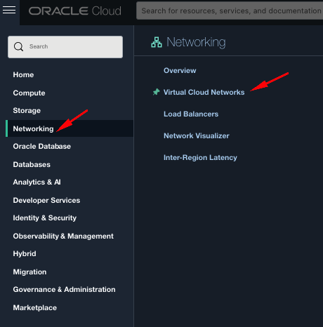
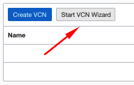
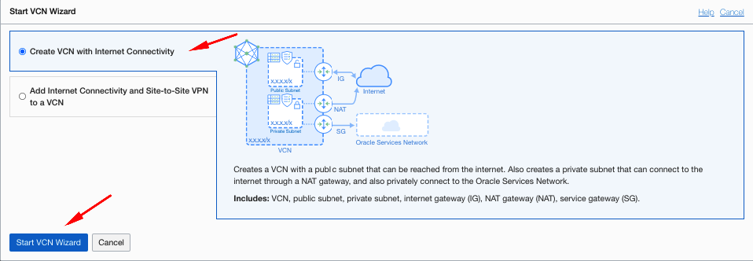
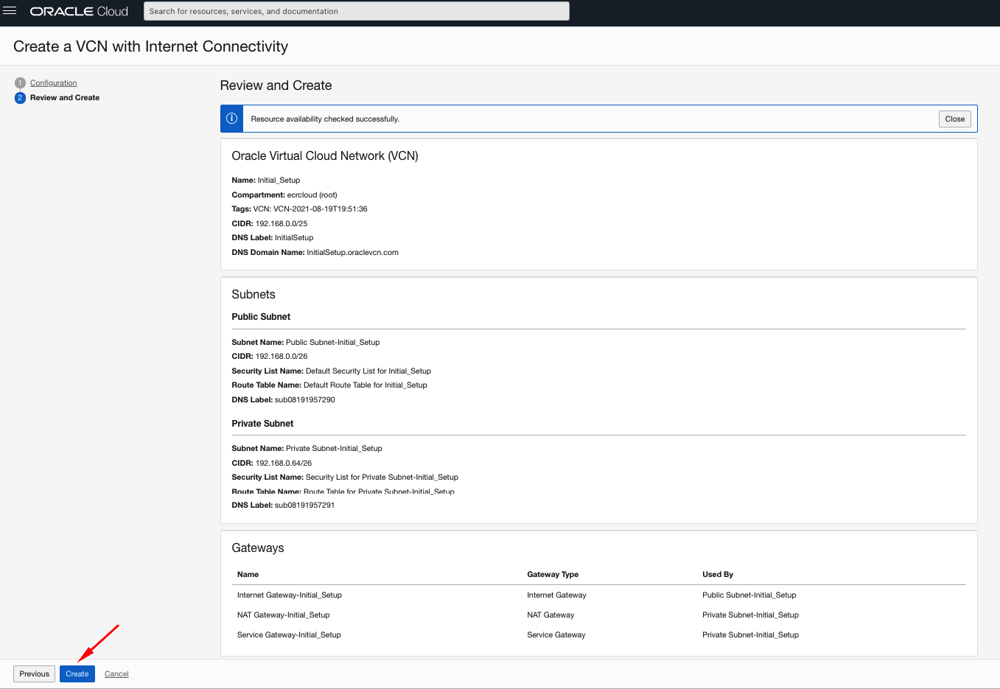

# OCI Cloud Bricks: Framework Examples

[](https://img.shields.io/badge/license-UPL-green) [](https://sonarcloud.io/dashboard?id=oracle-devrel_terraform-oci-cloudbricks-examples)

## Introduction
The following repository contains several examples to orchestrate the usage of Bricks for copy/paste purposes on customer migrated infrastructure.

## Getting Started
For initial understanding of methodology and framework, refer to the [following link](https://blogs.oracle.com/startup/infrastructure-as-code-for-startups)

This documentation is still under construction. Stay tunned for more details

### Prerequisites
- A small /30 VCN with a single subnet to provision initial bastion server. You can use the quickstart guide as instructed next:

    
    - Go to Hamburger Menu > Networking > Virtual Cloud Networks
        
    - Go to Root compartment on the left part of the screen
    - Click on *Start VCN Wizard*
        
    - Select *Create VCN with Internet Connectivity* and then hit on *Start VCN Wizard*
        
    - Fill the required fields with the following information: 
      - VCN Name: Initial_Setup
      - Compartment: root
      - VCN CIDR Block: 192.168.0.0/25
      - Public Subnet CIDR Block: 192.168.0.0/25
      - Private Subnet CIDR Block: 192.168.0.64/26
      - Click on Next
        
      - Click on *Create*
        
- Once VCN is created, create a simple compute using latest Oracle Linux Image
  - Machine should: 
    - Have Public IP
    - Locate it on root compartment
- Run script [setup_bastion.sh](setup_bastion.sh) to set up your development staging environment
- Clone this repository under path: /home/opc/REPOS/OCIFE
- Update each corresponding `system.tfvar` file inside each system, accordingly to your need.
- For system specific re-requisites check each individual `README.md`
- In order to provision infrastructure a pre-configured S3 compatibility API setup must be in place
- CLI pre-configured with pertaining user
  

## Important files
The following are some of the important files to be aware of in this project

### [setup_bastion.sh](setup_bastion.sh)
This bash script installs and pre-configures the entire executor server to properly run terraform and several other utilities


### [destroyInfra.sh](destroyInfra.sh)
This bash script destroys systems that are passed on as variables to it. 

Usage: 
```shell
./destroyInfra.sh SYSTEM_NAME
```


***Considerations***
- Once script has accepted it's workflow, there is no way back and infrastructure will be dropped
- This script can be ported to any continuous integration platform of your choice
- Script contains re-try logic in case of any errors. The amount of retries can be customized by updating variable `retry_attempts`
- Script relies on the value of .tfstate stored in bucket


### [provisionInfra.sh](provisionInfra.sh)
This bash script provisions systems that are passed on as variables to it. 

Usage: 
```shell
./provisionInfra.sh SYSTEM_NAME
```
***Considerations***
- Once script has accepted it's workflow, there is no way back and infrastructure will be dropped
- This script can be ported to any continuous integration platform of your choice
- Script contains re-try logic in case of any errors. The amount of retries can be customized by updating variable `retry_attempts`
- Script relies on the value of .tfstate stored in bucket


### [validateInfra.sh](validateInfra.sh)
This bash script validates system composition by checking it's integrity and variable composition

Usage: 
```shell
./validateInfra.sh SYSTEM_NAME
```

***Considerations***
- Once script has accepted it's workflow, there is no way back and infrastructure will be dropped
- This script can be ported to any continuous integration platform of your choice
- Script contains re-try logic in case of any errors. The amount of retries can be customized by updating variable `retry_attempts`
- Script relies on the value of .tfstate stored in bucket

### [setEnv.sh](setEnv.sh)
This bash script sets up the pipeline composition of the repository. This file can be updated to convinience. It's currently adapted to work with this particular repository and based on what's highlighted and pre-configured by script [setup_bastion.sh](setup_bastion.sh). The content of it is the following: 

```shell
export TERRAFORM_WORKSPACE='/home/opc/REPOS/OCIFE'
export PROJECT='terraform-oci-cloudbricks-examples'
export SYSTEM=$1
export TERRAFORM_ARTIFACT_WORKSPACE=$TERRAFORM_WORKSPACE/$PROJECT/$SYSTEM

```

## Contributing
This project is open source.  Please submit your contributions by forking this repository and submitting a pull request!  Oracle appreciates any contributions that are made by the open source community.

## License
Copyright (c) 2021 Oracle and/or its affiliates.

Licensed under the Universal Permissive License (UPL), Version 1.0.

See [LICENSE](LICENSE) for more details.
